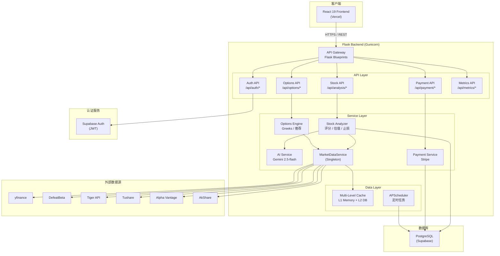
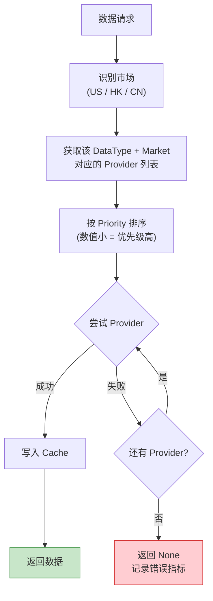

# AlphaGBM 系统概览

> Version: 1.0
> Last Updated: 2026-02-08

---

## 目录

1. [项目背景与定位](#1-项目背景与定位)
2. [技术栈](#2-技术栈)
3. [支持市场](#3-支持市场)
4. [系统架构图](#4-系统架构图)
5. [部署架构](#5-部署架构)
6. [核心依赖清单](#6-核心依赖清单)

---

## 1. 项目背景与定位

AlphaGBM 是一个**多市场股票/期权分析推荐平台**，面向个人投资者与期权交易者，
提供从数据采集、量化分析到 AI 报告生成的全链路投资决策辅助能力。

### 1.1 核心价值

| 能力维度 | 说明 |
|---------|------|
| **量化分析** | 基于基本面评分、技术面评分、市场情绪评分的多维度股票打分体系；DCF / 相对估值模型；ATR-based 止损计算 |
| **AI 深度报告** | 接入 Google Gemini 2.5-flash 大模型，自动生成可读性强的个股分析叙事报告 |
| **期权策略推荐** | Greeks 计算（Delta / Gamma / Theta / Vega）、合约评分、多策略推荐引擎 |

### 1.2 目标用户

- **个人投资者**：需要快速获取股票基本面与技术面评分、止损位参考、行业轮动信号
- **期权交易者**：需要实时期权链数据、Greeks 分析、最优合约推荐

---

## 2. 技术栈

### 2.1 Backend

| 组件 | 技术选型 | 版本 |
|-----|---------|------|
| 语言 | Python | 3.13 |
| Web Framework | Flask | 3.0.0 |
| ORM | Flask-SQLAlchemy | 3.1.1 |
| WSGI Server | Gunicorn | 23.0.0 |
| 任务调度 | APScheduler | 3.11.2 |
| 数据校验 | Pydantic | 2.12.4 |

### 2.2 数据库与认证

| 组件 | 技术选型 | 说明 |
|-----|---------|------|
| 生产数据库 | PostgreSQL (Supabase) | 通过 `psycopg2-binary` 连接 |
| 开发数据库 | SQLite | 本地开发零配置 |
| 认证服务 | Supabase Auth | JWT Token 校验，通过 `flask-jwt-extended` 集成 |
| 支付 | Stripe | 订阅与额度管理 |

### 2.3 AI 与数据源

| 组件 | 技术选型 | 用途 |
|-----|---------|------|
| AI 模型 | Google Gemini 2.5-flash | 生成个股分析叙事报告 |
| 美股数据 | yfinance / DefeatBeta / Alpha Vantage | 行情、历史、基本面、期权链 |
| 港股数据 | Tiger Open API | 行情、期权 |
| A 股数据 | Tushare | 行情、历史、基本面 |
| 宏观数据 | AkShare | 宏观经济指标、VIX、国债收益率 |

### 2.4 Frontend

| 组件 | 技术选型 | 版本 |
|-----|---------|------|
| UI Framework | React | 19 |
| 类型系统 | TypeScript | - |
| 构建工具 | Vite | - |
| CSS Framework | Tailwind CSS | - |
| 组件库 | Radix UI | - |

### 2.5 部署

| 组件 | 技术选型 |
|-----|---------|
| Backend 部署 | Gunicorn (multi-worker) |
| Frontend 部署 | Vercel |
| 数据库托管 | Supabase Cloud |

---

## 3. 支持市场

### 3.1 市场覆盖矩阵

| 市场 | 股票分析 | 期权分析 | 主要数据源 | 辅助数据源 |
|-----|---------|---------|-----------|-----------|
| **US（美股）** | 完整支持 | 完整支持 | yfinance (priority=10) | DefeatBeta (20), Alpha Vantage (25), Tiger (15) |
| **HK（港股）** | 支持 | 有限支持 | Tiger API (priority=15) | yfinance |
| **CN（A 股）** | 支持 | 不支持 | Tushare (priority=10) | Tiger (15) |

### 3.2 市场识别规则

系统通过 Ticker 后缀与前缀自动判断市场归属：

- **后缀匹配**：`.HK` -> 港股，`.SS` / `.SZ` -> A 股
- **6 位纯数字前缀匹配**：`60*` / `68*` -> 上交所（CN），`00*` / `30*` -> 深交所（CN）
- **默认**：无匹配则归类为 US（美股）

### 3.3 市场特定参数

| 参数 | US | CN | HK |
|-----|----|----|-----|
| 最低日成交额 | $5M | 100万 CNY | $2M |
| 风险溢价系数 | 1.0 | 1.3 | 1.15 |
| PE 阈值上限 | 40 | 50 | 35 |
| 波动率调整 | 1.0 | 1.2 | 1.1 |
| 投资风格权重偏好 | 均衡 | 成长偏好 | 价值偏好 |

---

## 4. 系统架构图

### 4.1 整体系统架构



### 4.2 数据提供者 Failover 流程



---

## 5. 部署架构

### 5.1 生产环境拓扑

```
  Vercel CDN (React Frontend)
          |  HTTPS
          v
  Gunicorn (multi-worker, Flask App)
          |
    +-----+------+
    |            |
  Supabase    外部 API
  (PG + Auth)  (yfinance / Tiger / Tushare / AkShare)
```

### 5.2 Gunicorn 配置

- **Worker 模式**：多进程 (pre-fork)
- **Worker 数量**：根据 CPU 核心数动态调整（推荐 `2 * CPU + 1`）
- **超时设置**：分析请求可能耗时较长，需适当增大 `timeout`

### 5.3 环境变量管理

系统通过 `python-dotenv` 加载 `.env` 文件，关键环境变量包括：

| 环境变量 | 用途 |
|---------|------|
| `DATABASE_URL` | PostgreSQL 连接字符串（Supabase） |
| `SUPABASE_URL` / `SUPABASE_KEY` | Supabase 服务地址与密钥 |
| `STRIPE_SECRET_KEY` | Stripe 支付密钥 |
| `GOOGLE_API_KEY` | Google Gemini API 密钥 |
| `TUSHARE_TOKEN` | Tushare 数据接口 Token |
| `ALPHA_VANTAGE_KEY` | Alpha Vantage API Key |
| `TIGER_ID` / `TIGER_PRIVATE_KEY` | Tiger Open API 认证 |
| `FLASK_ENV` | 运行环境（`development` / `production`） |

---

## 6. 核心依赖清单

### 6.1 Web Framework 与基础设施

| 包名 | 版本 | 用途 |
|-----|------|------|
| `flask` | 3.0.0 | Web Framework |
| `flask-cors` | 6.0.1 | 跨域资源共享 |
| `flask-sqlalchemy` | 3.1.1 | ORM 数据库访问 |
| `flask-jwt-extended` | 4.7.1 | JWT 认证 |
| `werkzeug` | 3.1.1 | WSGI 工具库（Flask 依赖） |
| `gunicorn` | 23.0.0 | 生产 WSGI Server |

### 6.2 数据源与市场数据

| 包名 | 版本 | 用途 |
|-----|------|------|
| `yfinance` | 0.2.63 | 美股/港股行情与期权数据 |
| `defeatbeta-api` | 0.0.33 | 美股基本面数据 |
| `alpha_vantage` | 3.0.0 | 美股行情备用数据源 |
| `tushare` | 1.4.19 | A 股行情与基本面数据 |
| `tigeropen` | 3.4.3 | Tiger 券商 API（多市场期权） |
| `akshare` | 1.17.26 | 宏观经济与 A 股辅助数据 |

### 6.3 AI 与数据处理

| 包名 | 版本 | 用途 |
|-----|------|------|
| `google-generativeai` | 0.8.5 | Google Gemini API 集成 |
| `pandas` | 2.2.3 | 数据分析与处理 |
| `numpy` | >=1.26.4 | 数值计算 |
| `scipy` | 1.16.2 | 科学计算（期权定价等） |
| `pydantic` | 2.12.4 | 数据模型校验 |

### 6.4 数据库与支付

| 包名 | 版本 | 用途 |
|-----|------|------|
| `supabase` | 2.25.1 | Supabase Python Client |
| `psycopg2-binary` | 2.9.11 | PostgreSQL 驱动 |
| `stripe` | 14.1.0 | Stripe 支付集成 |

### 6.5 调度与工具

| 包名 | 版本 | 用途 |
|-----|------|------|
| `apscheduler` | 3.11.2 | 定时任务调度（数据更新、缓存清理） |
| `python-dotenv` | 1.2.1 | 环境变量加载 |
| `requests` | 2.32.3 | HTTP Client |
| `python-dateutil` | 2.9.0 | 日期处理工具 |

---

*本文档基于项目实际代码结构与 `requirements.txt` 编写。如需了解更详细的架构细节，
请参阅 [ARCHITECTURE.md](../ARCHITECTURE.md)。*
