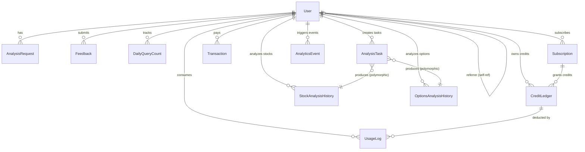

# AlphaGBM 数据库设计文档

> 源文件: `backend/app/models.py` | 数据库: SQLAlchemy + PostgreSQL (Supabase) | 更新: 2026-02-08

---

## 1. ER 图

> 注: PortfolioHolding, DailyProfitLoss, StyleProfit, PortfolioRebalance, DailyRecommendation, DailyAnalysisCache 为独立表，无 FK 关联。

---

## 2. 枚举类型定义

系统定义 7 个 `enum.Enum`，数据库中以 `.value` 字符串存储。

| 枚举类 | 成员 | 存储值 | 用途 |
|---|---|---|---|
| **ServiceType** | STOCK_ANALYSIS | `stock_analysis` | 股票分析服务 |
| | OPTION_ANALYSIS | `option_analysis` | 期权分析服务 |
| | DEEP_REPORT | `deep_report` | 深度研报服务 |
| **CreditSource** | SUBSCRIPTION | `subscription` | 订阅赠送 |
| | TOP_UP | `top_up` | 充值购买 |
| | REFERRAL | `referral` | 推荐奖励 |
| | SYSTEM_GRANT | `system_grant` | 系统发放 |
| | REFUND | `refund` | 退款返还 |
| **PlanTier** | FREE / PLUS / PRO | `free` / `plus` / `pro` | 免费 / Plus / Pro |
| **SubscriptionStatus** | ACTIVE | `active` | 活跃订阅 |
| | CANCELED | `canceled` | 已取消 |
| | PAST_DUE | `past_due` | 逾期未付 |
| | UNPAID | `unpaid` | 未支付 |
| | TRIALING | `trialing` | 试用中 |
| **TransactionStatus** | PENDING / SUCCEEDED / FAILED | `pending` / `succeeded` / `failed` | 交易状态 |
| **TaskType** | STOCK_ANALYSIS | `stock_analysis` | 股票分析任务 |
| | OPTION_ANALYSIS | `option_analysis` | 期权分析任务 |
| | ENHANCED_OPTION_ANALYSIS | `enhanced_option_analysis` | 增强期权分析 |
| **TaskStatus** | PENDING / PROCESSING / COMPLETED / FAILED | `pending` / `processing` / `completed` / `failed` | 任务状态 |

---

## 3. 模型字段详细定义

### 3.1 User (表名: `user`)

| 字段 | 类型 | 约束 | 说明 |
|---|---|---|---|
| `id` | String(36) | PK | Supabase UUID |
| `email` | String(120) | NOT NULL, UNIQUE, INDEX | 用户邮箱 |
| `username` | String(80) | NULLABLE | 用户名 |
| `created_at` | DateTime | DEFAULT utcnow | 注册时间 |
| `last_login` | DateTime | NULLABLE | 最后登录时间 |
| `stripe_customer_id` | String(255) | INDEX, NULLABLE | Stripe 客户 ID |
| `referrer_id` | String(36) | FK -> user.id, NULLABLE | 推荐人 (self-referential) |

Relationships: `referrer`(self), `analysis_requests`, `feedbacks`, `daily_queries` (均为 backref)

### 3.2 AnalysisRequest (表名: `analysis_request`)

| 字段 | 类型 | 约束 | 说明 |
|---|---|---|---|
| `id` | Integer | PK | 自增主键 |
| `user_id` | String(36) | FK, INDEX, NULLABLE | 关联用户 |
| `ticker` | String(20) | NOT NULL | 股票代码 |
| `style` | String(20) | NOT NULL | 分析风格 |
| `status` | String(20) | NOT NULL, DEFAULT 'success' | 请求状态 |
| `error_message` | Text | NULLABLE | 错误信息 |
| `created_at` | DateTime | DEFAULT utcnow | 创建时间 |

### 3.3 Feedback (表名: `feedback`)

| 字段 | 类型 | 约束 | 说明 |
|---|---|---|---|
| `id` | Integer | PK | 自增主键 |
| `user_id` | String(36) | FK, INDEX, NOT NULL | 关联用户 |
| `type` | String(50) | NOT NULL | 反馈类型 |
| `content` | Text | NOT NULL | 反馈内容 |
| `ticker` | String(20) | NULLABLE | 相关股票代码 |
| `ip_address` | String(50) | NULLABLE | 来源 IP |
| `submitted_at` | DateTime | DEFAULT utcnow | 提交时间 |

### 3.4 DailyQueryCount (表名: `daily_query_count`)

| 字段 | 类型 | 约束 | 说明 |
|---|---|---|---|
| `id` | Integer | PK | 自增主键 |
| `user_id` | String(36) | FK, INDEX, NOT NULL | 关联用户 |
| `date` | Date | NOT NULL | 查询日期 |
| `query_count` | Integer | DEFAULT 0 | 当日已查询次数 |
| `max_queries` | Integer | DEFAULT 5 | 当日最大查询次数 |
| `reset_time` | DateTime | NOT NULL, DEFAULT 次日零点 | 计数重置时间 |

### 3.5 PortfolioHolding (表名: `portfolio_holdings`)

| 字段 | 类型 | 约束 | 说明 |
|---|---|---|---|
| `id` | Integer | PK | 自增主键 |
| `ticker` | String(20) | NOT NULL, INDEX | 股票代码 |
| `name` | String(100) | NOT NULL | 股票名称 |
| `shares` | Integer | NOT NULL | 持有股数 |
| `buy_price` | Float | NOT NULL | 买入价格 |
| `style` | String(20) | NOT NULL, INDEX | 投资风格 |
| `user_id` | String(36) | NULLABLE, INDEX | 用户 ID (无 FK) |
| `currency` | String(3) | NOT NULL | 币种 (USD/CNY/HKD) |
| `created_at` | DateTime | DEFAULT utcnow | 创建时间 |
| `updated_at` | DateTime | DEFAULT utcnow, ON UPDATE | 更新时间 |

### 3.6 DailyProfitLoss (表名: `daily_profit_loss`)

| 字段 | 类型 | 约束 | 说明 |
|---|---|---|---|
| `id` | Integer | PK | 自增主键 |
| `trading_date` | Date | NOT NULL, INDEX | 交易日期 |
| `total_actual_investment` | Float | NOT NULL | 总实际投资额 |
| `total_market_value` | Float | NOT NULL | 总市场价值 |
| `total_profit_loss` | Float | NOT NULL | 总盈亏金额 |
| `total_profit_loss_percent` | Float | NOT NULL | 总盈亏百分比 |
| `user_id` | String(36) | NULLABLE, INDEX | 用户 ID (无 FK) |
| `created_at` | DateTime | DEFAULT utcnow | 创建时间 |

### 3.7 StyleProfit (表名: `style_profits`)

| 字段 | 类型 | 约束 | 说明 |
|---|---|---|---|
| `id` | Integer | PK | 自增主键 |
| `trading_date` | Date | NOT NULL, INDEX | 交易日期 |
| `style` | String(20) | NOT NULL | 投资风格 |
| `style_investment` | Float | NOT NULL | 风格投资额 |
| `style_market_value` | Float | NOT NULL | 风格市场价值 |
| `style_profit_loss` | Float | NOT NULL | 风格盈亏金额 |
| `style_profit_loss_percent` | Float | NOT NULL | 风格盈亏百分比 |

### 3.8 PortfolioRebalance (表名: `portfolio_rebalances`)

| 字段 | 类型 | 约束 | 说明 |
|---|---|---|---|
| `id` | Integer | PK | 自增主键 |
| `rebalance_date` | Date | NOT NULL, INDEX | 再平衡日期 |
| `rebalance_number` | Integer | NOT NULL | 第 N 次再平衡 |
| `holdings_added` | Integer | DEFAULT 0 | 新增持仓数 |
| `holdings_removed` | Integer | DEFAULT 0 | 移除持仓数 |
| `holdings_adjusted` | Integer | DEFAULT 0 | 调整持仓数 |
| `total_investment` | Float | NOT NULL | 再平衡后总投资额 |
| `total_market_value` | Float | NOT NULL | 再平衡后总市值 |
| `total_profit_loss` | Float | NOT NULL | 再平衡后总盈亏 |
| `total_profit_loss_percent` | Float | NOT NULL | 再平衡后盈亏比例 |
| `style_stats` | JSON | NULLABLE | 按风格统计 |
| `changes_detail` | JSON | NULLABLE | 变更明细 `{added, removed, adjusted}` |
| `notes` | Text | NULLABLE | 备注 |
| `created_at` | DateTime | DEFAULT utcnow | 记录时间 |

### 3.9 Subscription (表名: `subscriptions`)

| 字段 | 类型 | 约束 | 说明 |
|---|---|---|---|
| `id` | Integer | PK | 自增主键 |
| `user_id` | String(36) | FK, INDEX, NOT NULL | 关联用户 |
| `stripe_subscription_id` | String(255) | UNIQUE, NOT NULL | Stripe 订阅 ID |
| `plan_tier` | String(50) | NOT NULL | 套餐等级 (plus/pro) |
| `status` | String(50) | NOT NULL | 订阅状态 (SubscriptionStatus) |
| `current_period_start` | DateTime | DEFAULT utcnow | 当前周期开始 |
| `current_period_end` | DateTime | -- | 当前周期结束 |
| `cancel_at_period_end` | Boolean | DEFAULT False | 是否周期末取消 |
| `created_at` | DateTime | DEFAULT utcnow | 创建时间 |
| `updated_at` | DateTime | DEFAULT utcnow, ON UPDATE | 更新时间 |

### 3.10 Transaction (表名: `transactions`)

| 字段 | 类型 | 约束 | 说明 |
|---|---|---|---|
| `id` | Integer | PK | 自增主键 |
| `user_id` | String(36) | FK, INDEX, NOT NULL | 关联用户 |
| `stripe_payment_intent_id` | String(255) | UNIQUE, NULLABLE | Stripe PaymentIntent ID |
| `stripe_checkout_session_id` | String(255) | UNIQUE, NULLABLE | Stripe Checkout Session ID |
| `stripe_invoice_id` | String(255) | UNIQUE, INDEX, NULLABLE | Stripe Invoice ID (幂等性) |
| `amount` | Integer | NOT NULL | 金额 (单位: 分) |
| `currency` | String(10) | NOT NULL, DEFAULT 'cny' | 币种 |
| `status` | String(50) | NOT NULL | 交易状态 (TransactionStatus) |
| `description` | String(255) | -- | 交易描述 |
| `created_at` | DateTime | DEFAULT utcnow | 创建时间 |

### 3.11 CreditLedger (表名: `credit_ledger`)

> 额度台账 -- 记录每一笔额度的来源和消耗

| 字段 | 类型 | 约束 | 说明 |
|---|---|---|---|
| `id` | Integer | PK | 自增主键 |
| `user_id` | String(36) | FK, INDEX, NOT NULL | 关联用户 |
| `service_type` | String(50) | NOT NULL, DEFAULT 'stock_analysis' | 服务类型 |
| `source` | String(50) | NOT NULL | 额度来源 (CreditSource) |
| `amount_initial` | Integer | NOT NULL | 初始额度数 |
| `amount_remaining` | Integer | NOT NULL | 剩余额度数 |
| `expires_at` | DateTime | NULLABLE | 过期时间 (NULL=永久) |
| `subscription_id` | Integer | FK -> subscriptions.id, NULLABLE | 关联订阅 |
| `created_at` | DateTime | DEFAULT utcnow | 创建时间 |

### 3.12 UsageLog (表名: `usage_logs`)

| 字段 | 类型 | 约束 | 说明 |
|---|---|---|---|
| `id` | Integer | PK | 自增主键 |
| `user_id` | String(36) | FK, INDEX, NOT NULL | 关联用户 |
| `credit_ledger_id` | Integer | FK -> credit_ledger.id, NULLABLE | 消耗的额度包 |
| `service_type` | String(50) | NOT NULL | 服务类型 |
| `ticker` | String(20) | NULLABLE | 股票/期权代码 |
| `amount_used` | Integer | NOT NULL, DEFAULT 1 | 消耗额度数 |
| `created_at` | DateTime | DEFAULT utcnow | 消耗时间 |

### 3.13 StockAnalysisHistory (表名: `stock_analysis_history`)

| 字段 | 类型 | 约束 | 说明 |
|---|---|---|---|
| `id` | Integer | PK | 自增主键 |
| `user_id` | String(36) | FK, INDEX, NOT NULL | 关联用户 |
| `ticker` | String(20) | NOT NULL, INDEX | 股票代码 |
| `style` | String(20) | NOT NULL | 分析风格 |
| `current_price` | Float | NULLABLE | 当前价格 |
| `target_price` | Float | NULLABLE | 目标价格 |
| `stop_loss_price` | Float | NULLABLE | 止损价格 |
| `market_sentiment` | Float | NULLABLE | 市场情绪评分 |
| `risk_score` | Float | NULLABLE | 风险评分 |
| `risk_level` | String(20) | NULLABLE | 风险等级 |
| `position_size` | Float | NULLABLE | 建议仓位比例 |
| `ev_score` | Float | NULLABLE | EV 模型得分 |
| `ev_weighted_pct` | Float | NULLABLE | EV 加权百分比 |
| `recommendation_action` | String(20) | NULLABLE | 推荐操作 |
| `recommendation_confidence` | String(20) | NULLABLE | 推荐置信度 |
| `ai_summary` | Text | NULLABLE | AI 分析摘要 |
| `full_analysis_data` | JSON | NULLABLE | 完整分析 JSON |
| `created_at` | DateTime | DEFAULT utcnow, INDEX | 分析时间 |

### 3.14 OptionsAnalysisHistory (表名: `options_analysis_history`)

| 字段 | 类型 | 约束 | 说明 |
|---|---|---|---|
| `id` | Integer | PK | 自增主键 |
| `user_id` | String(36) | FK, INDEX, NOT NULL | 关联用户 |
| `symbol` | String(20) | NOT NULL, INDEX | 标的代码 |
| `option_identifier` | String(100) | NULLABLE | 期权合约标识 |
| `expiry_date` | String(20) | NULLABLE | 到期日 |
| `analysis_type` | String(50) | NOT NULL | 分析类型 (basic_chain/enhanced_analysis) |
| `strike_price` | Float | NULLABLE | 行权价 |
| `option_type` | String(10) | NULLABLE | call / put |
| `option_score` | Float | NULLABLE | 期权评分 |
| `iv_rank` | Float | NULLABLE | IV Rank |
| `vrp_analysis` | JSON | NULLABLE | VRP 分析数据 |
| `risk_analysis` | JSON | NULLABLE | 风险分析数据 |
| `ai_summary` | Text | NULLABLE | AI 分析摘要 |
| `full_analysis_data` | JSON | NULLABLE | 完整分析 JSON |
| `created_at` | DateTime | DEFAULT utcnow, INDEX | 分析时间 |

### 3.15 AnalysisTask (表名: `analysis_tasks`, PK: UUID)

| 字段 | 类型 | 约束 | 说明 |
|---|---|---|---|
| `id` | String(36) | PK | UUID 任务 ID |
| `user_id` | String(36) | FK, INDEX, NOT NULL | 关联用户 |
| `task_type` | String(50) | NOT NULL, INDEX | 任务类型 (TaskType) |
| `status` | String(20) | NOT NULL, DEFAULT 'pending', INDEX | 任务状态 (TaskStatus) |
| `priority` | Integer | NOT NULL, DEFAULT 100 | 优先级 (越小越高) |
| `input_params` | JSON | NOT NULL | 输入参数 |
| `progress_percent` | Integer | NOT NULL, DEFAULT 0 | 进度 0-100 |
| `current_step` | Text | NULLABLE | 当前步骤描述 |
| `result_data` | JSON | NULLABLE | 分析结果 |
| `error_message` | Text | NULLABLE | 错误信息 |
| `created_at` | DateTime | DEFAULT utcnow, INDEX | 创建时间 |
| `started_at` | DateTime | NULLABLE | 开始执行时间 |
| `completed_at` | DateTime | NULLABLE | 完成时间 |
| `related_history_id` | Integer | NULLABLE | 关联 History ID (多态) |
| `related_history_type` | String(50) | NULLABLE | 'stock' / 'options' |

> `related_history_id` + `related_history_type` 构成多态外键，指向 StockAnalysisHistory 或 OptionsAnalysisHistory。

### 3.16 DailyRecommendation (表名: `daily_recommendations`)

| 字段 | 类型 | 约束 | 说明 |
|---|---|---|---|
| `id` | Integer | PK | 自增主键 |
| `recommendation_date` | Date | NOT NULL, INDEX, UNIQUE | 推荐日期 |
| `recommendations` | JSON | NOT NULL | 推荐列表数据 |
| `market_summary` | JSON | NULLABLE | 市场摘要 |
| `created_at` | DateTime | DEFAULT utcnow | 创建时间 |
| `updated_at` | DateTime | DEFAULT utcnow, ON UPDATE | 更新时间 |

### 3.17 DailyAnalysisCache (表名: `daily_analysis_cache`)

| 字段 | 类型 | 约束 | 说明 |
|---|---|---|---|
| `id` | Integer | PK | 自增主键 |
| `ticker` | String(20) | NOT NULL, INDEX | 股票代码 |
| `style` | String(50) | NOT NULL | 分析风格 |
| `analysis_date` | Date | NOT NULL, INDEX | 分析日期 |
| `full_analysis_data` | JSON | NOT NULL | 完整分析结果 |
| `source_task_id` | String(36) | NULLABLE | 生成此缓存的 task ID |
| `created_at` | DateTime | DEFAULT utcnow | 创建时间 |

### 3.18 AnalyticsEvent (表名: `analytics_events`)

| 字段 | 类型 | 约束 | 说明 |
|---|---|---|---|
| `id` | BigInteger | PK | 自增主键 (BigInt 支持海量数据) |
| `event_type` | String(100) | NOT NULL, INDEX | 事件类型 |
| `session_id` | String(50) | NOT NULL, INDEX | 会话 ID |
| `user_id` | String(36) | FK, NULLABLE, INDEX | 关联用户 (匿名为 NULL) |
| `user_tier` | String(20) | NULLABLE | 用户等级 (guest/free/plus/pro) |
| `properties` | JSON | NULLABLE | 事件自定义属性 |
| `url` | String(500) | NULLABLE | 页面 URL |
| `referrer` | String(500) | NULLABLE | 来源 URL |
| `created_at` | DateTime | DEFAULT utcnow, INDEX | 事件时间 |

---

## 4. 关键索引和唯一约束

### 4.1 唯一约束 (Unique Constraints)

| 表 | 约束字段 | 说明 |
|---|---|---|
| `user` | `email` | 邮箱全局唯一 |
| `subscriptions` | `stripe_subscription_id` | Stripe 订阅 ID 唯一 |
| `transactions` | `stripe_payment_intent_id` | PaymentIntent 唯一 |
| `transactions` | `stripe_checkout_session_id` | Checkout Session 唯一 |
| `transactions` | `stripe_invoice_id` | Invoice ID 唯一 (幂等性保障) |
| `daily_recommendations` | `recommendation_date` (`uq_daily_recommendation_date`) | 每天一条 |
| `daily_analysis_cache` | `(ticker, style, analysis_date)` (`uq_daily_analysis_cache`) | 每组合每天一条 |

### 4.2 复合索引 (Composite Indexes)

| 表 | 索引名 | 字段 | 用途 |
|---|---|---|---|
| `daily_analysis_cache` | `idx_daily_cache_lookup` | (ticker, style, analysis_date) | 缓存命中查询 |
| `analytics_events` | `idx_analytics_type_date` | (event_type, created_at) | 按类型+时间分析 |
| `analytics_events` | `idx_analytics_user_date` | (user_id, created_at) | 按用户+时间分析 |

### 4.3 单列索引摘要

高频查询索引: `user.email`, `user.stripe_customer_id`, 各表 `user_id`, `stock_analysis_history.ticker`, `options_analysis_history.symbol`, `analysis_tasks.task_type`, `analysis_tasks.status`, `analysis_tasks.created_at`, `analytics_events.event_type`, `analytics_events.session_id`, `analytics_events.created_at`, `portfolio_holdings.ticker`, `portfolio_holdings.style`, `daily_profit_loss.trading_date`, `style_profits.trading_date`, `portfolio_rebalances.rebalance_date`, `daily_analysis_cache.ticker`, `daily_analysis_cache.analysis_date`

---

## 5. 数据生命周期

### 5.1 临时数据 (Temporary) -- 每日刷新

| 表 | 刷新策略 | 说明 |
|---|---|---|
| `daily_analysis_cache` | 每日覆盖 | 同一 (ticker, style, date) 只保留最新结果 |
| `daily_recommendations` | 每日生成 | 每天一条，旧记录保留供回溯 |
| `daily_query_count` | 每日重置 | `reset_time` 控制，次日零点重置 |

### 5.2 永久数据 (Permanent) -- 长期保留

| 表 | 原因 |
|---|---|
| `user` | 身份核心数据 |
| `transactions` | 财务审计合规 |
| `credit_ledger` | 额度流水审计 |
| `subscriptions` | 订阅历史，关联额度 |
| `stock_analysis_history` | 付费分析结果，支持回看 |
| `options_analysis_history` | 付费期权分析结果 |
| `portfolio_holdings` / `portfolio_rebalances` | 投资组合持仓与再平衡历史 |

### 5.3 可清理数据 (Cleanup Candidates)

| 表 | 清理策略 | 建议保留期 |
|---|---|---|
| `analytics_events` | 定期归档/删除 | 90 天 |
| `analysis_tasks` | 已完成/失败任务归档 | 30 天 (结果已持久化到 History) |
| `analysis_request` | 早期日志，已被 History 表替代 | 90 天 |
| `daily_analysis_cache` | 过期缓存清理 | 7 天 |
| `usage_logs` | 按需归档 | 180 天 |
| `feedback` | 按需归档 | 365 天 |

### 5.4 额度过期机制

`CreditLedger.expires_at` 控制额度有效期:
- `NULL` = 永久有效 (system_grant, refund)
- 订阅额度在周期结束时过期
- 查询可用额度: `WHERE expires_at IS NULL OR expires_at > NOW()`
- 过期记录保留但不再扣减 `amount_remaining`
