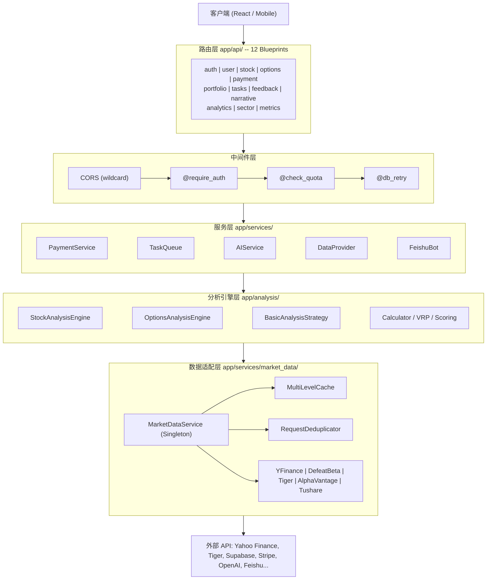
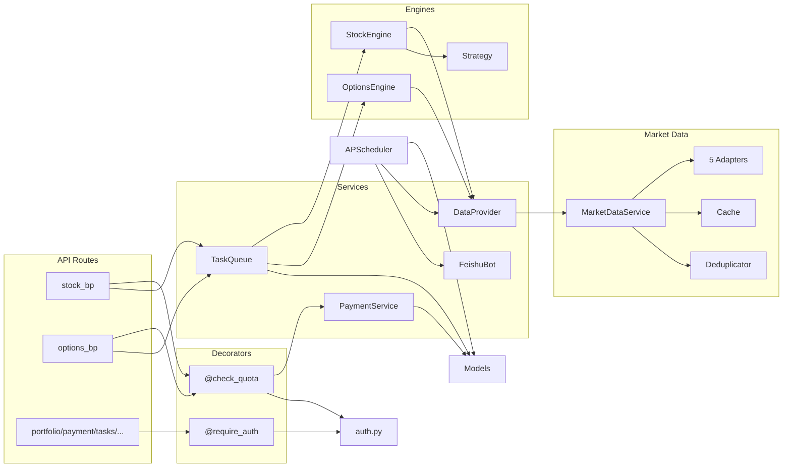

# AlphaGBM 整体架构文档

> 版本: 1.0 | 最后更新: 2026-02-08

本文档描述 AlphaGBM 多市场股票/期权分析平台的后端整体架构，涵盖分层设计、
设计模式、请求处理流程、模块依赖关系、并发模型及缓存策略。

---

## 1. 分层架构图

系统采用五层分层架构，各层职责单一、依赖方向严格自上而下。



| 层级 | 目录 | 职责 |
|------|------|------|
| 路由层 | `app/api/` | 12 个 Flask Blueprint，URL 路由、参数校验、Response 序列化 |
| 中间件层 | `app/utils/` | Token 认证、额度检查、数据库重试 |
| 服务层 | `app/services/` | 业务编排、任务队列、支付、AI 调用 |
| 分析引擎层 | `app/analysis/` | 股票/期权分析核心算法、投资策略、风险计算 |
| 数据适配层 | `app/services/market_data/` | 多源数据获取、Failover、缓存、去重、指标采集 |

---

## 2. 设计模式详解

### 2.1 工厂模式 -- `create_app()`

`create_app(config_class=Config)`（`app/__init__.py`）是 Flask Application Factory，
负责初始化 Flask 实例、CORS、SQLAlchemy、TaskQueue、APScheduler，并注册全部 Blueprint。

```python
def create_app(config_class=Config):
    app = Flask(__name__)
    app.config.from_object(config_class)
    CORS(app, resources={r"/api/*": {"origins": "*"}})
    # ... extensions, scheduler, 12 blueprints
    return app
```

### 2.2 单例模式 -- `MarketDataService`, `TaskQueue`

`MarketDataService`（`market_data/service.py`）使用 `__new__` + `threading.Lock` 实现
线程安全 Singleton，确保跨请求共享缓存、Adapter 注册表和 Deduplicator。

```python
class MarketDataService:
    _instance = None
    _lock = Lock()
    def __new__(cls):
        with cls._lock:
            if cls._instance is None:
                cls._instance = super().__new__(cls)
            return cls._instance
```

`TaskQueue` 通过模块级全局变量 `task_queue` 实现进程级单例。

### 2.3 适配器模式 -- 5 个数据源 Adapter

所有 Adapter 继承抽象基类 `DataProviderAdapter`（`interfaces.py`），实现统一接口：

| Adapter | 支持市场 | 主要数据类型 |
|---------|---------|------------|
| YFinanceAdapter | US, HK | Quote, History, Fundamentals, Options |
| DefeatBetaAdapter | US | Quote, Fundamentals |
| TigerAdapter | US, HK, CN | Quote, History, Options, Margin |
| AlphaVantageAdapter | US | Quote, Fundamentals |
| TushareAdapter | CN | Quote, History, Fundamentals |

核心接口: `get_quote()`, `get_history()`, `get_info()`, `get_fundamentals()`,
`get_options_chain()`, `health_check()`, `is_rate_limited()`

### 2.4 策略模式 -- 4 种投资风格

`BasicAnalysisStrategy.analyze(data, style, liquidity_info)`（`strategies/basic.py`）
根据 style 参数选择不同分析逻辑：

| Style | 侧重指标 |
|-------|---------|
| `quality` (品质型) | ROE, Profit Margin, 财务健康 |
| `value` (价值型) | PE, PB, PEG, EV/EBITDA |
| `growth` (成长型) | Revenue Growth, Earnings Growth |
| `momentum` (动量型) | 价格趋势、技术指标、ATR |

每种 style 使用 `MARKET_STYLE_WEIGHTS` 配置权重，支持 US/HK/CN 三个市场差异化参数。

### 2.5 装饰器模式 -- `@require_auth`, `@check_quota`, `@db_retry`

**`@require_auth`**（`auth.py`）: 解析 Bearer token -> token_cache 查找（5 分钟 TTL）
-> Cache miss 时 `supabase.auth.get_user(token)`（2 次重试 + 指数退避）-> 自动创建
本地 User -> 设置 `g.user_id`

**`@check_quota`**（`decorators.py`）: 内嵌认证逻辑 + `PaymentService.check_and_deduct_credits()`
-> 免费额度优先 -> 付费 Credit FIFO 扣减 -> 不足返回 402 -> 信息写入 `g.quota_info`

**`@db_retry`**（`decorators.py`）: 捕获 `OperationalError`/`DisconnectionError`，
针对 SSL/connection/timeout 瞬态错误最多重试 3 次，指数退避 + `engine.dispose()` 清理连接池。

### 2.6 门面模式 -- `DataProvider`

`DataProvider`（`data_provider.py`）封装 `MarketDataService`，提供 `yf.Ticker()` 兼容 API：

```python
stock = DataProvider('AAPL')   # 替代 yf.Ticker('AAPL')
stock.info                      # 底层走 MarketDataService 多源 failover
stock.history(period='1mo')
```

### 2.7 蓝图模式 -- 12 个 Flask Blueprint

| Blueprint | 功能 | Blueprint | 功能 |
|-----------|------|-----------|------|
| `auth_bp` | 登录/注册/Token | `portfolio_bp` | 组合管理/持仓盈亏 |
| `user_bp` | 用户信息/偏好 | `tasks_bp` | 异步任务状态 |
| `stock_bp` | 股票分析/反向查分 | `feedback_bp` | 用户反馈 |
| `options_bp` | 期权链/策略评分 | `narrative_bp` | AI 叙事报告 |
| `payment_bp` | Stripe 支付/订阅 | `analytics_bp` | 使用统计 |
| `sector_bp` | 行业轮动分析 | `metrics_bp` | 数据源健康指标 |

---

## 3. 请求处理完整流程

以 `POST /api/stock/analyze` 为例：

```
HTTP Request
  |
  v
[1] CORS 检查 (origins: "*", 放行所有 /api/* 请求)
  |
  v
[2] Flask Blueprint 路由匹配 -> stock_bp
  |
  v
[3] @check_quota(service_type='stock_analysis')
  |-- 解析 Authorization: Bearer <token>
  |-- token_cache 命中? -> 使用缓存 user 数据
  |-- Cache miss -> supabase.auth.get_user(token) (2次重试, 指数退避)
  |-- 验证成功 -> cache_user_token(token, user)
  |-- 本地 User 不存在? -> 自动 INSERT
  |-- 设置 g.user_id, g.user_email
  |-- PaymentService.check_and_deduct_credits()
  |     |-- 免费每日额度 -> 放行
  |     |-- 免费已满 -> 付费 Credit FIFO 扣减
  |     |-- 不足 -> 402 INSUFFICIENT_CREDITS
  |-- 额度信息写入 g.quota_info
  |
  v
[4] 业务逻辑
  |-- 创建 AnalysisTask -> TaskQueue Worker Thread
  |-- StockAnalysisEngine:
  |     DataProvider -> MarketDataService -> Cache/Dedup/Failover
  |     BasicAnalysisStrategy 策略计算
  |-- 结果写入 DailyAnalysisCache + StockAnalysisHistory
  |
  v
[5] Response: convert_numpy_types() -> jsonify() -> JSON (200/402/401/503)
```

---

## 4. 跨模块依赖关系图



**关键依赖说明:**
- **PaymentService** 被 `@check_quota` 调用，不直接被 API Route 引用
- **DataProvider** 是分析引擎与 MarketDataService 之间的 Facade 桥梁
- **APScheduler** 独立运行定时任务，通过 `run_with_app_context()` 获取 Flask 上下文
- **TaskQueue** 依赖分析引擎 + SQLAlchemy Models，在独立 Worker Thread 中运行

---

## 5. 并发与异步模型

### 5.1 Gunicorn Multi-Worker (生产环境)

每个 Worker 进程独立持有 MarketDataService 单例、TaskQueue 和 APScheduler。
`create_app()` 通过 `WERKZEUG_RUN_MAIN` 判断 debug reloader，避免 Scheduler 重复初始化。

```
Gunicorn Master
  |-- Worker 1 (Flask App + TaskQueue + Scheduler)
  |-- Worker 2 (Flask App + TaskQueue + Scheduler)
  |-- Worker N ...
```

### 5.2 TaskQueue -- 3 Worker Threads

`TaskQueue`（`task_queue.py`）使用 3 个 daemon Thread + `queue.Queue`（FIFO，线程安全），
支持三种模式: **Normal**（直接分析）、**Cached**（模拟进度 ~10s + 返回缓存）、
**Waiting**（轮询等待另一任务完成后共享结果）。

### 5.3 APScheduler -- BackgroundScheduler

| 任务 | 调度时间 | 功能 |
|------|---------|------|
| `daily_profit_loss_calculation` | 每日 18:12 | 计算持仓盈亏，写入 DailyProfitLoss |
| `daily_feishu_report` | 每日 20:00 | 推送运营数据到飞书群 |

### 5.4 线程安全机制

| 资源 | 保护机制 | 位置 |
|------|---------|------|
| `token_cache` dict | CPython GIL | `utils/auth.py` |
| `MarketDataService._instance` | `threading.Lock` | `market_data/service.py` |
| `TaskQueue.task_queue` | `queue.Queue` (内置安全) | `services/task_queue.py` |
| `RequestDeduplicator._in_flight` | `Lock` + `Event` | `market_data/deduplicator.py` |
| `MultiLevelCache._cache` | `threading.Lock` (LRU) | `market_data/cache.py` |
| `MetricsCollector` | 内部 Lock | `market_data/metrics.py` |

---

## 6. 缓存策略

### 6.1 Token Cache -- 认证缓存

进程内存 dict，TTL 5 分钟（`CACHE_DURATION = 300`）。Key 为 Bearer Token，
Value 为 `{user_data, expires_at}`。每 50 次写入时批量清理过期条目。

### 6.2 Exchange Rate Cache -- 汇率缓存

模块级全局变量，TTL 1 小时，数据源 `exchangerate-api.com`。
Fallback 硬编码汇率: `USD_TO_HKD: 7.8, USD_TO_CNY: 7.2`。

### 6.3 Market Data Cache -- 多级行情缓存

```
请求 -> L1 Memory (LRU OrderedDict, max=1000, per-process)
           | miss
           v
       L2 Database (PostgreSQL, 持久化, 跨进程)
           | miss
           v
       API 调用 (Adapter + Priority Failover)
```

L1 使用 `threading.Lock` 保护，TTL 按 DataType 分级配置。LRU 淘汰最久未访问条目。

### 6.4 Analysis Cache -- 分析结果缓存

| Model | Key | TTL | 用途 |
|-------|-----|-----|------|
| `DailyAnalysisCache` | (ticker, style, date) | 1 天 | 避免同日重复计算 |
| `DailyRecommendation` | (date) | 1 天 | 每日推荐列表 |
| `StockAnalysisHistory` | (user_id, ticker, style) | 永久 | 用户历史记录 |

TaskQueue 缓存命中流程: 新请求 -> 查 DailyAnalysisCache -> hit 则 `cache_mode='cached'`
模拟进度 -> 同 ticker 有 in-flight 任务则 `cache_mode='waiting'` 轮询等待 -> miss 则正常分析并写入 Cache。

### 6.5 Request Deduplication -- 请求去重

500ms 窗口内，相同 `(data_type, symbol, params)` 的并发请求只触发一次 API 调用。
Key 由 MD5 hash 生成，使用 `threading.Lock` + `threading.Event` 实现等待-通知机制。

### 缓存层级总览

```
                     TTL        存储             线程安全
Token Cache       5 min      Memory dict       GIL
Exchange Rate     1 hour     Global var        Single-thread
Market Data L1    按类型     LRU dict          threading.Lock
Market Data L2    按类型     PostgreSQL        DB transaction
AnalysisCache     1 day      PostgreSQL        DB unique constraint
Request Dedup     500ms      In-flight dict    Lock + Event
```

---

## 附录: 技术栈速查

| 类别 | 技术 |
|------|------|
| Web Framework | Flask 3.x + Flask-CORS |
| ORM | Flask-SQLAlchemy (PostgreSQL) |
| Auth | Supabase Auth (JWT Bearer Token) |
| Payment | Stripe API |
| Task Queue | 自研 threading.Thread (3 workers) + queue.Queue |
| Scheduler | APScheduler BackgroundScheduler |
| AI | OpenAI / DeepSeek API |
| Data Sources | YFinance, DefeatBeta, Tiger Open API, Alpha Vantage, Tushare |
| Deployment | Gunicorn + Docker |
| Notification | Feishu Webhook Bot |
