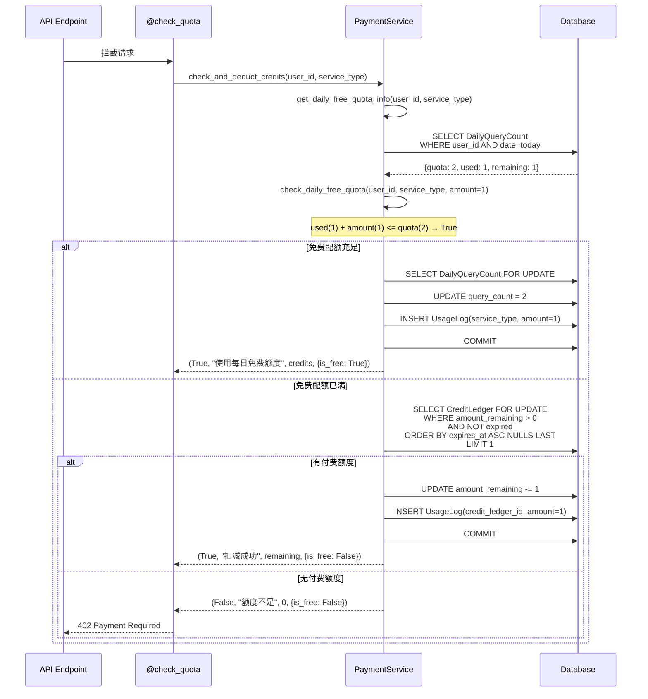

# 额度与配额管理流程

> 本文档描述免费配额、付费额度的检查与扣减流程。

## 1. 流程概述

系统采用 **双层额度体系**：

1. **免费配额**: 所有用户每日 2 次，跨服务共享 (stock_analysis + option_analysis)
2. **付费额度**: 来自订阅/加油包，FIFO 先进先出扣减，有过期时间

### 额度配置

| 用户类型 | 每日免费次数 | 付费额度来源 | 有效期 |
|----------|------------|------------|--------|
| Free 用户 | 2 次/天 (所有服务共享) | - | 每日重置 |
| Plus 月付 | 2 次/天 + 1,000 次/月 | Subscription | 30 天 |
| Plus 年付 | 2 次/天 + 12,000 次/年 | Subscription | 365 天 |
| Pro 月付 | 2 次/天 + 5,000 次/月 | Subscription | 30 天 |
| Pro 年付 | 2 次/天 + 60,000 次/年 | Subscription | 365 天 |
| 加油包 | - + 100 次 | Top-up | 90 天 |

## 2. 额度检查完整流程图

```mermaid
flowchart TD
    A[API 请求进入] --> B{@check_quota 装饰器}
    B --> C[check_and_deduct_credits<br/>user_id, service_type, amount]

    C --> D[get_daily_free_quota_info<br/>查询当日使用情况]
    D --> E{免费配额充足?}

    E -->|是| F[使用免费配额]
    F --> F1[DailyQueryCount 查询<br/>with_for_update 行级锁]
    F1 --> F2{记录存在?}
    F2 -->|否| F3[INSERT DailyQueryCount<br/>query_count = amount]
    F2 -->|是| F4[UPDATE query_count += amount]
    F3 --> F5[INSERT UsageLog<br/>credit_ledger_id = NULL]
    F4 --> F5
    F5 --> F6[返回 success<br/>is_free=True, free_remaining=N]

    E -->|否| G[查询付费额度<br/>CreditLedger FIFO]
    G --> G1[SELECT FROM credit_ledger<br/>WHERE user_id AND amount_remaining > 0<br/>AND (expires_at IS NULL OR expires_at > NOW)<br/>ORDER BY expires_at ASC NULLS LAST<br/>with_for_update]
    G1 --> H{有可用额度?}

    H -->|否| I[返回 402<br/>"额度不足，请充值或升级套餐"]

    H -->|是| J[扣减额度]
    J --> J1[amount_remaining -= amount]
    J1 --> J2[INSERT UsageLog<br/>credit_ledger_id = ledger.id]
    J2 --> J3[返回 success<br/>is_free=False, remaining=N]
```

## 3. 时序图



## 4. 关键实现细节

### 4.1 免费配额 -- 跨服务共享

```python
FREE_USER_DAILY_QUOTA = 2  # 所有服务共享 2 次/天

def check_daily_free_quota(cls, user_id, service_type, amount=1):
    free_quota = cls.FREE_USER_DAILY_QUOTA
    today = datetime.now().date()
    daily_count = DailyQueryCount.query.filter_by(
        user_id=user_id, date=today
    ).first()
    if not daily_count:
        return amount <= free_quota
    return (daily_count.query_count + amount) <= free_quota
```

**注意**: `DailyQueryCount` 表中 `query_count` 是所有服务类型的累计次数。
用户当天做了 1 次股票分析 + 1 次期权分析 = 2 次，即达到上限。

### 4.2 付费额度 -- FIFO 扣减

```python
valid_credits = CreditLedger.query.filter(
    and_(
        CreditLedger.user_id == user_id,
        CreditLedger.service_type == ServiceType.STOCK_ANALYSIS.value,  # 通用额度
        CreditLedger.amount_remaining > 0,
        or_(
            CreditLedger.expires_at == None,
            CreditLedger.expires_at > datetime.utcnow()
        )
    )
).order_by(
    CreditLedger.expires_at.asc().nullslast()  # 先过期的先用
).with_for_update().first()  # 行级锁
```

**关键设计**:
- 订阅额度统一存为 `service_type='stock_analysis'`，但可用于所有服务
- `expires_at ASC NULLS LAST`: 先消耗即将过期的额度
- `with_for_update()`: 行级锁防止并发扣减超量
- 如果 `with_for_update()` 不支持，自动 fallback 到普通查询

### 4.3 行级锁与并发安全

```python
# DailyQueryCount 更新也使用行级锁
try:
    daily_count = DailyQueryCount.query.filter_by(
        user_id=user_id, date=today
    ).with_for_update().first()
except Exception:
    # fallback 到普通查询 (SQLite 等不支持行锁的场景)
    daily_count = DailyQueryCount.query.filter_by(
        user_id=user_id, date=today
    ).first()
```

### 4.4 UsageLog 审计追踪

每次扣减都创建 `UsageLog` 记录：

```python
class UsageLog(db.Model):
    user_id = db.Column(db.String(36))
    credit_ledger_id = db.Column(db.Integer, nullable=True)  # NULL=免费额度
    service_type = db.Column(db.String(50))
    ticker = db.Column(db.String(20), nullable=True)
    amount_used = db.Column(db.Integer, default=1)
    created_at = db.Column(db.DateTime)
```

## 5. 返回结构

`check_and_deduct_credits` 返回 4 元组:

```python
(success: bool, message: str, remaining_credits: int, extra_info: dict)

# extra_info 结构:
{
    'is_free': True/False,         # 是否使用免费额度
    'free_used': 1,                # 本次使用的免费次数 (仅 is_free=True)
    'free_remaining': 1,           # 免费配额剩余
    'free_quota': 2                # 免费配额总量
}
```

前端可据此显示:
- "本次使用免费额度，今日剩余 1 次"
- "本次消耗 1 点额度，剩余 999 点"
- "额度不足，请充值或升级套餐"

## 6. 异常处理

| 场景 | 处理策略 |
|------|----------|
| `with_for_update()` 不支持 | fallback 到普通查询 |
| DB commit 失败 | `db.session.rollback()`，返回扣减失败 |
| 并发扣减超量 | 行级锁保证原子性；极端情况下 `amount_remaining` 设为 0 |
| 额度包全部过期 | FIFO 查询自动跳过过期记录 |

## 7. 相关文件

| 文件 | 说明 |
|------|------|
| `app/services/payment_service.py` | `check_and_deduct_credits`, `check_daily_free_quota`, `add_credits` |
| `app/models.py` | `CreditLedger`, `DailyQueryCount`, `UsageLog` 模型 |
| `app/api/stock.py` | `@check_quota` 装饰器使用示例 |
| `app/api/options.py` | `@check_quota` 装饰器使用示例 |
