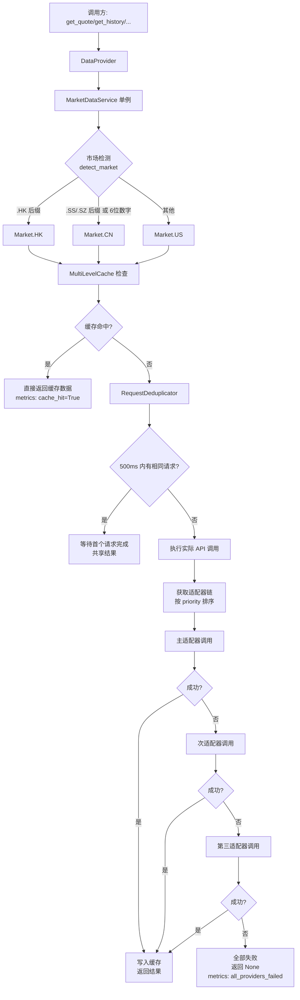
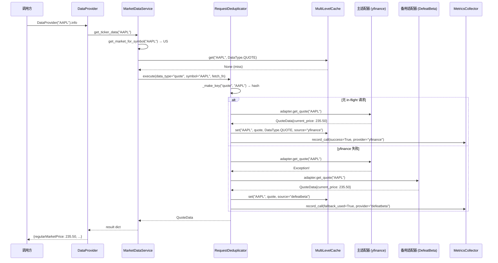

# 市场数据获取流程

> 本文档描述 MarketDataService 的多源 failover、缓存和去重机制。

## 1. 架构概述

市场数据获取采用三层架构：

```
调用方 (分析引擎/API)
    ↓
DataProvider (向后兼容 yf.Ticker 接口)
    ↓
MarketDataService (单例，中央入口)
    ├── RequestDeduplicator (500ms 去重)
    ├── MultiLevelCache (内存 LRU)
    └── Adapter 链 (多源 failover)
        ├── YFinanceAdapter
        ├── DefeatBetaAdapter
        ├── TigerAdapter
        ├── AlphaVantageAdapter
        └── TushareAdapter
```

## 2. 数据请求完整流程图



## 3. 时序图



## 4. Failover 适配器链

### 4.1 按市场的适配器优先级

| 市场 | 优先级 1 | 优先级 2 | 优先级 3 | 支持数据类型 |
|------|----------|----------|----------|-------------|
| US | yfinance | DefeatBeta | AlphaVantage | Quote, History, Fundamentals, Options, Earnings |
| HK | Tiger | yfinance | - | Quote, History, Options, Margin Rate |
| CN | Tushare | - | - | Quote, History, Fundamentals |

### 4.2 适配器选择逻辑

```python
def _get_providers_for_data_type(self, data_type, market, symbol):
    providers = []
    for name, adapter in self._adapters.items():
        config = self._configs.get(name)
        if not config or not config.enabled:
            continue
        if data_type not in adapter.supported_data_types:
            continue
        if market not in adapter.supported_markets:
            continue
        priority = config.priority
        if adapter.is_rate_limited():
            priority += 1000  # 降低优先级，但不排除
        providers.append((priority, adapter))
    providers.sort(key=lambda x: x[0])
    return [p[1] for p in providers]
```

### 4.3 市场检测规则

**文件**: `app/services/market_data/market_detector.py`

| 规则 | 示例 | 结果 |
|------|------|------|
| `.HK` 后缀 | `0700.HK` | Market.HK |
| `.SS` / `.SZ` / `.SH` 后缀 | `600519.SS` | Market.CN |
| 6 位数字, 前缀 `60/68` | `600519` | Market.CN (上海) |
| 6 位数字, 前缀 `00/30` | `000001` | Market.CN (深圳) |
| 其他 | `AAPL` | Market.US |

## 5. 缓存体系

### 5.1 MultiLevelCache

**文件**: `app/services/market_data/cache.py`

```
MultiLevelCache
    └── L1: LRUCache (内存)
        - max_size: 1000 entries
        - Thread-safe (threading.Lock)
        - TTL: 按 DataType 和 Provider 差异化
```

### 5.2 TTL 策略 (按数据类型)

| DataType | 说明 | 典型 TTL |
|----------|------|----------|
| QUOTE | 实时报价 | 较短 (秒级) |
| HISTORY | 历史 K 线 | 中等 (分钟级) |
| FUNDAMENTALS | 基本面 | 较长 (小时级) |
| INFO | 公司信息 | 较长 |
| OPTIONS_CHAIN | 期权链 | 中等 |
| OPTIONS_EXPIRATIONS | 到期日列表 | 较长 |
| EARNINGS | 财报数据 | 较长 |

### 5.3 缓存键格式

```
cache_key = f"{DataType.value}:{symbol.upper()}"
# 示例: "quote:AAPL", "history:AAPL:1mo:None:None"
```

## 6. 请求去重 (RequestDeduplicator)

**文件**: `app/services/market_data/deduplicator.py`

### 工作原理

1. 首个请求创建 `InFlightRequest`，执行实际 API 调用
2. 500ms 窗口内的相同请求等待首个请求的 `threading.Event`
3. 首个请求完成后，所有等待者共享同一结果

```python
class RequestDeduplicator:
    def __init__(self, window_ms=500):
        self._in_flight: Dict[str, InFlightRequest] = {}
        self._lock = threading.Lock()

    def execute(self, data_type, symbol, fetch_fn, timeout=30.0, **kwargs):
        key = self._make_key(data_type, symbol, **kwargs)
        # 1. 检查是否有 in-flight 请求
        # 2. 有 → 等待 Event
        # 3. 无 → 执行 fetch_fn，完成后通知所有等待者
```

### 去重统计

```python
stats = {
    "requests": 1000,      # 总请求数
    "deduplicated": 150,   # 被去重的请求数
    "api_calls": 850,      # 实际 API 调用数
}
```

## 7. Metrics 监控

`MetricsCollector` 记录每次数据获取的详细指标：

| 指标 | 说明 |
|------|------|
| `data_type` | 数据类型 |
| `symbol` | 股票代码 |
| `providers_tried` | 尝试过的适配器列表 |
| `provider_used` | 最终成功的适配器 |
| `latency_ms` | 总耗时 (ms) |
| `cache_hit` | 是否缓存命中 |
| `success` | 是否成功 |
| `fallback_used` | 是否使用了备用适配器 |
| `error_type` | 错误类型 (如果失败) |

## 8. DataProvider 向后兼容

**文件**: `app/services/data_provider.py`

`DataProvider` 提供与 `yf.Ticker()` 相同的接口:

```python
stock = DataProvider("AAPL")
stock.info           # → dict (quote + info + fundamentals)
stock.history()      # → DataFrame (OHLCV)
stock.options        # → tuple (expiration dates)
stock.option_chain() # → OptionChain(calls, puts)
stock.fast_info      # → dict (快速报价)
stock.get_margin_rate() # → float (保证金率)
```

所有调用最终委托给 `market_data_service` 单例。

## 9. 异常处理

| 场景 | 处理策略 |
|------|----------|
| 主适配器超时 | failover 到下一个适配器 |
| 所有适配器失败 | 返回 None，metrics 记录 `all_providers_failed` |
| Rate limit | 适配器 `priority += 1000` 降级，不完全排除 |
| 去重等待超时 (30s) | 抛出 `TimeoutError` |
| 缓存 LRU 满 | 淘汰最久未使用的条目 |

## 10. 相关文件

| 文件 | 说明 |
|------|------|
| `app/services/market_data/service.py` | `MarketDataService` 单例 (中央入口) |
| `app/services/market_data/cache.py` | `MultiLevelCache`, `LRUCache` |
| `app/services/market_data/deduplicator.py` | `RequestDeduplicator` |
| `app/services/market_data/market_detector.py` | 市场检测 + symbol 标准化 |
| `app/services/market_data/interfaces.py` | `DataType`, `Market`, 数据结构定义 |
| `app/services/market_data/config.py` | 适配器优先级、TTL 配置 |
| `app/services/market_data/metrics.py` | `MetricsCollector` 指标采集 |
| `app/services/market_data/adapters/` | 各数据源适配器实现 |
| `app/services/data_provider.py` | `DataProvider` (向后兼容 facade) |
