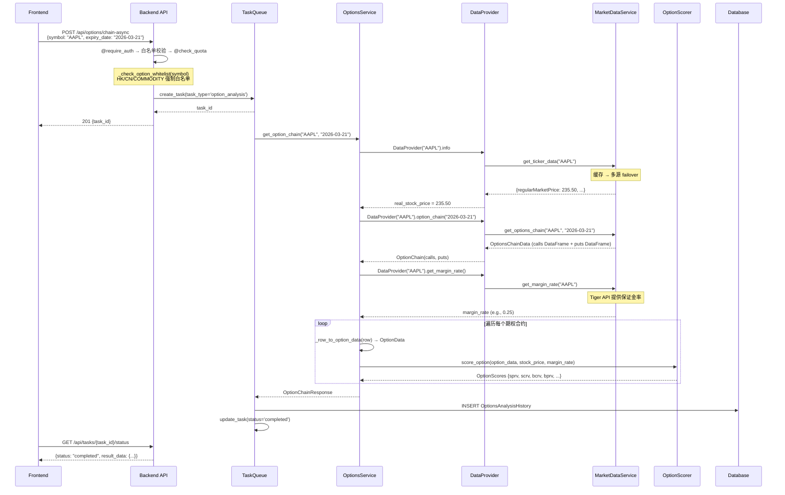
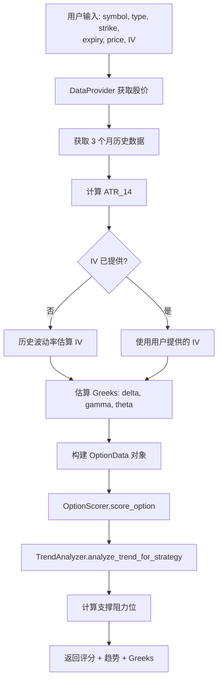
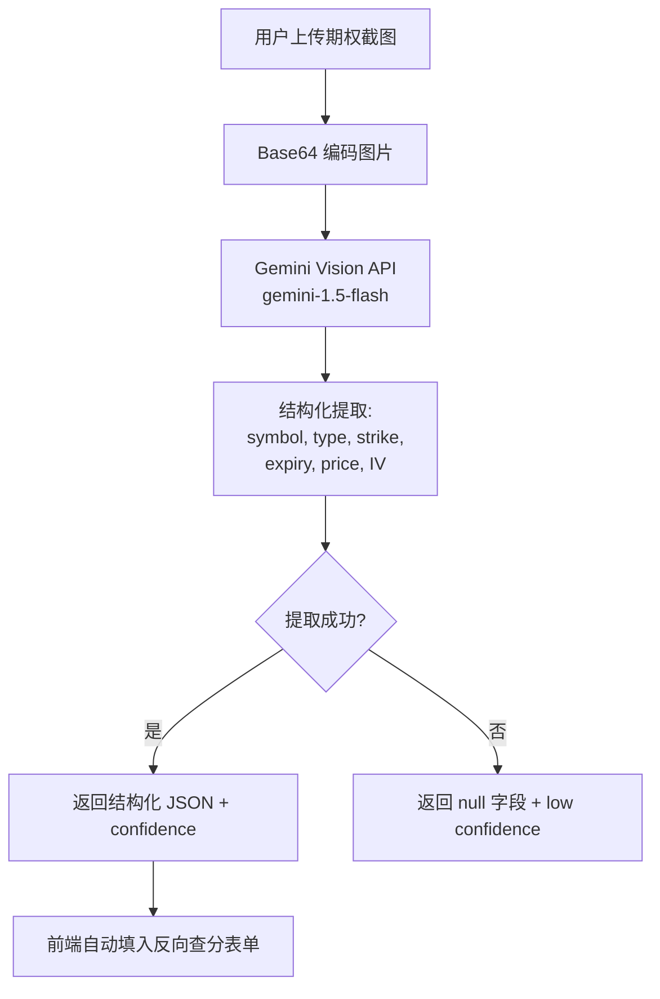

# 期权分析业务流程

> 本文档描述期权链分析、Enhanced 分析、反向查分和截图识别的完整业务流程。

## 1. 流程概述

期权分析模块提供 4 类服务：

| 端点 | 功能 | 模式 |
|------|------|------|
| `POST /api/options/chain-async` | 期权链分析 (4 策略评分) | 异步 |
| `POST /api/options/enhanced-async` | 增强分析 (VRP + Risk Adjuster) | 异步 |
| `POST /api/options/reverse-score` | 反向查分 (用户输入参数评分) | 同步 |
| `POST /api/options/recognize-image` | 截图识别 (Gemini Vision) | 同步 |

## 2. 期权链分析流程图

```mermaid
flowchart TD
    A[POST /api/options/chain-async] --> B{@require_auth}
    B -->|401| Z1[认证失败]
    B -->|通过| B2{白名单校验}
    B2 -->|400 不在白名单| Z3[白名单校验失败]
    B2 -->|通过| C{@check_quota}
    C -->|402| Z2[额度不足]
    C -->|通过| D[创建 AnalysisTask]

    D --> E[TaskQueue Worker 执行]
    E --> F[OptionsService.get_option_chain]

    F --> F1[DataProvider 获取标的价格]
    F1 --> F2[DataProvider 获取期权链数据]
    F2 --> F3[DataProvider 获取 margin_rate]

    F3 --> G{数据获取成功?}
    G -->|失败| G1[MockDataGenerator fallback]
    G -->|成功| H[遍历 calls + puts]

    H --> I[OptionScorer.score_option]
    I --> I1[SPRV - Sell Put 稳健价值]
    I --> I2[SCRV - Sell Call 稳健价值]
    I --> I3[BCRV - Buy Call 风险价值]
    I --> I4[BPRV - Buy Put 风险价值]

    I1 --> J[风险标签 + 排序]
    I2 --> J
    I3 --> J
    I4 --> J

    J --> K[构建 OptionChainResponse]
    K --> L[存储 OptionsAnalysisHistory]
    L --> M[返回结果]
```

## 3. 期权链分析时序图



## 4. 四策略评分体系

`OptionScorer` 对每个期权合约计算 4 种策略评分：

| 策略 | 缩写 | 说明 | 核心因子 |
|------|------|------|----------|
| Sell Put | SPRV | 卖 Put 稳健收益 | IV rank, 距行权价距离, 年化收益率, 流动性 |
| Sell Call | SCRV | 卖 Call 稳健收益 | IV rank, OTM 程度, 时间衰减, 流动性 |
| Buy Call | BCRV | 买 Call 杠杆做多 | Delta, IV percentile, 盈亏比, 流动性 |
| Buy Put | BPRV | 买 Put 对冲保护 | Delta, IV percentile, 保护成本, 流动性 |

每个评分 0-100 分，附带风险标签和颜色编码：
- **70+**: 低风险 (绿色 `#10B981`)
- **50-69**: 中等风险 (黄色 `#F59E0B`)
- **<50**: 高风险 (红色 `#EF4444`)

## 5. Enhanced 分析流程

`POST /api/options/enhanced-async` 在基础链分析之上增加：

### 5.1 VRP (Volatility Risk Premium) 计算

**文件**: `app/services/phase1/vrp_calculator.py`

```
1. 获取 3 个月历史价格 → DataProvider.history(period='3mo')
2. 计算历史波动率 (HV): log returns → std × sqrt(252)
3. 获取隐含波动率 (IV): 从期权链数据
4. VRP = IV - HV_forecast
5. 计算 IV Rank 和 IV Percentile
6. 输出: VRPResult {vrp, iv, rv_forecast, iv_rank, iv_percentile, recommendation}
```

### 5.2 Risk Adjuster 风险调整

**文件**: `app/services/phase1/risk_adjuster.py`

- 对 VRP 结果进行风险调整
- 输出: `RiskAnalysis {risk_level, risk_factors, adjusted_scores}`
- 风险等级: `LOW / MEDIUM / HIGH / EXTREME`

## 6. 反向查分流程 (Reverse Score)

`POST /api/options/reverse-score` -- 同步返回



### 反向查分返回结构

```json
{
  "success": true,
  "symbol": "AAPL",
  "total_score": 72.5,
  "stock_data": {"current_price", "atr_14", "trend", "support_resistance"},
  "estimated_greeks": {"delta", "gamma", "theta"},
  "scores": {
    "sell_put": {"score": 72.5, "risk_level": "low", "breakdown": {...}},
    "buy_put": {"score": 45.0, "risk_level": "medium", ...}
  },
  "trend_info": {"trend": "uptrend", "trend_strength": 0.78}
}
```

## 7. 截图识别流程 (Image Recognition)

`POST /api/options/recognize-image` -- 同步返回

**文件**: `app/services/image_recognition_service.py`



### Gemini Vision 提取字段

| 字段 | 类型 | 说明 |
|------|------|------|
| `symbol` | string | 股票代码 |
| `option_type` | string | CALL / PUT |
| `strike` | float | 执行价 |
| `expiry_date` | string | 到期日 (YYYY-MM-DD) |
| `option_price` | float | 期权价格 |
| `implied_volatility` | float | 隐含波动率 (小数形式) |
| `confidence` | string | high / medium / low |

## 7.1 商品期货合约查询流程 (2026-02-09 新增)

`GET /api/options/commodity/contracts/<product>` -- 同步返回

```mermaid
flowchart TD
    A[GET /commodity/contracts/au] --> B{@require_auth}
    B -->|401| Z1[认证失败]
    B -->|通过| C{品种验证}
    C -->|400 不支持| Z2[返回 supported 列表]
    C -->|通过| D[AkShareCommodityAdapter]
    D --> E[akshare.option_commodity_contract_sina]
    E --> F{数据获取成功?}
    F -->|失败| Z3[500 数据源异常]
    F -->|成功| G[按持仓量排序]
    G --> H[返回 contracts + dominant_contract + multiplier]
```

支持品种: `au`(黄金), `ag`(白银), `cu`(沪铜), `al`(沪铝), `m`(豆粕)。

---

## 8. 异常处理

| 场景 | HTTP Status | 处理策略 |
|------|-------------|----------|
| Symbol 不在白名单 | 400 | `_check_option_whitelist()` 返回白名单列表 |
| Symbol 无效 | 400 | 前端验证 + 后端校验 |
| 期权链数据获取失败 | 200 | `MockDataGenerator` fallback（标记 data_source="mock"）|
| 额度不足 | 402 | `@check_quota` 返回扣减失败信息 |
| VRP 计算数据不足 (<30 天) | 200 | 返回 `vrp_result=None`，不影响基础评分 |
| Gemini Vision 调用失败 | 500 | 返回识别失败，提示手动输入 |
| Phase 1 模块未安装 | 200 | `PHASE1_AVAILABLE=False`，Enhanced 分析返回 `available=False` |

## 9. 相关文件

| 文件 | 说明 |
|------|------|
| `app/services/options_service.py` | `OptionsService` 核心服务 |
| `app/services/option_scorer.py` | `OptionScorer` 四策略评分 |
| `app/services/option_models.py` | `OptionData`, `OptionChainResponse` 等数据模型 |
| `app/services/phase1/vrp_calculator.py` | VRP 波动率风险溢价计算 |
| `app/services/phase1/risk_adjuster.py` | 风险调整器 |
| `app/services/image_recognition_service.py` | Gemini Vision 截图识别 |
| `app/analysis/options_analysis/scoring/` | 各策略评分实现 (buy_call, buy_put 等) |
| `app/analysis/options_analysis/option_market_config.py` | 多市场参数配置 (US/HK/CN/COMMODITY) |
| `app/analysis/options_analysis/advanced/delivery_risk.py` | 商品期权交割风险评估 |
| `app/services/market_data/adapters/akshare_commodity_adapter.py` | 商品期权数据适配器 |
| `app/services/data_provider.py` | 统一数据访问层 |
