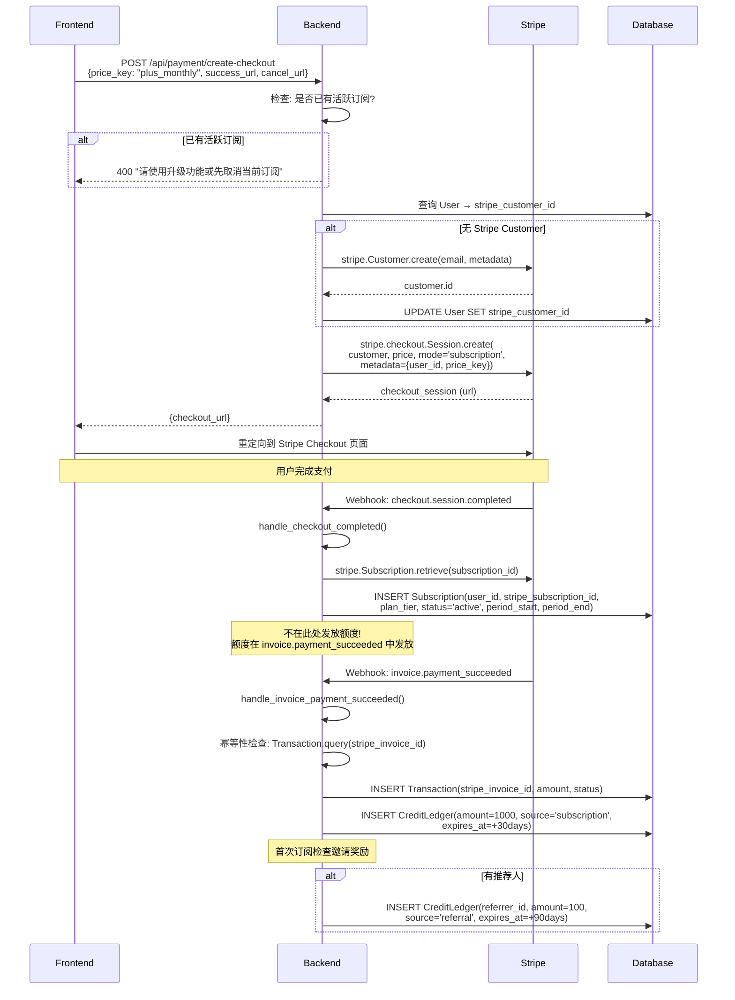
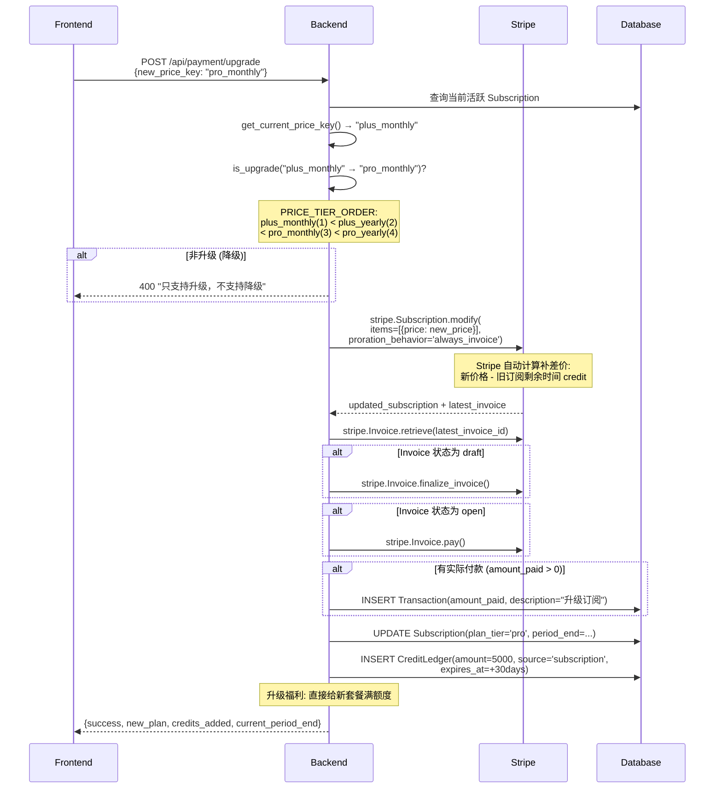
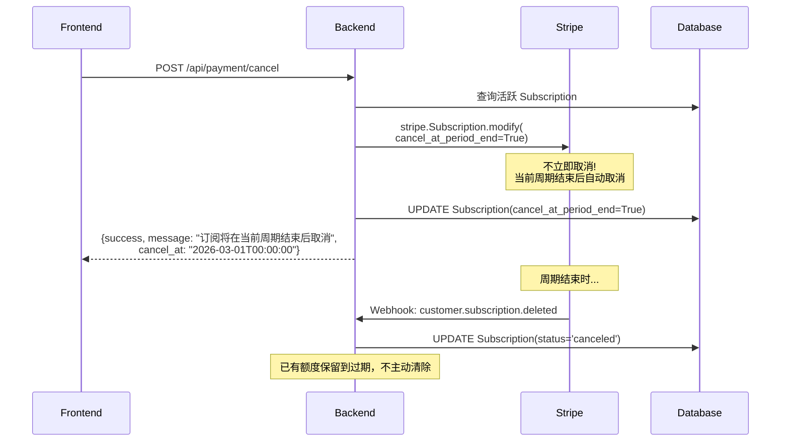
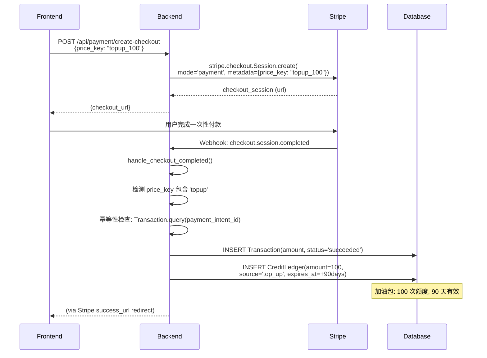
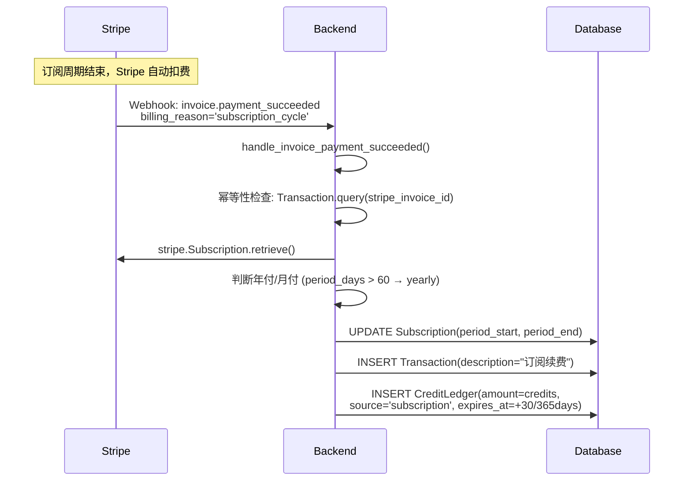

# 支付与订阅业务流程

> 本文档描述 Stripe 支付集成的完整业务流程，包括订阅、升级、取消和加油包购买。

## 1. 流程概述

系统使用 **Stripe** 作为支付网关，支持以下操作：

| 操作 | 入口 | Stripe 模式 |
|------|------|-------------|
| 新订阅 | `create_checkout_session` | Checkout Session (subscription) |
| 升级订阅 | `upgrade_subscription` | Subscription.modify (proration) |
| 取消订阅 | `cancel_subscription` | cancel_at_period_end=True |
| 加油包充值 | `create_checkout_session` | Checkout Session (payment) |

### 套餐配置

| 计划 | 月额度 | 年额度 |
|------|--------|--------|
| Plus | 1,000 次 | 12,000 次 |
| Pro | 5,000 次 | 60,000 次 |
| Top-up 加油包 | 100 次 (90 天有效) | - |

## 2. 新订阅流程

## 3. 订阅升级流程

## 4. 取消订阅流程

## 5. 加油包 (Top-up) 流程

## 6. 续费流程 (自动)

## 7. 幂等性设计

所有 webhook 处理都实现了幂等性，防止 Stripe 重复推送导致额度重复发放：

| Webhook | 幂等键 | 检查方式 |
|---------|--------|----------|
| checkout.session.completed (topup) | `payment_intent_id` | `Transaction.query(stripe_payment_intent_id)` |
| invoice.payment_succeeded | `invoice_id` | `Transaction.query(stripe_invoice_id)` |
| upgrade (invoice) | `payment_intent_id` | 升级方法内部处理，不经过 webhook |

**关键**: `invoice.payment_succeeded` 中 `billing_reason='subscription_update'` 的发票会被跳过，
因为升级逻辑在 `upgrade_subscription` 方法中已经完成了额度发放。

## 8. 异常处理

| 场景 | 处理策略 |
|------|----------|
| Stripe API Key 未配置 | 返回 "Stripe未配置" 错误 |
| 重复 checkout session | 幂等性检查，返回 "已处理" |
| Stripe Card Error | 记录日志，Invoice 保持 open 状态 |
| Webhook 顺序颠倒 | `invoice.payment_succeeded` 可以独立创建 Subscription |
| DB 写入失败 | `db.session.rollback()` 回滚 |
| 升级降级 | `is_upgrade()` 检查 `PRICE_TIER_ORDER`，降级返回错误 |

## 9. 相关文件

| 文件 | 说明 |
|------|------|
| `app/services/payment_service.py` | `PaymentService` 完整支付逻辑 |
| `app/models.py` | `Subscription`, `Transaction`, `CreditLedger` 模型 |
| `app/api/payment.py` | 支付 API 端点 |
| `app/config.py` | Stripe 环境变量配置 |
