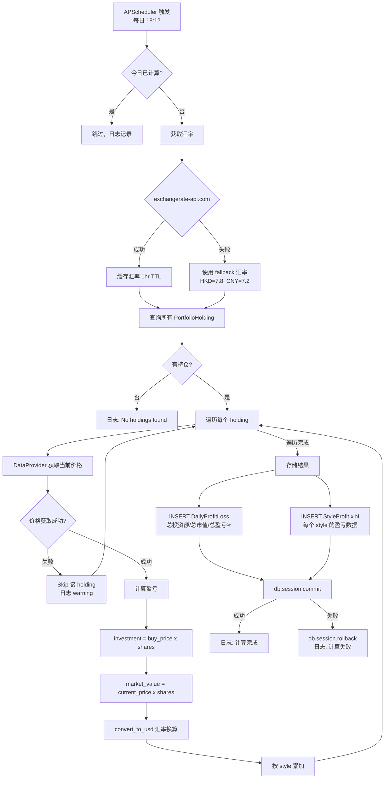
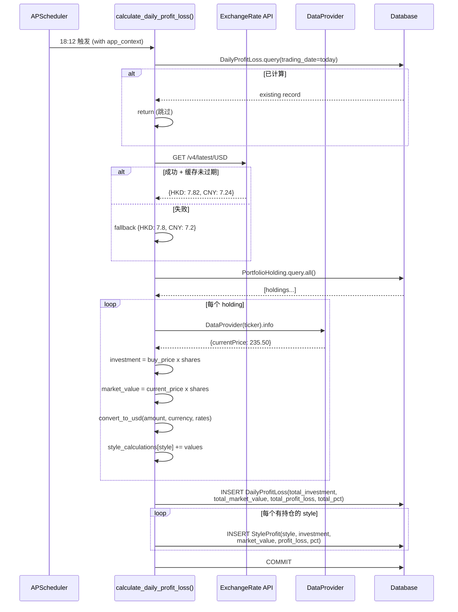

# 持仓每日盈亏计算流程

> 本文档描述 APScheduler 定时触发的每日持仓盈亏计算全流程。

## 1. 流程概述

系统每日自动计算投资组合的盈亏数据，包括：

- 总投资额 vs 总市值
- 按投资风格 (quality / value / growth / momentum) 分类汇总
- 多币种 (USD / HKD / CNY) 统一换算为 USD

**触发时间**: 每日 18:12 (APScheduler cron trigger)

## 2. 流程图



## 3. 时序图



## 4. 核心组件

### 4.1 Scheduler 初始化

**文件**: `app/scheduler.py`

```python
scheduler = BackgroundScheduler(daemon=True)
scheduler.add_job(
    func=lambda: run_with_app_context(app, calculate_daily_profit_loss),
    trigger='cron',
    hour=18, minute=12,
    id='daily_profit_loss_calculation',
    replace_existing=True
)
```

### 4.2 汇率获取

- **数据源**: `https://api.exchangerate-api.com/v4/latest/USD` (免费 tier)
- **缓存**: 内存变量 `exchange_rates_cache`，TTL 1 小时
- **Fallback 汇率**: `USD_TO_HKD=7.8`, `USD_TO_CNY=7.2`

```python
def convert_to_usd(amount, currency, rates):
    if currency == 'USD': return amount
    elif currency == 'HKD': return amount * rates['HKD_TO_USD']
    elif currency == 'CNY': return amount * rates['CNY_TO_USD']
    else: return amount  # 未知货币当 USD 处理
```

### 4.3 投资风格分类

4 种风格独立计算盈亏：

| 风格 | 说明 |
|------|------|
| quality | 优质股 (高 ROE, 稳定增长) |
| value | 价值股 (低 PE/PB, 高股息) |
| growth | 成长股 (高收入增长率) |
| momentum | 动量股 (强趋势) |

### 4.4 数据模型

```python
class DailyProfitLoss(db.Model):
    trading_date         # Date
    total_actual_investment   # Float (USD)
    total_market_value        # Float (USD)
    total_profit_loss         # Float (USD)
    total_profit_loss_percent # Float (%)
    user_id                   # String (nullable, 公共数据为 None)

class StyleProfit(db.Model):
    trading_date         # Date
    style                # String (quality/value/growth/momentum)
    style_investment     # Float (USD)
    style_market_value   # Float (USD)
    style_profit_loss    # Float (USD)
    style_profit_loss_percent # Float (%)
```

## 5. 异常处理

| 场景 | 处理策略 |
|------|----------|
| 汇率 API 超时/失败 | fallback 固定汇率 (HKD=7.8, CNY=7.2) |
| 个股价格获取失败 | skip 该 holding，日志 warning，不影响其他持仓 |
| 无持仓数据 | 日志 warning，直接 return |
| 今日已计算 | 日志 info，直接 return (幂等) |
| DB 写入失败 | `db.session.rollback()`，raise 异常 |

## 6. 其他定时任务

| 任务 | 时间 | 函数 |
|------|------|------|
| 每日盈亏计算 | 18:12 | `calculate_daily_profit_loss()` |
| 飞书运营日报 | 20:00 | `_send_feishu_report()` |

## 7. 相关文件

| 文件 | 说明 |
|------|------|
| `app/scheduler.py` | 定时任务调度 + `calculate_daily_profit_loss()` |
| `app/models.py` | `PortfolioHolding`, `DailyProfitLoss`, `StyleProfit` |
| `app/api/portfolio.py` | 持仓管理 API (查询/更新) |
| `app/services/data_provider.py` | `DataProvider` 获取股价 |
