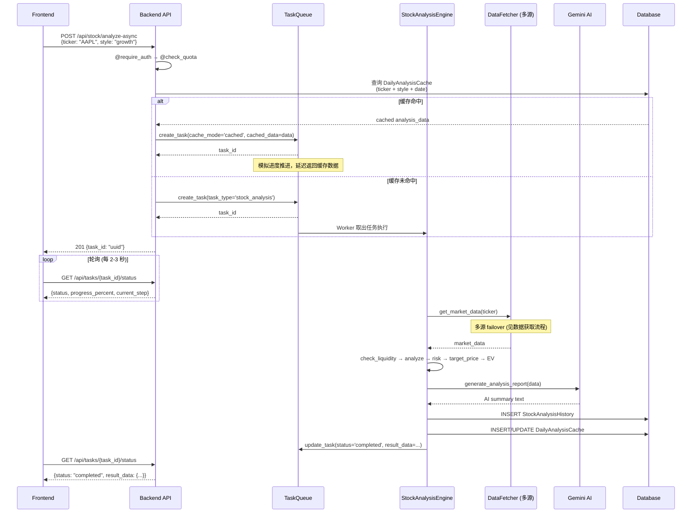

# 股票分析业务流程

> 本文档描述从用户发起股票分析请求到返回完整分析报告的全链路流程。

## 1. 流程概述

股票分析支持 **同步** 和 **异步** 两种模式：

- **同步模式**: `POST /api/stock/analyze` -- 直接返回分析结果
- **异步模式**: `POST /api/stock/analyze-async` -- 返回 task_id，通过 `GET /api/tasks/{id}/status` 轮询

两种模式共享相同的分析引擎和缓存层。

## 2. 全链路流程图

```mermaid
flowchart TD
    A[用户请求 POST /api/stock/analyze] --> B{@require_auth}
    B -->|401| Z1[返回认证错误]
    B -->|通过| C{@check_quota}
    C -->|402 额度不足| Z2[返回额度不足]
    C -->|通过| D{DailyAnalysisCache 查询}

    D -->|缓存命中| E[直接返回缓存数据]
    D -->|缓存未命中| F[创建 AnalysisTask]

    F --> G[TaskQueue 分配 Worker]
    G --> H[StockAnalysisEngine.analyze_stock]

    H --> H1[DataFetcher.get_market_data]
    H1 --> H2[Calculator.check_liquidity]
    H2 --> H3[BasicAnalysisStrategy.analyze]
    H3 --> H4[analyze_risk_and_position]
    H4 --> H5[calculate_target_price]
    H5 --> H6[EV Model 期望值计算]
    H6 --> H7[AI Report 生成 - Gemini]

    H7 --> I[存储结果]
    I --> I1[StockAnalysisHistory]
    I --> I2[DailyAnalysisCache]

    I1 --> J[返回完整分析结果]
    I2 --> J
```

## 3. 异步模式时序图



## 4. 核心组件详解

### 4.1 缓存层 - DailyAnalysisCache

**缓存键**: `(ticker, style, analysis_date)` 唯一约束

```python
class DailyAnalysisCache(db.Model):
    ticker = db.Column(db.String(20), nullable=False)
    style = db.Column(db.String(50), nullable=False)
    analysis_date = db.Column(db.Date, nullable=False)
    full_analysis_data = db.Column(db.JSON, nullable=False)
    source_task_id = db.Column(db.String(36), nullable=True)
```

**设计意图**: 同一只股票同一种风格每天只需分析一次。当多个用户查询相同 ticker+style 时，
第二个及后续请求直接命中缓存，通过 `cache_mode='cached'` 模拟假进度后返回。

### 4.2 分析引擎 - StockAnalysisEngine

**文件**: `app/analysis/stock_analysis/core/engine.py`

```python
class StockAnalysisEngine:
    def analyze_stock(self, ticker, style='growth', **kwargs):
        # 1. 获取市场数据 → DataFetcher
        # 2. 流动性检查 → Calculator.check_liquidity
        # 3. 基础分析 → BasicAnalysisStrategy.analyze
        # 4. 整合结果 → {success, ticker, market_data, liquidity_analysis, ...}
```

### 4.3 完整分析管线 (analysis_engine.py)

| 步骤 | 组件 | 进度 | 说明 |
|------|------|------|------|
| 1 | DataFetcher | 10% | 获取市场数据 (价格、基本面、历史数据) |
| 2 | check_liquidity | 20% | 流动性检查 (日均成交额门槛) |
| 3 | BasicAnalysisStrategy | 35% | 基础分析 (技术+基本面指标) |
| 4 | analyze_risk_and_position | 50% | 风险分析 + 仓位建议 |
| 5 | calculate_target_price | 65% | 目标价计算 (ATR, PEG 模型) |
| 6 | EV Model | 75% | 期望值模型 (概率加权回报) |
| 7 | AI Report (Gemini) | 90% | AI 生成分析摘要 |
| 8 | 存储 + 返回 | 100% | 写入 History + Cache |

### 4.4 数据获取 Failover 链

通过 `DataFetcher` -> `DataProvider` -> `MarketDataService` 多层抽象:

| 市场 | 主数据源 | 备用数据源 1 | 备用数据源 2 |
|------|----------|-------------|-------------|
| US (美股) | yfinance | DefeatBeta | AlphaVantage |
| HK (港股) | Tiger | yfinance | - |
| CN (A股) | Tushare | AkShare | - |

### 4.5 分析风格

系统支持 4 种分析风格，影响目标价和风险评估参数：

- **growth** (成长): 侧重收入增长率、PEG 比率
- **value** (价值): 侧重 PE、PB、股息率
- **quality** (优质): 侧重 ROE、利润率稳定性
- **momentum** (动量): 侧重趋势强度、相对强弱

## 5. 异常处理

| 场景 | HTTP Status | 处理策略 |
|------|-------------|----------|
| Ticker 格式无效 | 400 | 前端验证 + 后端校验 |
| Ticker 不存在/数据获取失败 | 503 | DataFetcher 多源 failover，全失败后返回错误 |
| 额度不足 | 402 | `@check_quota` 装饰器检查，返回 `额度不足，请充值或升级套餐` |
| Gemini AI 不可用 | - | 降级为无 AI 摘要的 fallback 报告，分析仍然完成 |
| 流动性不足 | 200 | 正常返回结果，但 `is_liquid=False` 附带警告 |
| Task Worker 异常 | 500 | 任务状态标记为 `failed`，记录 error_message |

## 6. 任务状态机

```
PENDING → PROCESSING → COMPLETED
                    ↘ FAILED
```

- **PENDING**: 任务已创建，在队列中等待
- **PROCESSING**: Worker 已取出，正在执行分析
- **COMPLETED**: 分析完成，result_data 可用
- **FAILED**: 分析失败，error_message 记录原因

## 7. TaskQueue 配置

- **Worker 数量**: `max_workers=3` (后台线程)
- **优先级**: `priority` 字段 (数值越小优先级越高，默认 100)
- **去重**: 同一 ticker+style+date 的缓存命中任务使用 `cache_mode` 避免重复分析

## 8. 相关文件

| 文件 | 说明 |
|------|------|
| `app/analysis/stock_analysis/core/engine.py` | `StockAnalysisEngine` 核心引擎 |
| `app/analysis/stock_analysis/core/data_fetcher.py` | 数据获取层 |
| `app/analysis/stock_analysis/core/calculator.py` | 计算器 (流动性、目标价等) |
| `app/analysis/stock_analysis/strategies/basic.py` | 基础分析策略 |
| `app/services/analysis_engine.py` | 完整分析管线 (整合所有步骤) |
| `app/services/task_queue.py` | `TaskQueue` 异步任务管理 |
| `app/services/ai_service.py` | Gemini AI 报告生成 |
| `app/services/ev_model.py` | EV 期望值模型 |
| `app/services/data_provider.py` | `DataProvider` 统一数据访问 |
| `app/models.py` | `DailyAnalysisCache`, `StockAnalysisHistory`, `AnalysisTask` |
