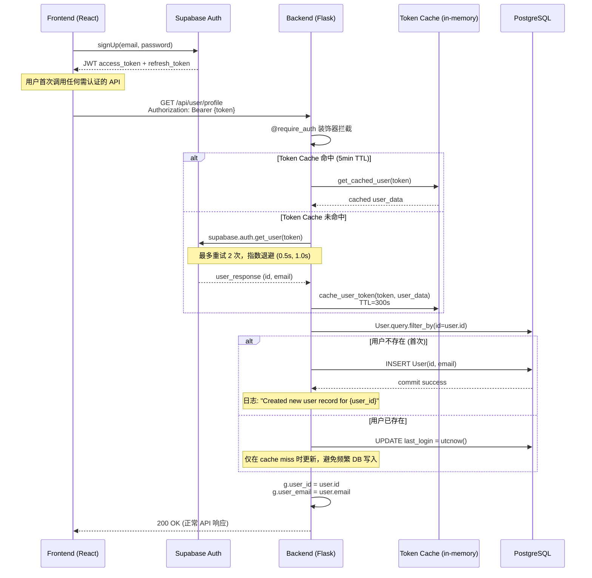

# 用户注册与认证流程

> 本文档描述从 Supabase Auth 注册到本地 User 自动创建的完整业务流程。

## 1. 流程概述

系统采用 **Supabase Auth + 本地 User 懒创建** 的双层架构：

1. 用户在前端通过 Supabase Auth SDK 完成注册/登录
2. 前端获取 JWT access_token
3. 首次调用后端 API 时，`@require_auth` 装饰器验证 token 并自动创建本地 User 记录

核心设计原则：**后端不负责注册逻辑，仅通过 token 验证被动同步用户**。

## 2. 时序图



## 3. 关键组件

### 3.1 `@require_auth` 装饰器

**文件**: `app/utils/auth.py`

- 从 `Authorization: Bearer {token}` 提取 token
- 先查 in-memory token_cache（TTL 300 秒）
- Cache miss 时调用 `supabase.auth.get_user(token)` 验证
- 验证成功后检查本地 User 表，不存在则 lazy create
- 将 `user_id` 和 `user_email` 存入 Flask `g` 对象

### 3.2 Token Cache

- 实现: Python dict `{token: {'user_data': user_obj, 'expires_at': timestamp}}`
- TTL: `CACHE_DURATION = 300` (5 分钟)
- 清理: 每 50 次调用触发一次 `clean_expired_tokens()`
- 支持手动失效: `invalidate_token_cache(token=None)`

### 3.3 本地 User Model

**文件**: `app/models.py`

```python
class User(db.Model):
    id = db.Column(db.String(36), primary_key=True)  # Supabase UUID
    email = db.Column(db.String(120), unique=True, nullable=False, index=True)
    username = db.Column(db.String(80), nullable=True)
    stripe_customer_id = db.Column(db.String(255), index=True, nullable=True)
    referrer_id = db.Column(db.String(36), ForeignKey('user.id'), nullable=True)
    created_at = db.Column(db.DateTime, default=datetime.utcnow)
    last_login = db.Column(db.DateTime, nullable=True)
```

## 4. 异常处理

| 场景 | HTTP Status | 处理策略 |
|------|-------------|----------|
| Authorization header 缺失 | 401 | 直接返回 `Missing Authorization header` |
| Token 格式错误 (无 Bearer) | 401 | 返回 `Invalid Authorization header format` |
| Supabase client 未初始化 | 500 | 返回 `Supabase client not initialized` |
| Token 无效/过期 | 401 | 返回 `Invalid token` |
| Supabase 网络/SSL/超时错误 | 503 | 重试 2 次 (指数退避) 后返回 `Authentication service temporarily unavailable` |
| 本地 DB 创建用户失败 | 401 | 捕获异常，返回 `Unauthorized` |

### 4.1 Supabase Auth 重试逻辑

```python
max_retries = 2
retry_delay = 0.5

for attempt in range(max_retries + 1):
    try:
        user_response = supabase.auth.get_user(token)
        break
    except Exception as e:
        if attempt < max_retries:
            time.sleep(retry_delay * (attempt + 1))  # 指数退避
        else:
            # SSL/timeout/connection → 503
            # 其他错误 → 401
```

## 5. 设计决策

### 为什么不在后端实现注册？

- Supabase Auth 提供完整的邮箱验证、OAuth、密码重置等能力
- 后端只需关注业务逻辑，减少安全攻击面
- 用户管理页面由 Supabase Dashboard 提供

### 为什么用 lazy creation 而非 webhook？

- Supabase webhook 有延迟且需要额外端点维护
- 首次 API 调用时创建，保证用户一定是活跃用户
- 简化部署：无需额外 webhook 基础设施

### 为什么需要 Token Cache？

- Supabase Auth API 调用有网络延迟 (~100-300ms)
- 高频请求场景下避免重复验证
- 5 分钟 TTL 平衡安全性与性能

## 6. 相关文件

| 文件 | 说明 |
|------|------|
| `app/utils/auth.py` | `@require_auth` 装饰器、token cache、辅助函数 |
| `app/models.py` | `User` model 定义 |
| `app/api/user.py` | 用户 profile API 端点 |
| `app/config.py` | `SUPABASE_URL` / `SUPABASE_KEY` 配置 |
