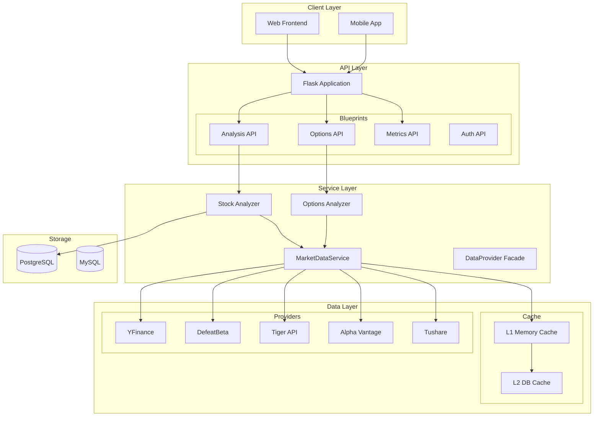
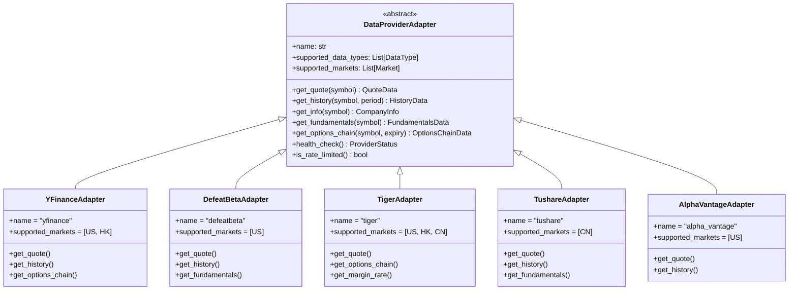
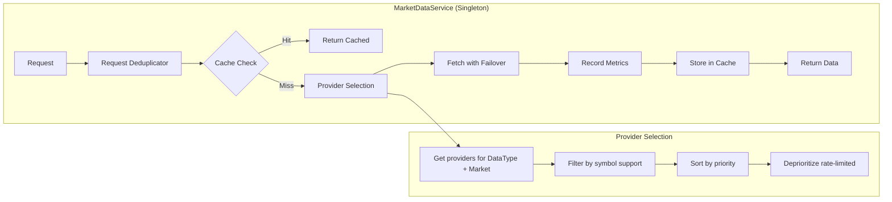
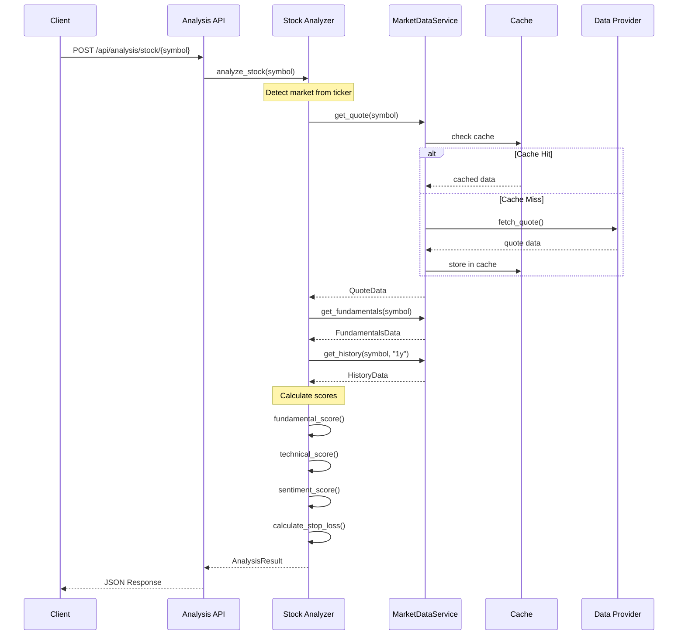
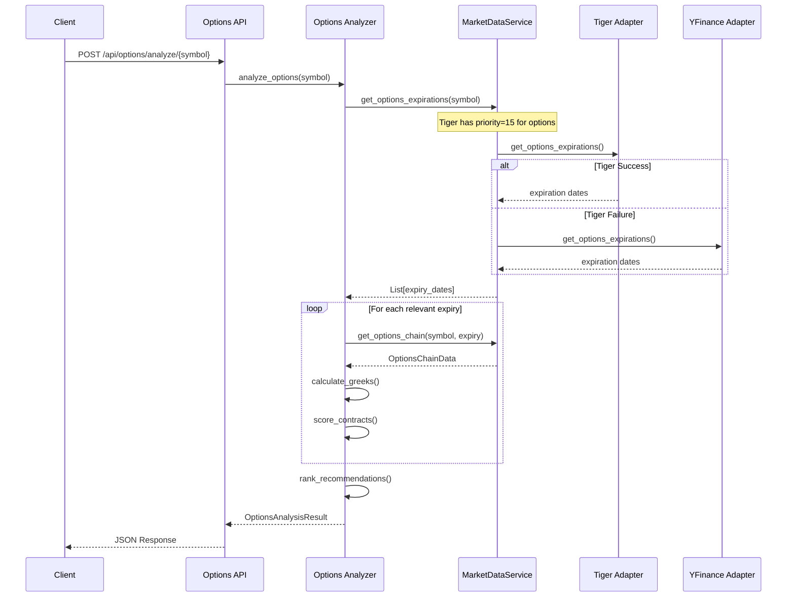
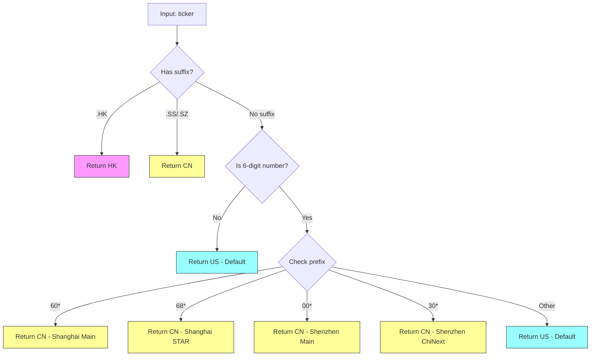
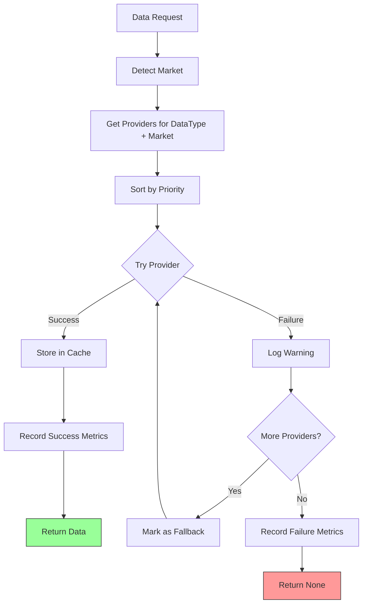
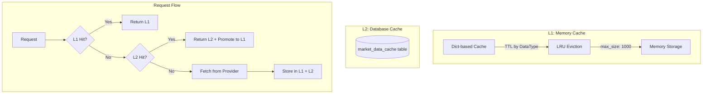

# AlphaGBM Backend Architecture Document

> Version: 1.0
> Last Updated: 2026-02-02
> Author: System Architecture Analysis

---

## Table of Contents

1. [System Overview](#1-system-overview)
2. [Architecture Diagrams](#2-architecture-diagrams)
3. [Business Flow Diagrams](#3-business-flow-diagrams)
4. [Component Details](#4-component-details)
5. [Data Provider Architecture](#5-data-provider-architecture)
6. [Multi-Market Support](#6-multi-market-support)
7. [Caching & Performance](#7-caching--performance)
8. [Metrics & Monitoring](#8-metrics--monitoring)
9. [Identified Issues](#9-identified-issues)
10. [Recommendations](#10-recommendations)
11. [API Reference](#11-api-reference)

---

## 1. System Overview

### 1.1 Technology Stack

| Layer | Technology |
|-------|------------|
| Web Framework | Flask 3.0 |
| Database | PostgreSQL (Supabase), MySQL (PyMySQL) |
| Cache | In-memory (dict-based), L2 Database |
| Data Sources | YFinance, DefeatBeta, Tiger API, Alpha Vantage, Tushare |
| Task Scheduler | APScheduler |
| AI Integration | Google Generative AI |
| Payment | Stripe |

### 1.2 Directory Structure

```
backend/
├── app/
│   ├── __init__.py              # Flask app factory
│   ├── constants.py             # System configuration parameters (God Object)
│   ├── api/                     # API Blueprint endpoints
│   │   ├── analysis.py          # /api/analysis/* endpoints
│   │   ├── options.py           # /api/options/* endpoints
│   │   ├── metrics.py           # /api/metrics/* endpoints
│   │   └── ...
│   ├── analysis/                # Analysis modules
│   │   ├── stock_analysis/      # Stock valuation & scoring
│   │   │   ├── core/            # Core analysis logic
│   │   │   ├── data/            # Data fetching layer
│   │   │   ├── strategies/      # Investment strategies
│   │   │   └── tests/           # Unit tests
│   │   └── options_analysis/    # Options analysis
│   │       ├── core/            # Core options logic
│   │       ├── advanced/        # Advanced strategies
│   │       └── scoring/         # Options scoring
│   ├── services/                # Service layer
│   │   ├── market_data/         # Unified data access layer
│   │   │   ├── service.py       # MarketDataService (singleton)
│   │   │   ├── interfaces.py    # Abstract interfaces
│   │   │   ├── config.py        # Provider configurations
│   │   │   ├── cache.py         # Multi-level cache
│   │   │   ├── metrics.py       # Metrics collection
│   │   │   └── adapters/        # Provider adapters
│   │   ├── data_provider.py     # Legacy DataProvider facade
│   │   └── tiger_client.py      # Tiger API client (duplicate #1)
│   ├── utils/                   # Utility functions
│   └── docs/                    # Documentation
├── requirements.txt
└── run.py                       # Application entry point
```

---

## 2. Architecture Diagrams

### 2.1 High-Level System Architecture



### 2.2 Data Provider Architecture (Adapter Pattern)



### 2.3 MarketDataService Architecture



---

## 3. Business Flow Diagrams

### 3.1 Stock Analysis Flow



### 3.2 Options Analysis Flow



### 3.3 Market Detection Flow



### 3.4 Provider Failover Flow



---

## 4. Component Details

### 4.1 Analysis Layer

#### Stock Analysis (`app/analysis/stock_analysis/`)

| Module | Purpose |
|--------|---------|
| `core/stock_valuation.py` | Core valuation models (DCF, relative) |
| `core/risk_scoring.py` | Risk assessment and scoring |
| `core/sentiment_scoring.py` | Market sentiment analysis |
| `core/stop_loss_calculator.py` | ATR-based stop loss calculation |
| `core/sector_rotation.py` | Sector rotation analysis |
| `core/capital_structure.py` | Capital structure analysis |
| `data/data_fetcher.py` | Data fetching (uses DataProvider) |
| `strategies/` | Investment strategy implementations |

#### Options Analysis (`app/analysis/options_analysis/`)

| Module | Purpose |
|--------|---------|
| `core/data_fetcher.py` | Options data fetching (has duplicate Tiger client) |
| `core/greeks_calculator.py` | Greeks calculation (Delta, Gamma, Theta, Vega) |
| `core/recommendation_engine.py` | Options recommendation logic |
| `advanced/` | Advanced options strategies |
| `scoring/` | Options contract scoring |

### 4.2 Service Layer

#### MarketDataService (`app/services/market_data/service.py`)

**Singleton pattern** providing unified data access:

```python
from app.services.market_data import market_data_service

# Get quote
quote = market_data_service.get_quote("AAPL")

# Get history
history = market_data_service.get_history("AAPL", period="1mo")

# Get options chain
chain = market_data_service.get_options_chain("AAPL", "2026-03-21")
```

**Features:**
- Multi-provider support with automatic failover
- Request deduplication (500ms window)
- Multi-level caching (L1 memory + L2 database)
- Per-provider health monitoring
- Detailed metrics collection

#### DataProvider Facade (`app/services/data_provider.py`)

**Backward-compatible facade** for legacy code:

```python
from app.services.data_provider import DataProvider

# Legacy interface (delegates to MarketDataService)
provider = DataProvider()
info = provider.get_ticker_info("AAPL")
history = provider.get_stock_history("AAPL", period="3mo")
```

---

## 5. Data Provider Architecture

### 5.1 Provider Configurations

| Provider | Priority | Markets | Key Data Types | Rate Limits |
|----------|----------|---------|----------------|-------------|
| **YFinance** | 10 (US) | US, HK | Quote, History, Options, Fundamentals | 100/min, 2000/day |
| **Tushare** | 10 (CN) | CN | Quote, History, Fundamentals | 200/min, 10000/day |
| **Tiger** | 15 | US, HK, CN | Quote, Options, Margin | 60/min, 5000/day |
| **DefeatBeta** | 20 | US | Quote, History, Fundamentals | 1000/min (local) |
| **Alpha Vantage** | 25 | US | Quote, History | 5/min, 500/day |

### 5.2 Provider Priority by Market

```
US Market:
  Quote/History/Fundamentals: yfinance(10) → defeatbeta(20) → alpha_vantage(25)
  Options: tiger(15) → yfinance(10)

CN Market (A-Share):
  Quote/History/Fundamentals: tushare(10) → tiger(15)
  Options: tiger(15)

HK Market:
  Quote/History: yfinance(10) → tiger(15)
  Options: tiger(15) → yfinance(10)
```

### 5.3 Cache TTL Configuration

| Data Type | YFinance | Tiger | DefeatBeta | Tushare | Alpha Vantage |
|-----------|----------|-------|------------|---------|---------------|
| Quote | 60s | 60s | 120s | 120s | 300s |
| History | 300s | 300s | 600s | 600s | 900s |
| Fundamentals | 3600s | N/A | 7200s | 3600s | 7200s |
| Options Chain | 120s | 90s | N/A | N/A | N/A |
| Company Info | 86400s | N/A | 172800s | 86400s | 172800s |

---

## 6. Multi-Market Support

### 6.1 Market Detection Logic

**Location**: `app/constants.py:detect_market_from_ticker()`

```python
TICKER_SUFFIX_TO_MARKET = {
    '.SS': 'CN',   # Shanghai Stock Exchange
    '.SZ': 'CN',   # Shenzhen Stock Exchange
    '.HK': 'HK',   # Hong Kong Exchange
}

CN_STOCK_PREFIX_RULES = {
    '60': 'SS',    # Shanghai Main Board
    '68': 'SS',    # Shanghai STAR Market
    '00': 'SZ',    # Shenzhen Main Board
    '30': 'SZ',    # Shenzhen ChiNext
}
```

### 6.2 Market-Specific Parameters

| Parameter | US | CN (A-Share) | HK |
|-----------|----|--------------|----|
| Min Daily Volume | $5M | $1M (CNY) | $2M |
| Risk Premium | 1.0 | 1.3 | 1.15 |
| Growth Discount | 0.6 | 0.7 | 0.65 |
| PE High Threshold | 40 | 50 | 35 |
| Volatility Adjustment | 1.0 | 1.2 | 1.1 |
| Currency | USD | CNY | HKD |

### 6.3 Market Style Weights

```python
MARKET_STYLE_WEIGHTS = {
    'US': {'quality': 1.0, 'value': 1.0, 'growth': 1.0, 'momentum': 1.0},
    'CN': {'quality': 0.8, 'value': 0.7, 'growth': 1.3, 'momentum': 1.2},  # Growth preference
    'HK': {'quality': 1.2, 'value': 1.3, 'growth': 0.9, 'momentum': 0.8},  # Value preference
}
```

---

## 7. Caching & Performance

### 7.1 Multi-Level Cache Architecture



### 7.2 Request Deduplication

```python
# Concurrent requests within 500ms window share the same result
window_ms = 500

# Example: 10 concurrent requests for AAPL quote
# Result: Only 1 API call is made, all 10 requests get same result
```

---

## 8. Metrics & Monitoring

### 8.1 Metrics Collection

**Location**: `app/services/market_data/metrics.py`

Collected metrics per call:
- `data_type`: Quote, History, Options, etc.
- `symbol`: Stock ticker
- `providers_tried`: List of attempted providers
- `provider_used`: Successful provider
- `latency_ms`: Response time
- `cache_hit`: Boolean
- `success`: Boolean
- `fallback_used`: Boolean
- `error_type`: Error category (if failed)

### 8.2 Metrics API Endpoints

| Endpoint | Description |
|----------|-------------|
| `GET /api/metrics/` | All metrics summary |
| `GET /api/metrics/providers` | Provider status |
| `GET /api/metrics/providers/{name}` | Single provider health |
| `GET /api/metrics/latency` | Latency percentiles (p50, p90, p95, p99) |
| `GET /api/metrics/recent` | Recent calls with filtering |
| `GET /api/metrics/dashboard` | HTML dashboard |

### 8.3 Dashboard

Access at: `/api/metrics/dashboard`

Features:
- Total calls, success rate, cache hit rate
- Per-provider status with health badges
- Recent errors list
- Data type breakdown
- Auto-refresh every 30 seconds

---

## 9. Identified Issues

### 9.1 Code Duplication

#### Issue 1: Market Detection Duplication

| Location | Function | Logic |
|----------|----------|-------|
| `app/constants.py:220` | `detect_market_from_ticker()` | Comprehensive (suffix + prefix rules) |
| `app/services/market_data/config.py:296` | `get_market_for_symbol()` | Simplified (suffix only, no prefix) |

**Impact**: Inconsistent market detection for 6-digit A-share codes without suffix.

#### Issue 2: Tiger Client Triple Duplication

| Location | Purpose | Lines |
|----------|---------|-------|
| `app/services/tiger_client.py` | General Tiger API client | ~300 |
| `app/analysis/options_analysis/core/tiger_client.py` | Options-specific Tiger client | ~250 |
| `app/services/market_data/adapters/tiger_adapter.py` | Adapter wrapper | ~200 |

**Impact**: Maintenance burden, potential inconsistencies, triple the bugs.

### 9.2 Architecture Issues

#### Issue 3: God Object in constants.py

`app/constants.py` (379 lines) contains:
- Valuation parameters
- Stop loss parameters
- Liquidity parameters
- PE percentile parameters
- Market configurations
- Style weights
- Sector rotation config
- Capital structure config
- Market detection functions

**Impact**: Single Responsibility Principle violation, difficult to test and maintain.

#### Issue 4: Mixed Service Layer Responsibilities

```
services/
├── data_provider.py      # Backward-compatible facade (good)
├── tiger_client.py       # Should be in market_data/adapters/
├── market_data/
│   ├── service.py        # Main service (good)
│   └── adapters/
│       └── tiger_adapter.py  # Uses tiger_client.py (circular?)
```

### 9.3 Multi-Market Gaps

#### Issue 5: A-Share Provider Priority

Current config shows Tushare priority=10 for CN market, but:
- `get_market_for_symbol()` in `config.py` doesn't detect 6-digit codes without suffix
- Example: `600519` (Maotai) may be incorrectly routed to US providers

#### Issue 6: HK Market Incomplete

- YFinance supports HK but with `.HK` suffix requirement
- Tiger supports HK but API may require different authentication

### 9.4 Test Coverage

**Estimated Coverage**: ~15%

| Area | Test Files | Coverage |
|------|------------|----------|
| Stock Analysis | `stock_analysis/tests/` | ~20% |
| Options Analysis | None | 0% |
| Market Data Service | `market_data/tests/` | ~25% |
| API Endpoints | None | 0% |
| Integration | None | 0% |

### 9.5 Documentation Gaps

| Gap | Impact |
|-----|--------|
| No API documentation (OpenAPI/Swagger) | Hard to integrate |
| No inline docstrings in some modules | Hard to understand |
| No architecture decision records (ADRs) | Historical context lost |
| No deployment documentation | Operations difficulty |

---

## 10. Recommendations

### 10.1 High Priority

#### R1: Consolidate Market Detection

```python
# Move all market detection to one location
# app/services/market_data/market_detector.py

def detect_market(symbol: str) -> Market:
    """Unified market detection with comprehensive rules."""
    symbol = symbol.upper().strip()

    # 1. Check suffix
    if symbol.endswith('.HK'):
        return Market.HK
    if symbol.endswith('.SS') or symbol.endswith('.SZ'):
        return Market.CN

    # 2. Check 6-digit A-share codes
    base = symbol.split('.')[0]
    if base.isdigit() and len(base) == 6:
        prefix = base[:2]
        if prefix in ('60', '68', '00', '30'):
            return Market.CN

    # 3. Default to US
    return Market.US
```

#### R2: Consolidate Tiger Client

Merge three Tiger implementations into single adapter:

```python
# app/services/market_data/adapters/tiger_adapter.py
class TigerAdapter(DataProviderAdapter):
    """Single Tiger implementation with all features."""

    def get_margin_rate(self, symbol: str) -> Optional[float]:
        """Margin rate feature (from old tiger_client.py)"""
        pass

    def get_options_chain(self, symbol: str, expiry: str) -> OptionsChainData:
        """Options feature (from old options tiger_client.py)"""
        pass
```

### 10.2 Medium Priority

#### R3: Split constants.py

```
app/
├── config/
│   ├── __init__.py
│   ├── valuation.py         # Valuation parameters
│   ├── risk.py              # Stop loss, ATR parameters
│   ├── markets.py           # Market-specific config
│   ├── sectors.py           # Sector rotation config
│   └── capital_structure.py # Capital structure config
```

#### R4: Add Integration Tests

```python
# tests/integration/test_market_data_providers.py

def test_yfinance_us_stock():
    """Test YFinance adapter with real US stock."""
    pass

def test_tushare_cn_stock():
    """Test Tushare adapter with real A-share stock."""
    pass

def test_failover_yfinance_to_defeatbeta():
    """Test failover when YFinance fails."""
    pass
```

### 10.3 Low Priority

#### R5: Add OpenAPI Documentation

```python
# Using flask-openapi3 or flasgger
from flasgger import Swagger

swagger_config = {
    "headers": [],
    "specs": [{"endpoint": 'apispec', "route": '/apispec.json'}],
    "title": "AlphaGBM API",
    "version": "1.0"
}
```

#### R6: Add Architecture Decision Records

```
docs/adr/
├── 0001-use-adapter-pattern-for-providers.md
├── 0002-singleton-market-data-service.md
├── 0003-multi-level-caching.md
└── 0004-request-deduplication.md
```

---

## 11. API Reference

### 11.1 Analysis Endpoints

| Method | Endpoint | Description |
|--------|----------|-------------|
| GET | `/api/analysis/stock/{symbol}` | Analyze single stock |
| POST | `/api/analysis/batch` | Batch analyze multiple stocks |
| GET | `/api/analysis/sector/{sector}` | Sector rotation analysis |

### 11.2 Options Endpoints

| Method | Endpoint | Description |
|--------|----------|-------------|
| GET | `/api/options/expirations/{symbol}` | Get available expiry dates |
| GET | `/api/options/chain/{symbol}/{expiry}` | Get options chain |
| POST | `/api/options/analyze/{symbol}` | Full options analysis |
| POST | `/api/options/recommend/{symbol}` | Get recommendations |

### 11.3 Metrics Endpoints

| Method | Endpoint | Description |
|--------|----------|-------------|
| GET | `/api/metrics/` | All metrics |
| GET | `/api/metrics/providers` | Provider status |
| GET | `/api/metrics/latency` | Latency percentiles |
| GET | `/api/metrics/recent` | Recent calls |
| GET | `/api/metrics/dashboard` | HTML dashboard |

---

## Appendix A: Data Type Enums

```python
class DataType(Enum):
    QUOTE = "quote"                      # Real-time price
    HISTORY = "history"                  # Historical OHLCV
    INFO = "info"                        # Company info
    FUNDAMENTALS = "fundamentals"        # PE, PB, ROE
    OPTIONS_CHAIN = "options_chain"      # Full options chain
    OPTIONS_EXPIRATIONS = "options_expirations"
    EARNINGS = "earnings"                # Quarterly earnings
    MACRO = "macro"                      # VIX, Treasury, indices

class Market(Enum):
    US = "us"
    HK = "hk"
    CN = "cn"

class ProviderStatus(Enum):
    HEALTHY = "healthy"
    DEGRADED = "degraded"
    RATE_LIMITED = "rate_limited"
    UNAVAILABLE = "unavailable"
```

---

## Appendix B: Configuration Reference

### B.1 Provider Config Structure

```python
@dataclass
class ProviderConfig:
    name: str
    enabled: bool = True
    priority: int = 100              # Lower = higher priority
    requests_per_minute: int = 60
    requests_per_day: int = 10000
    supported_data_types: List[DataType]
    supported_markets: List[Market]
    cooldown_on_error_seconds: int = 60
    max_consecutive_failures: int = 3
    auto_recover: bool = True
    cache_ttl: Optional[ProviderCacheTTL] = None
```

### B.2 Cache Config Structure

```python
@dataclass
class CacheConfig:
    memory_enabled: bool = True
    memory_ttl_quote: int = 60       # 1 minute
    memory_ttl_history: int = 300    # 5 minutes
    memory_ttl_fundamentals: int = 3600  # 1 hour
    memory_ttl_info: int = 86400     # 24 hours
    memory_ttl_options: int = 120    # 2 minutes
    memory_max_size: int = 1000
    db_cache_enabled: bool = True
    dedup_window_ms: int = 500
```

---

## Changelog

| Version | Date | Changes |
|---------|------|---------|
| 1.1 | 2026-02-02 | Code optimization: Fixed A-share detection, consolidated Tiger clients, split constants.py |
| 1.0 | 2026-02-02 | Initial architecture documentation |

---

## Appendix C: Optimization Changes (v1.1)

### Changes Made

**1. Fixed A-Share Market Detection Bug**
- Location: `app/services/market_data/config.py`
- Added prefix detection for 6-digit A-share codes (60*, 68*, 00*, 30*)
- Now correctly routes `600519` to CN market

**2. Created Unified Market Detector**
- New file: `app/services/market_data/market_detector.py`
- Functions: `detect_market()`, `detect_market_with_exchange()`, `normalize_symbol()`
- Single source of truth for all market detection

**3. Consolidated Tiger Client (Removed Duplicates)**
- Deleted: `app/services/tiger_client.py` (deprecated)
- Deleted: `app/analysis/options_analysis/core/tiger_client.py` (mock-only)
- Kept: `app/services/market_data/adapters/tiger_adapter.py` (production)
- Lines removed: ~536

**4. Split constants.py into Modules**
- New directory: `app/params/`
  - `valuation.py` - Growth, PEG, PE parameters
  - `risk_management.py` - ATR, Beta, VIX parameters
  - `market.py` - Market configurations
  - `sector_rotation.py` - Sector rotation config
  - `capital_structure.py` - Capital structure config
- `constants.py` now re-exports from these modules for backward compatibility

**5. Added Market Detection Tests**
- New file: `app/services/market_data/tests/test_market_detector.py`
- Tests for US, CN, HK market detection
- Tests for symbol normalization

### Updated Directory Structure

```
backend/app/
├── constants.py              # Backward-compatible re-export hub
├── params/                   # NEW: Organized configuration modules
│   ├── __init__.py
│   ├── valuation.py
│   ├── risk_management.py
│   ├── market.py
│   ├── sector_rotation.py
│   └── capital_structure.py
├── services/
│   ├── market_data/
│   │   ├── market_detector.py  # NEW: Unified market detection
│   │   ├── config.py           # UPDATED: Fixed A-share detection
│   │   ├── tests/
│   │   │   └── test_market_detector.py  # NEW
│   │   └── ...
│   └── tiger_client.py       # DELETED
├── analysis/
│   └── options_analysis/
│       └── core/
│           ├── tiger_client.py  # DELETED
│           └── engine.py        # UPDATED: Removed unused import
└── ...
```
