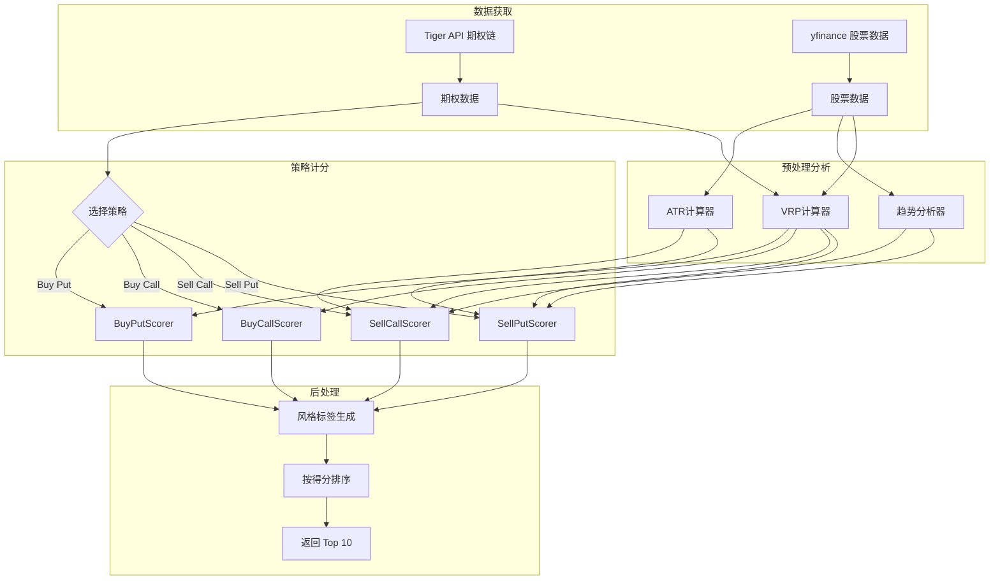
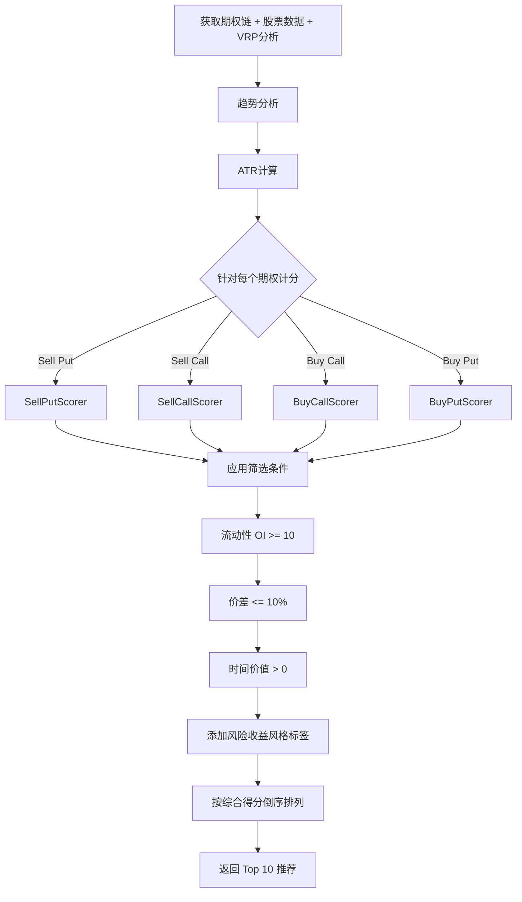

# 期权推荐算法详解

本文档详细说明 AlphaGBM 期权推荐系统的核心算法，基于实际代码实现编写。

> **2026年1月更新**：基于真实交易者反馈，系统已优化为包含趋势过滤、ATR动态安全边际、多周期支撑阻力分析等功能。

---

## 目录

1. [系统架构概览](#一系统架构概览)
2. [四种策略介绍](#二四种策略介绍)
3. [趋势分析系统](#三趋势分析系统)
4. [ATR动态安全边际](#四atr动态安全边际)
5. [Sell Put 计分器](#五sell-put-计分器)
6. [Sell Call 计分器](#六sell-call-计分器)
7. [Buy Call 计分器](#七buy-call-计分器)
8. [Buy Put 计分器](#八buy-put-计分器)
9. [VRP计算系统](#九vrp计算系统)
10. [风险收益风格标签](#十风险收益风格标签)
11. [推荐排序与输出](#十一推荐排序与输出)

---

## 一、系统架构概览

### 1.1 整体流程图



### 1.2 核心文件结构

| 文件路径 | 功能 |
|---------|------|
| `backend/app/analysis/options_analysis/scoring/sell_put.py` | Sell Put 计分器 |
| `backend/app/analysis/options_analysis/scoring/sell_call.py` | Sell Call 计分器 |
| `backend/app/analysis/options_analysis/scoring/buy_call.py` | Buy Call 计分器 |
| `backend/app/analysis/options_analysis/scoring/buy_put.py` | Buy Put 计分器 |
| `backend/app/analysis/options_analysis/scoring/trend_analyzer.py` | 趋势分析 + ATR计算 |
| `backend/app/analysis/options_analysis/scoring/risk_return_profile.py` | 风险收益风格标签 |
| `backend/app/analysis/options_analysis/advanced/vrp_calculator.py` | VRP 计算器 |

---

## 二、四种策略介绍

| 策略 | 中文名 | 适用场景 | 最大收益 | 最大亏损 | 理想趋势 |
|------|--------|----------|----------|----------|----------|
| **Sell Put** | 卖出看跌 | 下跌接货/中性 | 权利金 | 行权价-权利金 | 📉 下跌 |
| **Sell Call** | 卖出看涨 | 上涨锁定收益 | 权利金 | 理论无限 | 📈 上涨 |
| **Buy Call** | 买入看涨 | 强烈看涨 | 理论无限 | 权利金 | 📈 上涨 |
| **Buy Put** | 买入看跌 | 看跌/对冲 | 行权价-权利金 | 权利金 | 📉 下跌 |

> **交易者经验**：
> - Sell Put 只在下跌时做（价格更便宜，接货更划算）
> - Sell Call 只在上涨时做（锁定收益）

---

## 三、趋势分析系统

### 3.1 趋势判断方法

位于 `trend_analyzer.py` 的 `TrendAnalyzer` 类使用三个信号综合判断当日趋势：

```python
def determine_intraday_trend(price_history, current_price):
    """
    三信号综合判断法
    """
    signals = {}

    # 信号1: 当日涨跌幅
    today_change = (current_price - prev_close) / prev_close
    if today_change > 0.005:      # 涨 > 0.5%
        signals['today_change'] = 'bullish'
    elif today_change < -0.005:   # 跌 > 0.5%
        signals['today_change'] = 'bearish'
    else:
        signals['today_change'] = 'neutral'

    # 信号2: 相对MA5位置
    ma5_position = (current_price - ma5) / ma5
    if ma5_position > 0.01:       # 高于MA5 1%以上
        signals['ma5_position'] = 'bullish'
    elif ma5_position < -0.01:    # 低于MA5 1%以上
        signals['ma5_position'] = 'bearish'
    else:
        signals['ma5_position'] = 'neutral'

    # 信号3: 近5日动量
    momentum_5d = (current_price - price_5d_ago) / price_5d_ago
    if momentum_5d > 0.02:        # 5日涨 > 2%
        signals['momentum_5d'] = 'bullish'
    elif momentum_5d < -0.02:     # 5日跌 > 2%
        signals['momentum_5d'] = 'bearish'
    else:
        signals['momentum_5d'] = 'neutral'

    # 综合判断：3项中2项同向即为该趋势
    bullish_count = sum(1 for s in signals.values() if s == 'bullish')
    bearish_count = sum(1 for s in signals.values() if s == 'bearish')

    if bullish_count >= 2:
        return 'uptrend', bullish_count / 3
    elif bearish_count >= 2:
        return 'downtrend', bearish_count / 3
    else:
        return 'sideways', 0.5
```

### 3.2 趋势-策略匹配评分矩阵

系统采用"显示但降分"策略，不完全过滤不匹配趋势的推荐：

| 策略 | 上涨趋势 | 横盘整理 | 下跌趋势 |
|------|----------|----------|----------|
| **Sell Call** | 100 ✅ | 60 | 30 ⚠️ |
| **Sell Put** | 30 ⚠️ | 60 | 100 ✅ |
| **Buy Call** | 100 | 50 | 20 |
| **Buy Put** | 20 | 50 | 100 |

### 3.3 趋势强度调整

```python
def calculate_trend_alignment_score(strategy, trend, trend_strength):
    base_score = trend_score_matrix[strategy][trend]

    if base_score >= 80:  # 匹配趋势
        # 趋势越强，加分越多（最多+20%）
        adjusted_score = base_score * (1 + trend_strength * 0.2)
    else:  # 不匹配趋势
        # 趋势越强，扣分越多（最多-30%）
        adjusted_score = base_score * (1 - trend_strength * 0.3)

    return min(120, max(0, adjusted_score))
```

---

## 四、ATR动态安全边际

### 4.1 ATR计算公式

```python
def calculate_atr(high, low, close, period=14):
    """
    True Range = max(
        High - Low,
        |High - PrevClose|,
        |Low - PrevClose|
    )
    ATR(14) = 14日 True Range 的简单移动平均
    """
    tr1 = high[1:] - low[1:]           # 当日最高 - 当日最低
    tr2 = abs(high[1:] - close[:-1])   # 当日最高 - 昨日收盘
    tr3 = abs(low[1:] - close[:-1])    # 当日最低 - 昨日收盘

    tr = max(tr1, tr2, tr3)
    atr = mean(tr[-period:])
    return atr
```

### 4.2 ATR安全边际计算

```python
def calculate_atr_based_safety(current_price, strike, atr_14, atr_ratio=2.0):
    """
    安全边际 = 执行价距离 / (ATR × 系数)

    - 高波动股（ATR大）：需要更大的价差才算安全
    - 低波动股（ATR小）：小价差也算安全
    """
    required_buffer = atr_14 * atr_ratio  # 需要2倍ATR的安全缓冲
    actual_buffer = abs(current_price - strike)

    safety_ratio = actual_buffer / required_buffer
    atr_multiples = actual_buffer / atr_14

    return {
        'safety_ratio': safety_ratio,      # >= 1.0 表示安全
        'atr_multiples': atr_multiples,    # 几倍ATR
        'is_safe': safety_ratio >= 1.0
    }
```

### 4.3 ATR安全评分规则

| safety_ratio | 基础得分 | 说明 |
|--------------|----------|------|
| >= 2.0 | 100 | 超过需求2倍，非常安全 |
| 1.5 - 2.0 | 90-100 | 充足安全边际 |
| 1.0 - 1.5 | 70-90 | 刚好满足安全标准 |
| 0.5 - 1.0 | 40-70 | 安全边际不足 |
| < 0.5 | 0-40 | 危险，缓冲过小 |

**额外调整**：
- `atr_multiples >= 3`：+10分
- `atr_multiples >= 2`：+5分
- `atr_multiples < 1`：-10分

---

## 五、Sell Put 计分器

### 5.1 权重配置

| 指标 | 权重 | 说明 |
|------|------|------|
| `premium_yield` | 20% | 期权费收益率 |
| `support_strength` | 20% | 支撑位强度 |
| `safety_margin` | 15% | ATR动态安全边际 |
| `trend_alignment` | 15% | 趋势匹配度 |
| `probability_profit` | 15% | 盈利概率 |
| `liquidity` | 10% | 流动性 |
| `time_decay` | 5% | 时间衰减优势 |

### 5.2 筛选条件

```python
# 只考虑虚值或轻微实值期权（适合卖出）
strike <= current_price * 1.02

# 必须有时间价值
time_value > 0
```

### 5.3 各项评分详解

#### premium_yield 评分（年化收益率）

| 年化收益率 | 得分 |
|-----------|------|
| >= 20% | 100 |
| 15% - 20% | 80 + (yield - 15) × 4 |
| 10% - 15% | 60 + (yield - 10) × 4 |
| 5% - 10% | 40 + (yield - 5) × 4 |
| < 5% | yield × 8 |

#### safety_margin 评分（百分比安全边际 + ATR调整）

**基础评分**：

| 安全边际% | 基础得分 |
|----------|----------|
| >= 10% | 100 |
| 5% - 10% | 80 + (margin - 5) × 4 |
| 0% - 5% | 50 + margin × 6 |
| < 0%（实值）| 50 + margin × 2 |

**ATR调整**：

| safety_ratio | 调整 |
|--------------|------|
| >= 1.5 | +15分 |
| >= 1.0 | +5分 |
| >= 0.5 | -10分 |
| < 0.5 | -20分 |

#### support_strength 评分

检查执行价是否接近关键支撑位：

| 支撑位 | 最高分值 | 距离阈值 |
|--------|----------|----------|
| S1（第一支撑位）| 25 | 1%/3%/5% → 100%/70%/40% |
| S2（第二支撑位）| 20 | 同上 |
| MA50 | 20 | 同上 |
| MA200 | 25 | 同上 |
| 52周低点 | 10 | 同上 |

如无匹配支撑位，基于安全边际给分：
- >= 10%：60分
- >= 5%：40分
- 其他：20分

#### probability_profit 评分（Black-Scholes估算）

```python
from scipy.stats import norm

t = days_to_expiry / 365
d1 = (log(S/K) + (r + σ²/2)T) / (σ√T)
prob_profit = norm.cdf(-d1)  # 股价高于执行价的概率

score = min(100, prob_profit × 100)
```

简化版（无scipy时）：

| 安全边际% | 得分 |
|----------|------|
| >= 15% | 95 |
| >= 10% | 85 |
| >= 5% | 70 |
| >= 0% | 55 |
| < 0% | max(20, 55 + margin × 2) |

#### liquidity 评分

```python
liquidity_score = volume_score + oi_score + spread_score

volume_score = min(50, volume / 10)
oi_score = min(30, open_interest / 50)

if spread_pct <= 5%:    spread_score = 20
elif spread_pct <= 10%: spread_score = 15
elif spread_pct <= 20%: spread_score = 10
else:                   spread_score = max(0, 10 - (spread_pct - 20) / 2)
```

#### time_decay 评分

| 到期天数 | 得分 |
|----------|------|
| 20-45天 | 100（最优） |
| 10-20天 | 70 + (days - 10) × 3 |
| 45-90天 | 100 - (days - 45) × 1.5 |
| < 10天 | max(10, 70 - (10 - days) × 6) |
| > 90天 | max(20, 100 - (days - 90) × 0.5) |

### 5.4 输出结构

```python
{
    'option_symbol': str,
    'strike': float,
    'expiry': str,
    'days_to_expiry': int,
    'bid': float,
    'ask': float,
    'mid_price': float,
    'time_value': float,
    'intrinsic_value': float,
    'premium_yield': float,           # 单次收益率%
    'annualized_return': float,       # 年化收益率
    'is_short_term': bool,            # <= 7天
    'safety_margin': float,           # 安全边际%
    'implied_volatility': float,      # IV%
    'score': float,                   # 0-100综合得分
    'score_breakdown': {              # 各项得分明细
        'premium_yield': float,
        'safety_margin': float,
        'support_strength': float,
        'trend_alignment': float,
        'probability_profit': float,
        'liquidity': float,
        'time_decay': float
    },
    'assignment_risk': str,           # very_low/low/moderate/high/very_high
    'max_profit': float,              # 最大收益（美元）
    'breakeven': float,               # 盈亏平衡点
    'atr_safety': {                   # ATR安全边际信息
        'safety_ratio': float,
        'atr_multiples': float,
        'is_safe': bool
    },
    'trend_warning': str,             # 趋势警告（如有）
    'is_ideal_trend': bool            # 是否理想趋势
}
```

---

## 六、Sell Call 计分器

### 6.1 权重配置

| 指标 | 权重 | 说明 |
|------|------|------|
| `premium_yield` | 20% | 期权费收益率 |
| `resistance_strength` | 20% | 阻力位强度 |
| `trend_alignment` | 15% | 趋势匹配度 |
| `upside_buffer` | 15% | 上涨缓冲（ATR动态） |
| `liquidity` | 10% | 流动性 |
| `is_covered` | 10% | 是否有现股（Covered Call加分）|
| `time_decay` | 5% | 时间衰减 |
| `overvaluation` | 5% | 超买程度 |

### 6.2 筛选条件

```python
# 只考虑虚值或轻微实值 Call
strike >= current_price * 0.98
```

### 6.3 特有评分指标

#### resistance_strength 评分

检查执行价是否接近关键阻力位：

| 阻力位 | 最高分值 |
|--------|----------|
| R1（第一阻力位）| 25 |
| R2（第二阻力位）| 20 |
| 52周高点 | 25 |
| MA50 + 5%（若价格在MA上方）| 15 |
| MA200 + 8%（若价格在MA上方）| 15 |

#### is_covered 评分

```python
# 如果用户持有该股票（Covered Call）
if symbol in user_holdings:
    score = 100  # Covered Call 风险可控
else:
    score = 50   # 裸卖 Call 风险较高
```

#### overvaluation 评分

综合以下因素评估超买程度：

| 条件 | 得分 |
|------|------|
| 距R1 <= 2% | 90 |
| 距R1 <= 5% | 70 |
| 距R1 <= 10% | 50 |
| 距52周高点 <= 3% | 85 |
| 距52周高点 <= 8% | 60 |
| 当日涨幅 >= 3% | 80 |
| 当日涨幅 >= 1% | 60 |
| 当日跌幅 >= 2% | 20 |

#### upside_buffer 评分

**基础评分**（基于百分比缓冲）：

| 上涨缓冲% | 基础得分 |
|----------|----------|
| >= 10% | 80 |
| 5% - 10% | 60 + (buffer - 5) × 4 |
| 2% - 5% | 40 + (buffer - 2) × 6.67 |
| < 2% | max(10, buffer × 20) |

**ATR调整**：同 Sell Put 的 safety_margin 调整

#### time_decay 评分（Sell Call偏好更短期限）

| 到期天数 | 得分 |
|----------|------|
| 15-30天 | 100（最优） |
| 7-15天 | 90 |
| 30-45天 | 80 - (days - 30) × 1.5 |
| < 7天 | max(20, 90 - (7 - days) × 10) |
| > 45天 | max(30, 80 - (days - 45) × 0.8) |

---

## 七、Buy Call 计分器

### 7.1 权重配置

| 指标 | 权重 | 说明 |
|------|------|------|
| `bullish_momentum` | 25% | 上涨动量 |
| `breakout_potential` | 20% | 突破潜力 |
| `value_efficiency` | 20% | 价值效率（Delta/价格）|
| `volatility_timing` | 15% | 波动率择时 |
| `liquidity` | 10% | 流动性 |
| `time_optimization` | 10% | 时间价值优化 |

### 7.2 评分指标详解

#### bullish_momentum 评分

基于多个因素综合评估上涨动量：

| 因素 | 条件 | 得分调整 |
|------|------|----------|
| 当日涨跌幅 | >= 3% | 100 |
| | >= 2% | 90 |
| | >= 1% | 75 |
| | >= 0% | 60 |
| | >= -1% | 40 |
| | < -1% | max(10, 40 - \|change+1\| × 10) |
| 52周位置 | >= 70% | +20 |
| | >= 50% | +15 |
| | <= 30% | -10 |
| 距R1距离 | <= 5% | +10 |
| | >= 15% | -5 |

#### breakout_potential 评分

| 条件 | 得分 |
|------|------|
| 距R1 <= 3% | +25 |
| 距R1 <= 6% | +20 |
| 距R1 <= 10% | +15 |
| 执行价 >= R1 × 1.02 | +20（突破后获利空间大）|
| 执行价 >= R2 | +15 |
| 距52周高点 <= 5% | +15 |
| 执行价 >= 52周高点 | +10 |
| 当日涨幅 >= 2% 且 接近R1 | +20 |

#### value_efficiency 评分

```python
efficiency = delta / mid_price

if efficiency >= 0.6: score = 100
elif efficiency >= 0.4: score = 90
elif efficiency >= 0.3: score = 80
elif efficiency >= 0.2: score = 70
elif efficiency >= 0.1: score = 60
else: score = 40

# moneyness 调整
if -5% <= moneyness <= 5%:  score += 10  # 平值加分
if moneyness < -15%:        score -= 15  # 深度虚值减分
if moneyness > 15%:         score -= 5   # 深度实值略减分
```

#### volatility_timing 评分

Buy Call 偏好低IV环境（期权费便宜）：

| IV vs HV 比率 | 得分调整 |
|---------------|----------|
| <= 0.85 | +25 |
| <= 0.95 | +15 |
| <= 1.05 | +5 |
| <= 1.20 | -10 |
| > 1.20 | -20 |

| IV Percentile | 得分调整 |
|---------------|----------|
| <= 30 | +20 |
| <= 50 | +10 |
| >= 80 | -15 |

#### time_optimization 评分

```python
time_value_ratio = time_value / mid_price

# Buy Call 希望时间价值不要太高
if 0.2 <= ratio <= 0.6:   score += 30  # 理想比例
elif 0.1 <= ratio < 0.2:  score += 20
elif 0.6 < ratio <= 0.8:  score += 10
elif ratio > 0.9:         score -= 25  # 时间价值过高
elif ratio < 0.1:         score += 25  # 低时间价值

# 到期时间调整（Buy Call偏好中等期限）
if days <= 7:      score -= 20  # 太短
elif days <= 30:   score += 15
elif days <= 60:   score += 20  # 最佳
elif days <= 90:   score += 10
else:              score -= 10  # 太长
```

---

## 八、Buy Put 计分器

### 8.1 权重配置

| 指标 | 权重 | 说明 |
|------|------|------|
| `bearish_momentum` | 25% | 下跌动量 |
| `support_break` | 20% | 支撑位突破潜力 |
| `value_efficiency` | 20% | 价值效率 |
| `volatility_expansion` | 15% | 波动率扩张潜力 |
| `liquidity` | 10% | 流动性 |
| `time_value` | 10% | 时间价值合理性 |

### 8.2 评分指标详解

#### bearish_momentum 评分

| 当日涨跌幅 | 基础得分 |
|-----------|----------|
| <= -3% | 100（强烈下跌信号）|
| <= -2% | 90 |
| <= -1% | 75 |
| <= 0% | 60 |
| <= 1% | 40 |
| > 1% | max(10, 40 - (change - 1) × 10) |

52周位置调整：
- 位置 <= 20%：+15（接近52周低点）
- 位置 <= 40%：+10
- 位置 >= 80%：-10（接近高点，不利于买Put）

#### support_break 评分

| 条件 | 得分 |
|------|------|
| 距S1 <= 3% | +30（接近支撑位）|
| 距S1 <= 6% | +20 |
| 距S1 <= 10% | +10 |
| 执行价 <= S1 | +20（在支撑位下方）|
| 执行价 <= S2 | +15 |
| 当日跌幅 >= 2% 且 接近S1 | +25 |

#### volatility_expansion 评分

Buy Put 同样偏好低IV环境：

| IV / HV 比率 | 得分调整 |
|--------------|----------|
| <= 0.8 | +30 |
| <= 0.9 | +20 |
| <= 1.0 | +10 |
| <= 1.2 | -5 |
| > 1.2 | -15 |

| IV Percentile | 得分调整 |
|---------------|----------|
| <= 20 | +25 |
| <= 40 | +15 |
| >= 80 | -20 |

#### time_value 评分

```python
time_value_ratio = time_value / mid_price

if 0.3 <= ratio <= 0.7:   score += 30  # 理想
elif 0.2 <= ratio < 0.3:  score += 20
elif 0.7 < ratio <= 0.8:  score += 15
elif ratio > 0.9:         score -= 20  # 时间价值过高
elif ratio < 0.1:         score += 10

# 到期时间调整
if days <= 7:      score -= 15  # 太短
elif days <= 30:   score += 10
elif days <= 60:   score += 15
elif days <= 90:   score += 5
else:              score -= 10  # 太长
```

---

## 九、VRP计算系统

### 9.1 VRP定义

VRP（Volatility Risk Premium）= 隐含波动率 - 历史波动率

```python
vrp_absolute = implied_vol - historical_vol
vrp_relative = (implied_vol - historical_vol) / historical_vol
```

### 9.2 VRP等级阈值

| VRP相对值 | 等级 | 对卖方 | 对买方 |
|----------|------|--------|--------|
| >= 15% | very_high | 非常有利 | 不利 |
| 5% - 15% | high | 有利 | 略不利 |
| -5% - 5% | normal | 中性 | 中性 |
| -15% - -5% | low | 不利 | 有利 |
| < -15% | very_low | 非常不利 | 非常有利 |

### 9.3 信号强度分类

| vrp_relative | 信号强度 |
|--------------|----------|
| >= 20% | very_strong_positive |
| >= 10% | strong_positive |
| >= 5% | moderate_positive |
| -5% - 5% | neutral |
| >= -10% | moderate_negative |
| >= -20% | strong_negative |
| < -20% | very_strong_negative |

### 9.4 策略建议生成

```python
if vrp_level in ['very_high', 'high']:
    # 高VRP，偏向卖方策略
    suggestions = [
        {'strategy': 'sell_put', 'confidence': 'high'},
        {'strategy': 'sell_call', 'confidence': 'medium'},
        {'strategy': 'iron_condor', 'confidence': 'high'}  # 仅 very_high
    ]

elif vrp_level in ['very_low', 'low']:
    # 低VRP，偏向买方策略
    suggestions = [
        {'strategy': 'buy_call', 'confidence': 'high'},
        {'strategy': 'buy_put', 'confidence': 'medium'},
        {'strategy': 'long_straddle', 'confidence': 'medium'}  # 仅 very_low
    ]

else:
    # 中性VRP
    suggestions = [
        {'strategy': 'directional_bias', 'confidence': 'medium'}
    ]
```

---

## 十、风险收益风格标签

### 10.1 四种风格分类

| 风格 | 中文 | 英文 | 典型胜率 | 典型收益 |
|------|------|------|----------|----------|
| `steady_income` | 稳健收益 | STEADY INCOME | 65-80% | 1-5%/月 |
| `balanced` | 稳中求进 | BALANCED | 40-55% | 50-200% |
| `high_risk_high_reward` | 高风险高收益 | HIGH RISK HIGH REWARD | 20-40% | 2-10倍 |
| `hedge` | 保护对冲 | HEDGE | 30-50% | 0-1倍 |

### 10.2 风险等级与颜色

| 等级 | 英文 | 颜色 |
|------|------|------|
| 低 | low | green |
| 中 | moderate | yellow |
| 高 | high | orange |
| 极高 | very_high | red |

### 10.3 Sell Put 风格判定逻辑

```python
if safety_margin_pct >= 10 and annualized_return <= 25:
    style = 'steady_income'       # 大安全边际 + 适中收益
    risk_level = 'low'

elif safety_margin_pct >= 5 and annualized_return <= 40:
    style = 'balanced'            # 中等安全边际
    risk_level = 'moderate'

elif safety_margin_pct < 3 or annualized_return > 50:
    style = 'high_risk_high_reward'  # 小安全边际或高收益
    risk_level = 'high' if safety_margin_pct >= 0 else 'very_high'

else:
    style = 'balanced'
    risk_level = 'moderate'
```

### 10.4 Sell Call 风格判定逻辑

```python
distance_pct = (strike - current_price) / current_price * 100

if distance_pct >= 15 and annualized_return <= 20:
    style = 'steady_income'
    risk_level = 'moderate'  # Sell Call 至少是 moderate

elif distance_pct >= 8:
    style = 'balanced'
    risk_level = 'moderate'

else:
    style = 'high_risk_high_reward'
    risk_level = 'high'
```

### 10.5 Buy Call 风格判定逻辑

```python
distance_pct = (strike - current_price) / current_price * 100  # 虚值程度

if distance_pct > 20:
    style = 'high_risk_high_reward'  # 深度虚值
    risk_level = 'very_high'
    max_profit_pct = 500  # 潜在5倍+

elif distance_pct > 10:
    style = 'high_risk_high_reward'  # 中度虚值
    risk_level = 'high'
    max_profit_pct = 300

elif distance_pct > 3:
    style = 'balanced'  # 轻度虚值
    risk_level = 'high'
    max_profit_pct = 200

else:
    style = 'balanced'  # 平值或轻度实值
    risk_level = 'moderate'
    max_profit_pct = 150
```

### 10.6 Buy Put 风格判定逻辑

```python
distance_pct = (current_price - strike) / current_price * 100  # 虚值程度
hedge_cost_pct = (premium / current_price) * 100
is_protective = distance_pct <= 5

if is_protective and hedge_cost_pct <= 5:
    style = 'hedge'  # 保护对冲
    risk_level = 'low'

elif distance_pct > 15:
    style = 'high_risk_high_reward'  # 深度虚值
    risk_level = 'very_high'

elif distance_pct > 8:
    style = 'high_risk_high_reward'
    risk_level = 'high'

else:
    style = 'balanced'
    risk_level = 'moderate'
```

### 10.7 胜率估算（Black-Scholes）

#### Sell Put 胜率

```python
from scipy.stats import norm

t = days_to_expiry / 365
d1 = (log(S/K) + (r + σ²/2)T) / (σ√T)
prob_above_strike = norm.cdf(d1)  # 股价高于执行价的概率

# VRP调整
if vrp_level == 'very_high':
    prob = min(0.90, prob + 0.05)
elif vrp_level == 'high':
    prob = min(0.85, prob + 0.03)
```

#### Buy Call 胜率

```python
breakeven = strike + premium
d1 = (log(S/breakeven) + (r + σ²/2)T) / (σ√T)
prob_above_breakeven = norm.cdf(d1)

# VRP调整（低VRP对买方有利）
if vrp_level == 'very_low':
    prob = min(0.60, prob + 0.05)
elif vrp_level == 'low':
    prob = min(0.55, prob + 0.03)
```

---

## 十一、推荐排序与输出

### 11.1 整体流程



### 11.2 返回数据结构

```json
{
  "success": true,
  "strategy": "sell_put",
  "symbol": "AAPL",
  "current_price": 180.50,
  "analysis_time": "2026-01-28T10:30:00",
  "total_options_analyzed": 45,
  "qualified_options": 12,
  "recommendations": [
    {
      "strike": 170,
      "expiry": "2026-02-21",
      "days_to_expiry": 24,
      "mid_price": 2.65,
      "premium_yield": 1.56,
      "annualized_return": 23.7,
      "safety_margin": 5.82,
      "score": 78.5,
      "score_breakdown": {
        "premium_yield": 82.0,
        "support_strength": 75.0,
        "safety_margin": 70.0,
        "trend_alignment": 100.0,
        "probability_profit": 72.0,
        "liquidity": 85.0,
        "time_decay": 95.0
      },
      "atr_safety": {
        "safety_ratio": 1.25,
        "atr_multiples": 2.5,
        "is_safe": true
      },
      "risk_return_profile": {
        "style": "balanced",
        "style_label": "稳中求进 / BALANCED",
        "risk_level": "moderate",
        "risk_color": "yellow",
        "win_probability": 0.72,
        "max_profit_pct": 1.56,
        "max_loss_pct": 98.44,
        "summary_cn": "胜率72%，收益1.56%，24天到期，风险收益均衡"
      },
      "trend_warning": null,
      "is_ideal_trend": true
    }
  ],
  "strategy_analysis": {
    "market_outlook": "neutral_to_bullish",
    "strategy_suitability": "good",
    "risk_level": "moderate",
    "best_opportunity": {
      "strike": 170,
      "premium_yield": 1.56,
      "score": 78.5,
      "support_score": 75.0
    },
    "trend_analysis": {
      "trend": "downtrend",
      "trend_name_cn": "下跌趋势",
      "is_ideal_trend": true
    },
    "recommendations": [
      "当前下跌趋势，适合Sell Put策略",
      "推荐卖出执行价 $170 的看跌期权",
      "执行价接近重要支撑位，被击穿风险较低",
      "安全缓冲2.5倍ATR，波动风险可控"
    ]
  },
  "scoring_weights": {
    "premium_yield": 0.20,
    "support_strength": 0.20,
    "safety_margin": 0.15,
    "trend_alignment": 0.15,
    "probability_profit": 0.15,
    "liquidity": 0.10,
    "time_decay": 0.05
  },
  "trend_info": {
    "trend": "downtrend",
    "trend_strength": 0.67,
    "trend_alignment_score": 100
  },
  "atr_14": 4.2
}
```

---

## 十二、关键算法总结

| 策略 | 核心权重 | 理想趋势 | 主要指标 |
|------|----------|----------|----------|
| Sell Put | support_strength 20%, premium_yield 20% | 下跌 | 支撑位、安全边际、ATR |
| Sell Call | resistance_strength 20%, premium_yield 20% | 上涨 | 阻力位、上涨缓冲、Covered |
| Buy Call | bullish_momentum 25%, breakout_potential 20% | 上涨 | 动量、突破潜力、价值效率 |
| Buy Put | bearish_momentum 25%, support_break 20% | 下跌 | 动量、支撑突破、波动率扩张 |

---

## 十三、设计亮点

1. **趋势过滤系统**：基于真实交易者经验，Sell Put只在下跌时做，Sell Call只在上涨时做
2. **ATR动态安全边际**：高波动股需要更大的安全缓冲，低波动股可以更激进
3. **支撑/阻力位强度评分**：执行价接近关键技术位时更安全
4. **VRP动态调整**：根据波动率溢价自动调整胜率预期和策略建议
5. **风险收益风格标签**：一目了然的风格分类，降低用户决策难度
6. **Black-Scholes胜率估算**：科学计算期权到期时获利的概率
7. **多维度综合评分**：结合收益、风险、流动性、技术分析等多个维度
