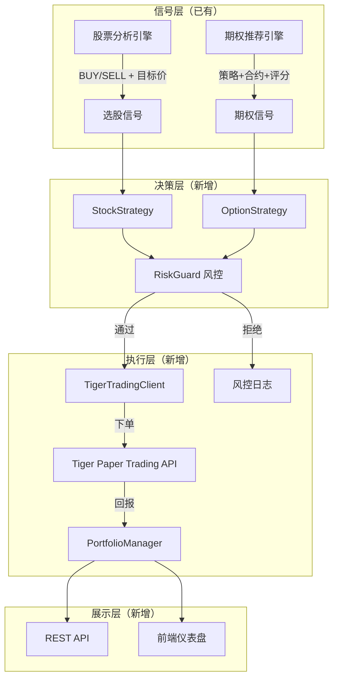
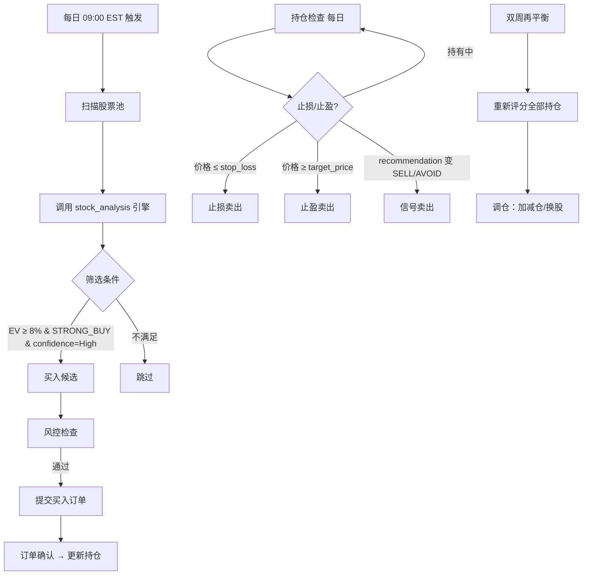
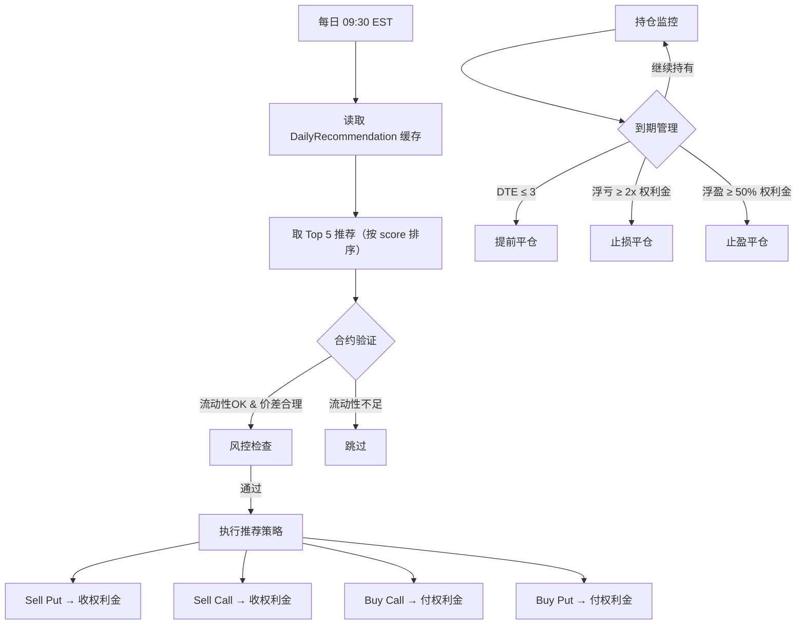

# 模拟盘交易系统设计文档

AlphaGBM 模拟盘系统：将分析信号自动转化为模拟交易，验证策略实盘表现。

> **文档版本**: 2026.03.03 | 设计阶段

---

## 目录

1. [项目目标](#一项目目标)
2. [系统架构](#二系统架构)
3. [模拟盘 1 — 自动选股交易](#三模拟盘-1--自动选股交易)
4. [模拟盘 2 — 期权推荐跟单](#四模拟盘-2--期权推荐跟单)
5. [Tiger 交易客户端](#五tiger-交易客户端)
6. [风控模块](#六风控模块)
7. [数据模型](#七数据模型)
8. [API 接口](#八api-接口)
9. [调度与运维](#九调度与运维)
10. [技术方案选型：OpenClaw vs 自建](#十技术方案选型openclaw-vs-自建)
11. [实施路线图](#十一实施路线图)

---

## 一、项目目标

### 1.1 核心目的

- **验证策略有效性**：将股票分析引擎（EV 模型）和期权推荐引擎的输出，在模拟环境中跑出真实 P&L
- **积累实盘经验**：为后续真实交易打基础，发现模型盲区
- **产品展示**：给用户展示"如果跟着系统操作，收益如何"

### 1.2 两个模拟盘定位

| | 模拟盘 1：自动选股 | 模拟盘 2：期权跟单 |
|--|-------------------|-------------------|
| **策略来源** | 股票分析引擎（EV 模型） | 期权推荐引擎（DailyRecommendation） |
| **交易标的** | 股票（美股/港股） | 期权合约 |
| **决策方式** | 全自动：模型选股 → 自动下单 | 半自动：每日推荐 → 自动执行 |
| **调仓频率** | 双周再平衡 + 止损触发 | 每日（跟随推荐更新） |
| **初始资金** | $100,000 模拟 | $50,000 模拟 |
| **目标** | 跑赢 SPY 基准 | 验证期权策略年化收益 |

---

## 二、系统架构

### 2.1 整体流程



### 2.2 模块结构

```
backend/app/services/paper_trading/
├── __init__.py
├── tiger_trading_client.py   # Tiger 交易 API 封装
├── portfolio_manager.py      # 模拟盘持仓/资金管理
├── stock_strategy.py         # 模拟盘1：选股策略执行
├── option_strategy.py        # 模拟盘2：期权策略执行
├── risk_guard.py             # 风控规则引擎
└── trade_logger.py           # 交易日志与审计

backend/app/models/
└── paper_trade.py            # 数据模型（交易记录/持仓/快照）

backend/app/api/
└── paper_trading.py          # REST API Blueprint
```

---

## 三、模拟盘 1 — 自动选股交易

### 3.1 策略逻辑



### 3.2 选股规则

**入场条件（同时满足）：**

| 条件 | 阈值 | 来源 |
|------|------|------|
| EV 加权收益率 | ≥ 8% | `ev_weighted_pct` |
| 推荐动作 | STRONG_BUY 或 BUY | `recommendation_action` |
| 置信度 | High 或 Medium | `recommendation_confidence` |
| 风险评分 | ≤ 6 (满分10) | `risk_score` |
| 建议仓位 | > 0 | `position_size` |

**出场条件（任一触发）：**

| 条件 | 说明 |
|------|------|
| 止损 | 价格跌破 `stop_loss_price`（ATR 动态止损） |
| 止盈 | 价格达到 `target_price` |
| 信号反转 | 重新分析后 action 变为 SELL/STRONG_AVOID |
| 再平衡 | 双周检查，评分下降则减仓 |

### 3.3 仓位管理

- **单只股票上限**：总资金的 10%
- **风格分散**：Quality/Value/Growth/Momentum 各不超过 30%
- **最大持仓数**：15 只
- **现金储备**：最低保留 10% 现金

### 3.4 股票池范围

沿用现有系统的股票覆盖范围：
- 美股：S&P 500 成分股 + 用户关注列表
- 港股：恒生指数成分股（通过 Tiger HK 数据）
- 优先扫描有 `StockAnalysisHistory` 记录的 ticker

---

## 四、模拟盘 2 — 期权推荐跟单

### 4.1 策略逻辑



### 4.2 跟单规则

**入场条件：**

| 条件 | 阈值 | 来源 |
|------|------|------|
| 推荐评分 | ≥ 70 (满分100) | `score` |
| 标的质量 | Tier 1-3 | `symbol_tier` |
| IV Rank | ≥ 30（卖方策略）| `iv_rank` |
| 到期天数 | 14-60 天 | DTE |
| 日内期权 | 排除 | `is_daily_option = False` |

**出场条件：**

| 条件 | 说明 |
|------|------|
| 时间止损 | DTE ≤ 3 天，平仓避免行权风险 |
| 浮亏止损 | 卖方：亏损 ≥ 收到权利金的 2 倍；买方：亏损 ≥ 50% |
| 浮盈止盈 | 卖方：收回 50% 权利金即平仓；买方：盈利 ≥ 100% |
| 到期作废 | OTM 到期，记录全额损益 |

### 4.3 仓位管理

- **单笔合约上限**：总资金的 5%（按保证金/权利金计算）
- **同一标的上限**：不超过 2 个未平仓合约
- **策略分散**：卖方策略总仓位 ≤ 60%，买方策略总仓位 ≤ 40%
- **保证金预留**：卖方策略需预留 2x 保证金缓冲
- **每日最大新开仓**：3 笔

---

## 五、Tiger 交易客户端

### 5.1 Tiger Open API 交易接口

基于现有 `TigerAdapter`（数据层）扩展，新增交易能力。

```python
class TigerTradingClient:
    """Tiger Open API 交易封装 — Paper Trading 专用"""

    def __init__(self, config: TigerConfig):
        # 复用现有 Tiger 连接配置
        # 强制使用 Paper Trading 环境
        self.is_paper = True  # 硬编码，防止误操作真实账户

    # --- 订单管理 ---
    def place_order(self, order: OrderRequest) -> OrderResult:
        """提交限价/市价单"""

    def cancel_order(self, order_id: str) -> bool:
        """撤销未成交订单"""

    def get_order_status(self, order_id: str) -> OrderStatus:
        """查询订单状态"""

    def get_open_orders(self) -> List[Order]:
        """获取所有未成交订单"""

    # --- 持仓与账户 ---
    def get_positions(self) -> List[Position]:
        """获取当前持仓"""

    def get_account_summary(self) -> AccountSummary:
        """账户概览：资金/市值/盈亏"""

    # --- 期权专用 ---
    def place_option_order(self, order: OptionOrderRequest) -> OrderResult:
        """期权合约下单（含合约代码拼装）"""

    def close_option_position(self, contract: str) -> OrderResult:
        """平仓指定期权合约"""
```

### 5.2 安全机制

```python
# 所有交易操作的安全检查
class SafetyGuard:
    PAPER_ONLY = True           # 强制模拟盘
    MAX_ORDER_VALUE = 20_000    # 单笔上限 $20k
    DAILY_TRADE_LIMIT = 20      # 每日交易次数上限
    COOLDOWN_SECONDS = 5        # 下单间隔冷却

    # 启动时验证账户类型
    def verify_paper_account(self):
        """确认连接的是模拟盘账户，否则拒绝启动"""
        account = self.client.get_account_summary()
        assert account.account_type == "PAPER", "拒绝连接真实账户!"
```

### 5.3 Tiger Paper Trading 环境

Tiger Open API 提供独立的模拟盘环境：
- 独立的模拟资金（不影响真实账户）
- 行情数据与真实环境一致
- 撮合逻辑：限价单按到价成交，市价单即时成交
- 支持美股 + 美股期权

---

## 六、风控模块

### 6.1 规则引擎

```python
class RiskGuard:
    """交易前风控检查，任一规则不通过则拒绝下单"""

    rules = [
        PositionLimitRule(),      # 单只/总仓位上限
        DailyLossLimitRule(),     # 日内最大亏损 -3%
        DrawdownLimitRule(),      # 最大回撤 -15% 暂停交易
        ConcentrationRule(),      # 行业/风格集中度
        LiquidityRule(),          # 期权流动性（bid-ask spread）
        MarketHoursRule(),        # 仅交易时段下单
        CooldownRule(),           # 同一标的冷却期
    ]

    def check(self, order: OrderRequest, portfolio: Portfolio) -> RiskResult:
        for rule in self.rules:
            result = rule.evaluate(order, portfolio)
            if not result.passed:
                return RiskResult(passed=False, reason=result.reason)
        return RiskResult(passed=True)
```

### 6.2 核心风控参数

| 参数 | 模拟盘1（股票） | 模拟盘2（期权） |
|------|----------------|----------------|
| 单笔最大金额 | $10,000 | $2,500 |
| 单标的仓位上限 | 10% | 5% |
| 日内最大亏损 | -3% | -5% |
| 最大回撤熔断 | -15% → 暂停3天 | -20% → 暂停3天 |
| 单日最大交易次数 | 5 | 3 |
| 同标的冷却期 | 24h | 无 |

### 6.3 熔断机制

```
日内亏损 ≥ 2%  → 警告日志，继续运行
日内亏损 ≥ 3%  → 停止新开仓，仅允许平仓
累计回撤 ≥ 10% → 降低仓位上限至 50%
累计回撤 ≥ 15% → 全面暂停，发送告警通知
```

---

## 七、数据模型

### 7.1 模拟交易记录

```python
class PaperTrade(db.Model):
    """每笔模拟交易"""
    __tablename__ = 'paper_trades'

    id = db.Column(db.Integer, primary_key=True)
    portfolio_id = db.Column(db.String(20))      # 'stock_auto' / 'option_follow'

    # 订单信息
    symbol = db.Column(db.String(20))
    action = db.Column(db.String(10))             # BUY / SELL
    asset_type = db.Column(db.String(10))         # STOCK / OPTION
    quantity = db.Column(db.Integer)
    price = db.Column(db.Float)
    total_value = db.Column(db.Float)

    # 期权专用
    option_type = db.Column(db.String(4))         # CALL / PUT (nullable)
    strike = db.Column(db.Float)                  # nullable
    expiry = db.Column(db.Date)                   # nullable
    contract_symbol = db.Column(db.String(40))    # OCC 合约代码

    # 信号来源
    signal_source = db.Column(db.String(50))      # 'ev_model' / 'option_recommender'
    signal_score = db.Column(db.Float)            # 触发信号的评分
    signal_action = db.Column(db.String(20))      # STRONG_BUY / score=85 等

    # 状态
    status = db.Column(db.String(15))             # PENDING / FILLED / CANCELLED / REJECTED
    order_id = db.Column(db.String(50))           # Tiger 订单号
    filled_at = db.Column(db.DateTime)
    created_at = db.Column(db.DateTime, default=datetime.utcnow)

    # 关联平仓
    close_trade_id = db.Column(db.Integer, db.ForeignKey('paper_trades.id'))
    close_reason = db.Column(db.String(30))       # stop_loss / take_profit / signal / rebalance / expiry
    realized_pnl = db.Column(db.Float)
```

### 7.2 持仓快照

```python
class PaperPosition(db.Model):
    """当前持仓（实时更新）"""
    __tablename__ = 'paper_positions'

    id = db.Column(db.Integer, primary_key=True)
    portfolio_id = db.Column(db.String(20))
    symbol = db.Column(db.String(20))
    asset_type = db.Column(db.String(10))

    quantity = db.Column(db.Integer)
    avg_cost = db.Column(db.Float)
    current_price = db.Column(db.Float)
    unrealized_pnl = db.Column(db.Float)

    # 期权字段
    option_type = db.Column(db.String(4))
    strike = db.Column(db.Float)
    expiry = db.Column(db.Date)

    # 关联的入场交易
    entry_trade_id = db.Column(db.Integer, db.ForeignKey('paper_trades.id'))
    opened_at = db.Column(db.DateTime)
    updated_at = db.Column(db.DateTime, default=datetime.utcnow)
```

### 7.3 每日绩效快照

```python
class PaperDailySnapshot(db.Model):
    """每日收盘时的组合快照"""
    __tablename__ = 'paper_daily_snapshots'

    id = db.Column(db.Integer, primary_key=True)
    portfolio_id = db.Column(db.String(20))
    date = db.Column(db.Date)

    # 资金
    total_value = db.Column(db.Float)         # 总市值（含现金）
    cash = db.Column(db.Float)
    positions_value = db.Column(db.Float)     # 持仓市值

    # 收益
    daily_pnl = db.Column(db.Float)           # 当日盈亏
    daily_return_pct = db.Column(db.Float)    # 当日收益率
    cumulative_return_pct = db.Column(db.Float)  # 累计收益率

    # 基准对比
    benchmark_return_pct = db.Column(db.Float)   # SPY 同期收益
    alpha = db.Column(db.Float)                  # 超额收益

    # 风控指标
    max_drawdown = db.Column(db.Float)        # 历史最大回撤
    sharpe_ratio = db.Column(db.Float)        # 滚动 Sharpe
    win_rate = db.Column(db.Float)            # 已平仓胜率

    # 持仓统计
    num_positions = db.Column(db.Integer)
    num_trades_today = db.Column(db.Integer)
```

---

## 八、API 接口

### 8.1 Blueprint: `/api/paper-trading`

```
GET  /portfolios                     # 两个模拟盘概览
GET  /portfolios/<id>/positions      # 当前持仓明细
GET  /portfolios/<id>/trades         # 交易历史（分页）
GET  /portfolios/<id>/performance    # 绩效曲线（日/周/月）
GET  /portfolios/<id>/risk-metrics   # 风控指标
GET  /portfolios/<id>/daily-summary  # 每日汇总
POST /portfolios/<id>/pause          # 暂停交易
POST /portfolios/<id>/resume         # 恢复交易
```

### 8.2 响应示例

```json
// GET /api/paper-trading/portfolios
{
  "portfolios": [
    {
      "id": "stock_auto",
      "name": "自动选股模拟盘",
      "initial_capital": 100000,
      "current_value": 106520,
      "cash": 12300,
      "cumulative_return": "6.52%",
      "benchmark_return": "4.10%",
      "alpha": "2.42%",
      "max_drawdown": "-3.2%",
      "sharpe_ratio": 1.85,
      "num_positions": 12,
      "status": "active",
      "last_trade_at": "2026-03-03T15:30:00Z"
    },
    {
      "id": "option_follow",
      "name": "期权跟单模拟盘",
      "initial_capital": 50000,
      "current_value": 53200,
      "cash": 38500,
      "cumulative_return": "6.40%",
      "max_drawdown": "-4.1%",
      "win_rate": "68%",
      "num_positions": 4,
      "status": "active"
    }
  ]
}
```

---

## 九、调度与运维

### 9.1 定时任务

基于现有 `Scheduler` 模块扩展：

| 时间 (EST) | 任务 | 说明 |
|------------|------|------|
| 08:30 | 盘前准备 | 加载当日推荐，检查持仓到期 |
| 09:30 | 模拟盘2 开盘执行 | 读取期权推荐 → 下单 |
| 09:35 | 模拟盘1 选股执行 | EV 筛选 → 下单 |
| 12:00 | 午间检查 | 止损/止盈扫描 |
| 15:30 | 盘后处理 | 平仓即将到期期权，记录日快照 |
| 16:00 | 日终结算 | 计算 P&L，更新绩效指标 |
| 周五 16:00 | 周报生成 | 汇总本周交易/收益 |
| 双周一 09:00 | 股票再平衡 | 模拟盘1 全面重新评分+调仓 |

### 9.2 日志与告警

```python
# 交易日志结构
{
    "timestamp": "2026-03-03T09:35:12Z",
    "portfolio": "stock_auto",
    "event": "ORDER_SUBMITTED",
    "symbol": "AAPL",
    "action": "BUY",
    "quantity": 50,
    "price": 178.50,
    "signal": {"action": "STRONG_BUY", "ev_score": 8.5, "confidence": "High"},
    "risk_check": {"passed": true, "rules_checked": 7}
}
```

告警通知（可选集成）：
- 熔断触发 → 日志 + 前端提示
- 订单被拒 → 记录原因
- 日亏损超阈值 → 预警

---

## 十、技术方案选型：OpenClaw vs 自建

### 10.1 方案对比

| 维度 | OpenClaw Agent | 自建调度器 |
|------|---------------|-----------|
| **决策方式** | LLM 理解推荐 → 自主决策 | 规则引擎，确定性执行 |
| **灵活性** | 高：可处理模糊情况 | 中：需预定义规则 |
| **可靠性** | 中：LLM 输出有随机性 | 高：确定性逻辑 |
| **延迟** | 高：每次决策需 LLM 调用 | 低：纯代码执行 |
| **成本** | LLM API 费用（~$5-15/天） | 无额外费用 |
| **可审计性** | 低：LLM 决策难复现 | 高：规则可追溯 |
| **开发量** | 中：需适配 OpenClaw 插件 | 中：需开发策略模块 |
| **维护性** | 依赖 OpenClaw 社区更新 | 完全自主可控 |

### 10.2 推荐方案

**核心引擎：自建调度器**（路径 B）

理由：
1. AlphaGBM 的信号输出已经高度结构化（数值评分 + 明确动作），不需要 LLM 再"理解"
2. 模拟盘需要可复现性——同样的输入必须产生同样的交易决策
3. 减少外部依赖，降低运维复杂度

**辅助增强：OpenClaw 可选集成**

适合用 OpenClaw 做的事情：
- 每日交易报告生成（自然语言总结）
- 异常情况告警解读（"为什么今天亏损较大？"）
- 非标准事件处理（如财报季特殊策略调整）

```
核心交易流: AlphaGBM Scheduler → Tiger Paper API  (自建，确定性)
辅助报告流: OpenClaw Agent → 读取交易日志 → 生成每日总结  (可选)
```

---

## 十一、实施路线图

### Phase 1：基础设施（1-2 周）

- [ ] Tiger 交易客户端：对接 Paper Trading API（下单/撤单/查询）
- [ ] 数据模型：PaperTrade / PaperPosition / PaperDailySnapshot 建表
- [ ] 安全防护：Paper 账户验证 + 交易限额
- [ ] 基础风控：仓位上限 + 日亏损限制

### Phase 2：模拟盘 1 — 自动选股（1-2 周）

- [ ] StockStrategy：对接 EV 模型输出 → 生成买卖信号
- [ ] 入场/出场逻辑实现
- [ ] 双周再平衡调度
- [ ] 止损/止盈监控

### Phase 3：模拟盘 2 — 期权跟单（1-2 周）

- [ ] OptionStrategy：读取 DailyRecommendation → 执行跟单
- [ ] 期权合约生命周期管理（开仓 → 监控 → 平仓/到期）
- [ ] 期权专用风控（保证金、流动性检查）

### Phase 4：展示与运维（1 周）

- [ ] REST API 接口开发
- [ ] 前端仪表盘：实时持仓 + 绩效曲线 + 交易历史
- [ ] 定时任务集成到现有 Scheduler
- [ ] 日志与告警系统

### Phase 5：优化迭代

- [ ] 与 SPY 基准对比分析
- [ ] 策略参数调优（基于模拟盘数据）
- [ ] OpenClaw 报告集成（可选）
- [ ] 真实交易切换准备

---

## 附录

### A. Tiger Open API 交易相关接口

| 接口 | 说明 |
|------|------|
| `TradeOrder.place_order()` | 下单 |
| `TradeOrder.modify_order()` | 改单 |
| `TradeOrder.cancel_order()` | 撤单 |
| `TradeOrder.get_orders()` | 查询订单 |
| `TradeOrder.get_positions()` | 查询持仓 |
| `TradeOrder.get_assets()` | 查询资产 |

> 参考：[Tiger Open API 文档](https://quant.itigerup.com/openapi/zh/python/operation/trade/placeOrder.html)

### B. 环境变量

```env
# Paper Trading 配置
PAPER_TRADING_ENABLED=true
PAPER_STOCK_INITIAL_CAPITAL=100000
PAPER_OPTION_INITIAL_CAPITAL=50000
PAPER_MAX_DRAWDOWN_PCT=15
PAPER_DAILY_LOSS_LIMIT_PCT=3

# Tiger Trading（复用现有配置）
TIGER_ID=xxx
TIGER_PRIVATE_KEY=xxx
TIGER_ACCOUNT=xxx           # Paper Trading 账号
```
