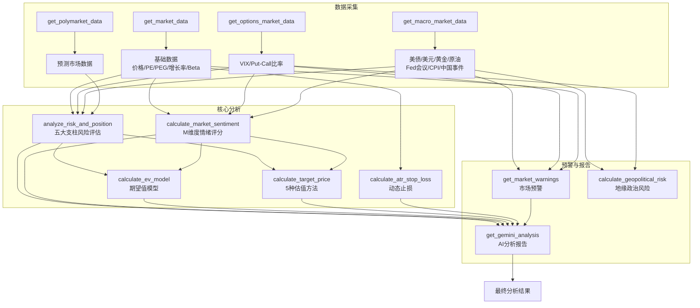
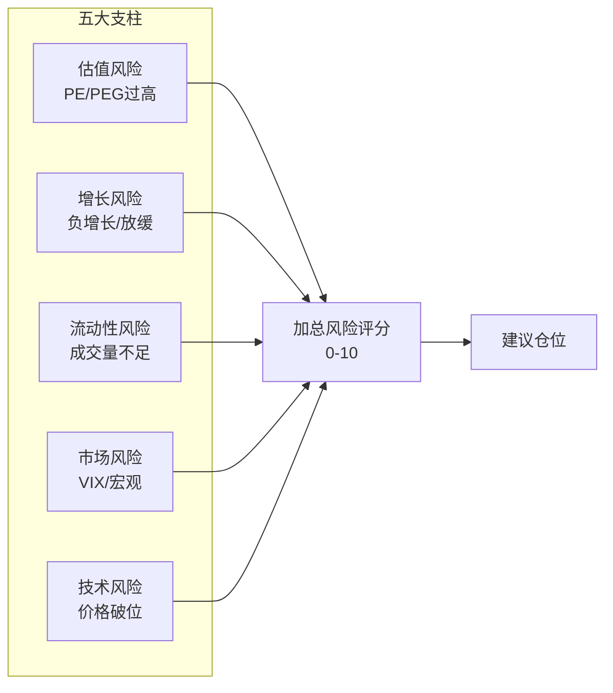
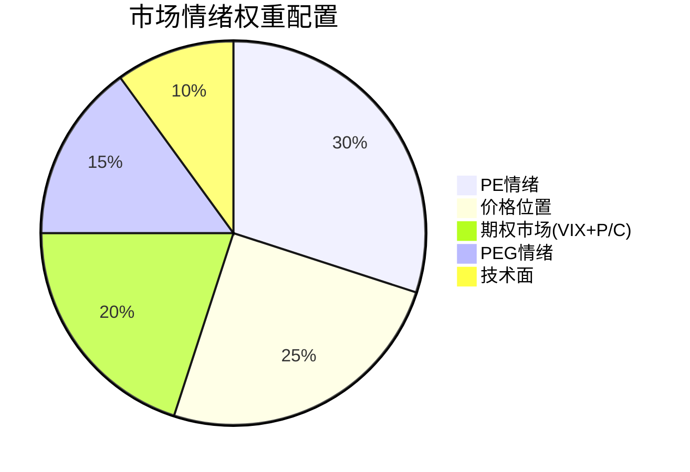
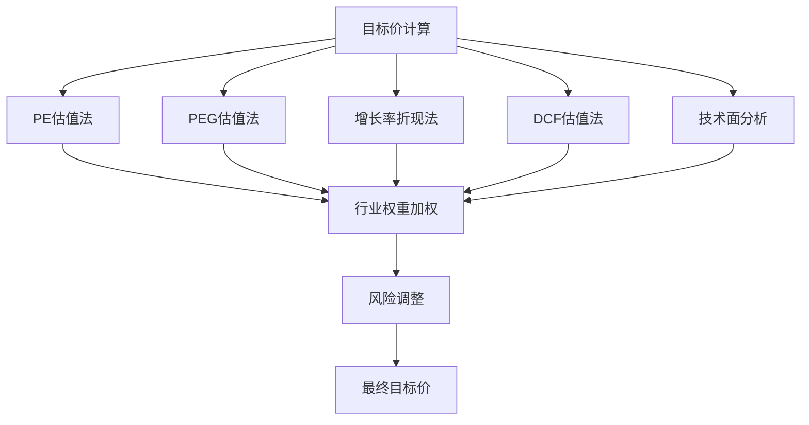
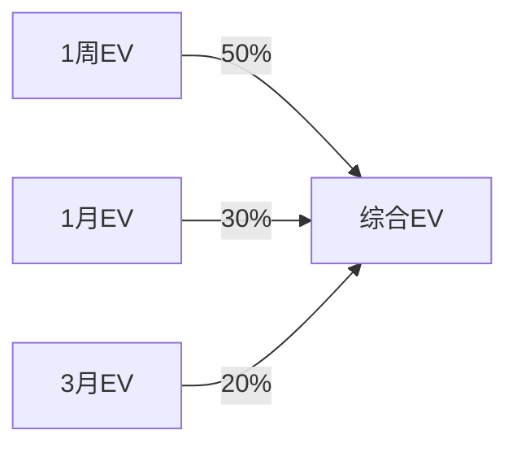
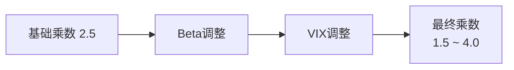
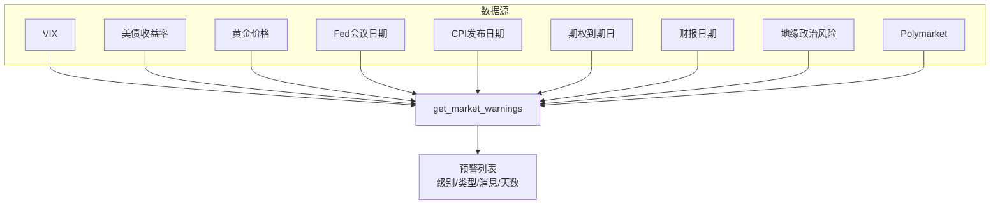
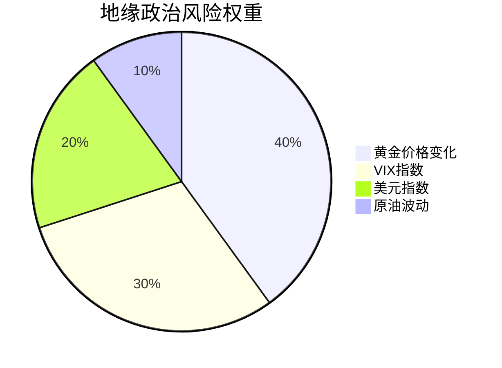

# 股票分析算法详解

本文档详细说明 AlphaGBM 股票分析系统的核心算法、评分逻辑和数据流程。

> **文档版本**: 2026.01.28 | 基于实际代码同步更新

---

## 目录

1. [系统架构与分析流程](#一系统架构与分析流程)
2. [核心模型：G = B + M](#二核心模型g--b--m)
3. [数据采集模块](#三数据采集模块)
4. [风险分析模块（五大支柱）](#四风险分析模块五大支柱)
5. [市场情绪计算（M维度）](#五市场情绪计算m维度)
6. [目标价格计算（5种方法）](#六目标价格计算5种方法)
7. [EV期望值模型](#七ev期望值模型)
8. [ATR动态止损](#八atr动态止损)
9. [市场预警系统](#九市场预警系统)
10. [AI分析报告](#十ai分析报告)
11. [市场差异化处理](#十一市场差异化处理)
12. [配置参数速查](#十二配置参数速查)

---

## 一、系统架构与分析流程

### 1.1 完整分析管线



### 1.2 核心函数调用链

```
analyze_stock(ticker, style)
│
├─→ get_market_data(ticker)              # 基础市场数据
├─→ get_options_market_data(ticker)      # VIX、Put/Call
├─→ get_macro_market_data()              # 宏观经济数据
├─→ get_polymarket_data()                # 预测市场
│
├─→ calculate_geopolitical_risk()        # 地缘政治风险指数
├─→ get_market_warnings()                # 市场预警
│
├─→ analyze_risk_and_position()          # 风险评估 → risk_score
├─→ calculate_market_sentiment()         # 情绪评分 → sentiment_score
│
├─→ calculate_ev_model()                 # EV模型 → ev_result
├─→ calculate_target_price()             # 目标价 → target_price
├─→ calculate_atr_stop_loss()            # 止损价 → stop_loss
│
└─→ get_gemini_analysis()                # AI报告
```

### 1.3 核心文件位置

| 文件 | 职责 |
|------|------|
| `backend/app/services/analysis_engine.py` | 核心分析引擎（3000+行） |
| `backend/app/services/ev_model.py` | EV期望值模型 |
| `backend/app/services/ai_service.py` | AI分析服务 |
| `backend/app/services/data_provider.py` | 数据源抽象（yfinance + defeatbeta fallback） |
| `backend/app/constants.py` | 配置参数 |

---

## 二、核心模型：G = B + M

### 2.1 模型公式

```
G = B + M

G (Gain)     = 预期收益
B (Basics)   = 基本面价值（财务数据、行业趋势、估值）
M (Momentum) = 市场情绪（技术趋势、资金流向、波动率）
```

### 2.2 维度说明

| 维度 | 组成 | 数据来源 |
|------|------|----------|
| **B（基本面）** | PE/PEG、增长率、利润率、ROE、FCF | yfinance / defeatbeta-api |
| **M（情绪面）** | VIX、技术指标、资金流向、宏观环境 | yfinance / Tiger API |

---

## 三、数据采集模块

### 3.1 基础市场数据 `get_market_data()`

```python
market_data = {
    # 价格数据
    'price': float,              # 当前价格
    'week52_high': float,        # 52周最高
    'week52_low': float,         # 52周最低
    'ma50': float,               # 50日均线
    'ma200': float,              # 200日均线

    # 基本面数据
    'pe': float,                 # 市盈率
    'peg': float,                # PEG比率
    'growth': float,             # 营收增长率
    'margin': float,             # 利润率
    'beta': float,               # Beta系数
    'free_cash_flow': float,     # 自由现金流
    'shares_outstanding': int,   # 流通股数

    # 财报数据
    'earnings_dates': list,      # 财报日期（最近2个）

    # 相关性数据
    'market_correlation': {
        'current_correlation': float,   # 与SPY的60日相关性
        'beta_estimate': float,         # 估算Beta
        'high_correlation_warning': bool
    }
}
```

### 3.2 期权市场数据 `get_options_market_data()`

```python
options_data = {
    'vix': float,              # CBOE波动率指数
    'vix_change': float,       # VIX变化率%
    'put_call_ratio': float,   # Put/Call比率
    'options_volume': float,   # 期权总成交量
    'has_options': bool        # 是否有期权数据
}
```

### 3.3 宏观经济数据 `get_macro_market_data()`

```python
macro_data = {
    # 市场指标
    'treasury_10y': float,       # 10年期美债收益率
    'treasury_10y_change': float,
    'dxy': float,                # 美元指数
    'dxy_change': float,
    'gold': float,               # 黄金价格
    'gold_change': float,
    'oil': float,                # 原油价格
    'oil_change': float,

    # 经济日历（硬编码+计算）
    'fed_meetings': list,        # 美联储会议日期
    'cpi_releases': list,        # CPI发布日期
    'china_events': list,        # 中国经济事件
    'options_expirations': list, # 期权到期日

    # 计算指标
    'geopolitical_risk': float,  # 地缘政治风险指数（0-10）
    'polymarket': dict           # 预测市场数据
}
```

### 3.4 数据源与Ticker

| 数据 | yfinance Ticker | 备用来源 |
|------|-----------------|----------|
| VIX恐慌指数 | `^VIX` | 无 |
| 10年期美债 | `^TNX` | 硬编码4.5% |
| 美元指数 | `DX-Y.NYB` / `^DXY` | 无 |
| 黄金价格 | `GC=F` | 无 |
| 原油价格 | `CL=F` | 无 |
| S&P 500 | `^GSPC` | 无 |
| 财报日期 | `ticker.calendar` | `ticker.info['earningsTimestamp']` |

---

## 四、风险分析模块（五大支柱）

### 4.1 风险评估框架



### 4.2 风险评分计算（累加制）

风险评分采用**累加制**，各因素触发条件满足则加分：

| 风险因素 | 触发条件 | 加分 |
|----------|----------|------|
| **估值风险** | PE > 60 | +2.0 |
| | PE > 40 | +1.5 |
| | PEG > 2.0 | +1.0 |
| | PE高估 + Z-Score高 | +0.5 |
| **增长风险** | Growth < -10% | +2.0 |
| | Growth < 0% | +1.0 |
| **流动性风险** | 成交额 < 市场门槛 | +2.0 |
| **市场风险** | VIX > 30 | +1.5 |
| | Put/Call > 1.5 | +1.0 |
| | 10Y收益率 > 4.5% | +0.5 |
| **技术风险** | 价格 < MA50 × 90% | +0.5 |
| | 价格 < MA200 | +1.0 |

### 4.3 风险等级与建议仓位

| 风险评分 | 等级 | 建议最大仓位 | 操作建议 |
|----------|------|--------------|----------|
| 0-2 | 极低 | 20% | 可适度建仓 |
| 2-4 | 低 | 15% | 正常持仓 |
| 4-6 | 中等 | 10% | 谨慎操作 |
| 6-8 | 高 | 5% | 减少敞口 |
| 8-10 | 极高 | 0% | 不建议买入 |

---

## 五、市场情绪计算（M维度）

### 5.1 情绪评分权重分布



### 5.2 完整权重表

| 指标 | 权重 | 评分范围 | 说明 |
|------|------|----------|------|
| PE情绪 | 30% | 0-10 | PE估值情绪 |
| 价格位置 | 25% | 0-10 | 52周高低点位置 |
| VIX恐慌指数 | 12% | 0-10 | 市场波动率 |
| Put/Call比率 | 8% | 0-10 | 期权市场方向 |
| PEG情绪 | 15% | 0-10 | 成长估值情绪 |
| 技术面 | 10% | 0-10 | 均线位置/趋势 |
| 宏观环境 | — | — | 子权重分解↓ |
| → 美债收益率 | 4% | 0-10 | 流动性环境 |
| → 美元指数 | 3% | 0-10 | 全球流动性 |
| → 黄金价格 | 2% | 0-10 | 避险情绪 |
| → 原油价格 | 1% | 0-10 | 通胀预期 |
| Polymarket | 3% | 0-10 | 预测市场情绪 |
| 期权到期 | 2% | 0-10 | 交割日影响 |

### 5.3 PE情绪评分规则

| PE区间 | 情绪评分 | 含义 |
|--------|----------|------|
| < 10 | 3.0 | 极度低估 |
| 10-15 | 4.0 | 低估 |
| 15-25 | 5.0 | 合理 |
| 25-40 | 7.0 | 偏高 |
| 40-60 | 8.5 | 高估 |
| > 60 | 9.5 | 极度高估 |

### 5.4 PEG情绪评分（动态阈值）

```python
# 动态PEG阈值计算
dynamic_peg_threshold = 1.5 × [1 - (treasury_yield - 3%) × 0.15]
# 限制范围：0.5 ~ 2.0

# 评分规则
PEG < 0.7 × threshold  → 8.0（成长价值）
PEG < threshold        → 6.0（合理）
PEG < 1.3 × threshold  → 5.0（中性）
PEG > 1.3 × threshold  → 3.0（高估）
```

### 5.5 价格位置情绪评分

```python
position = (price - week52_low) / (week52_high - week52_low)

# 评分规则
position < 0.2  → 2.0（接近52周低点，悲观）
position 0.2-0.4 → 4.0
position 0.4-0.6 → 5.0（中位）
position 0.6-0.8 → 7.0
position > 0.8  → 8.5（接近52周高点，乐观）
```

### 5.6 VIX情绪评分

| VIX区间 | 基础分 | 变化调整 |
|---------|--------|----------|
| < 15 | 8.0 | VIX↓>10%: +1.0 |
| 15-20 | 6.5 | — |
| 20-25 | 5.0 | — |
| 25-30 | 3.5 | VIX↑>10%: -1.5 |
| 30-40 | 2.0 | VIX↑>5%: -0.8 |
| > 40 | 1.0 | — |

### 5.7 Put/Call比率评分

| P/C比率 | 情绪分 | 含义 |
|---------|--------|------|
| < 0.7 | 7.5 | 极度乐观 |
| 0.7-0.9 | 6.0 | 乐观 |
| 0.9-1.1 | 5.0 | 中性 |
| 1.1-1.3 | 4.0 | 谨慎 |
| 1.3-1.5 | 3.0 | 悲观 |
| > 1.5 | 2.0 | 恐慌 |

### 5.8 美债收益率情绪评分

| 10Y收益率 | 情绪分 | 含义 |
|-----------|--------|------|
| < 2.5% | 7.0 | 宽松 |
| 2.5-3.5% | 6.0 | 温和 |
| 3.5-4.5% | 5.0 | 中性 |
| 4.5-5.0% | 4.0 | 偏紧 |
| > 5.0% | 2.5 | 收紧 |

---

## 六、目标价格计算（5种方法）

### 6.1 估值方法架构



### 6.2 五种估值方法

#### 方法1：PE估值法

```python
if current_pe > reasonable_pe × 1.5:
    target = price × (reasonable_pe / current_pe)
elif current_pe < reasonable_pe × 0.7:
    target = price × (reasonable_pe / current_pe) × 0.9
else:
    target = price × (reasonable_pe / current_pe) × 0.95
```

#### 方法2：PEG估值法

```python
if peg < dynamic_peg_threshold:
    peg_multiplier = min(dynamic_threshold / current_peg, 1.5)
    target = price × peg_multiplier
```

#### 方法3：增长率折现法

```python
# 增长阶段乘数
if growth > 30%:      multiplier = 1 + growth × 0.6
elif growth > 15%:    multiplier = 1 + growth × 0.4
elif growth > 0%:     multiplier = 1 + growth × 0.2
else:                 multiplier = 1.0

# 利润率加成
if margin > 15%:      multiplier × 1.1

target = price × multiplier
```

#### 方法4：DCF估值法

```python
# 折现率 = 无风险利率 + 风险溢价
discount_rate = 0.04 + 0.03 + (risk_score / 100)

# 5年预测（增长率逐年递减）
for year in range(1, 6):
    year_growth = growth × (0.9 ** (year - 1))
    projected_fcf = current_fcf × (1 + year_growth)
    discounted = projected_fcf / ((1 + discount_rate) ** year)
    fcf_projections.append(discounted)

# 永续价值（Gordon Growth Model）
terminal_growth = min(growth × 0.3, 0.025)  # 不超过2.5%
terminal_value = fcf_year5 × (1 + terminal_growth) / (discount_rate - terminal_growth)
terminal_pv = terminal_value / ((1 + discount_rate) ** 5)

# 企业价值
enterprise_value = sum(fcf_projections) + terminal_pv
target = enterprise_value / shares_outstanding
```

#### 方法5：技术面分析

```python
position = (price - week52_low) / (week52_high - week52_low)

if position < 0.3:
    if bullish: target = week52_high
    else:       target = (week52_high + week52_low) / 2
elif position < 0.7:
    if bullish: target = week52_high
    else:       target = price × 1.15
else:  # > 0.7
    target = price × 1.1
```

### 6.3 行业权重配置

| 行业 | PE估值 | PEG估值 | 增长折现 | DCF | 技术面 |
|------|--------|---------|----------|-----|--------|
| 科技/医疗 | 20% | 25% | 25% | 20% | 10% |
| 金融 | 45% | 15% | 15% | 10% | 15% |
| 能源/公用事业 | 30% | 10% | 15% | 30% | 15% |
| 消费/工业 | 25% | 20% | 20% | 25% | 10% |
| 默认 | 30% | 20% | 20% | 20% | 10% |

### 6.4 风险调整

```python
# 风险折价
if risk_score >= 6:
    target × 0.85  # 高风险下调15%
elif risk_score >= 4:
    target × 0.92  # 中等风险下调8%
else:
    target × 1.0   # 低风险不调整
```

---

## 七、EV期望值模型

### 7.1 核心公式

```
EV = (上涨概率 × 上涨幅度) + (下跌概率 × 下跌幅度)
```

### 7.2 多时间视界加权



```python
ev_weighted = ev_1week × 0.50 + ev_1month × 0.30 + ev_3months × 0.20
```

### 7.3 概率计算因子

| 因子 | 条件 | 概率调整 |
|------|------|----------|
| **价格位置** | 52周位置 < 30% | +10% |
| | 52周位置 > 80% | -10% |
| **均线排列** | 多头排列 (Price > MA50 > MA200) | +12% |
| | 金叉（MA50刚上穿MA200） | +8% |
| | 空头排列 | -12% |
| | 死叉 | -8% |
| **基本面** | PEG < 1.0 | +8% |
| | PEG > 2.0 | -5% |
| | Growth > 20% | +5% |
| | Growth < 0% | -8% |
| **风险评分** | Risk >= 4 | -15% |
| | Risk >= 3 | -10% |
| | Risk >= 2 | -5% |
| | Risk <= 1 | +5% |
| **情绪调整** | (sentiment - 5.0) × 0.02 | ±调整 |

**概率范围限制**：20% ~ 80%

### 7.4 预期波动幅度

```python
time_factor = sqrt(days / 252)
expected_move = annual_volatility × time_factor

# 使用IV（如有），否则使用HV
# 受52周高低点约束
```

### 7.5 EV评分转换（0-10）

```python
base_score = 5.0 + (ev_weighted × 25)
final_score = base_score - (risk_score × 0.3)
```

### 7.6 EV信心度评估

| 因子 | 权重 | 评分规则 |
|------|------|----------|
| 时间一致性 | 40% | 3个时间维度方向一致: +40; 部分一致: +25; 分歧: -15 |
| 信号强度 | 30% | EV > 10%: +30; 5-10%: +20; 2-5%: +10; <2%: -10 |
| 数据质量 | 20% | >200天: +20; 60-200天: +10; 20-60天: +5; <20天: -10 |
| 波动稳定性 | 10% | 波动率比0.7-1.3: +10; >1.5: -5; <0.5: +5 |

### 7.7 EV推荐映射

| EV值 | 推荐 | 信心度 |
|------|------|--------|
| > +8% | STRONG_BUY | high |
| +3% ~ +8% | BUY | medium |
| -3% ~ +3% | HOLD | medium |
| -8% ~ -3% | AVOID | medium |
| < -8% | STRONG_AVOID | high |

---

## 八、ATR动态止损

### 8.1 ATR计算

```python
# True Range
TR = max(High - Low, |High - Close_prev|, |Low - Close_prev|)

# ATR(14) = 14日TR简单移动平均
ATR = SMA(TR, 14)
```

### 8.2 止损公式

```python
stop_loss = buy_price - (ATR × multiplier)
```

### 8.3 动态乘数调整



#### Beta调整

| Beta区间 | 乘数系数 |
|----------|----------|
| > 1.5（高波动） | × 1.2 |
| 1.2-1.5 | × 1.1 |
| 0.8-1.0 | × 0.9 |
| < 0.8（低波动） | × 0.8 |

#### VIX调整

```python
if vix > 20:
    adjustment = min(1.0, ((vix - 20) / 10) × 0.3)
    multiplier += adjustment
    # VIX每上升10点，乘数+0.3
elif vix < 15:
    multiplier -= 0.2  # 低波动时收紧
```

### 8.4 调整示例

| 场景 | VIX | Beta | 基础乘数 | 最终乘数 |
|------|-----|------|----------|----------|
| 平静市场 | 15 | 1.0 | 2.5 | 2.3 |
| 正常市场 | 20 | 1.0 | 2.5 | 2.5 |
| 高波动 | 30 | 1.0 | 2.5 | 2.8 |
| 高波动+高Beta | 30 | 1.8 | 2.5 | 3.4 |
| 恐慌市场 | 40 | 1.5 | 2.5 | 3.8 |

### 8.5 硬止损保护

```python
hard_stop = buy_price × (1 - 0.15)  # 15%硬止损
stop_loss_price = min(atr_stop, hard_stop)  # 取更保守的
```

---

## 九、市场预警系统

### 9.1 预警数据流



### 9.2 完整预警规则表

| 预警类型 | 触发条件 | 严重级别 | 数据源 |
|----------|----------|----------|--------|
| VIX恐慌 | VIX >= 30 | HIGH | yfinance `^VIX` |
| VIX接近危险 | VIX >= 25 | MEDIUM | yfinance `^VIX` |
| VIX快速上升 | VIX >= 20 且 变化 > 10% | MEDIUM | yfinance `^VIX` |
| VIX中等偏高 | VIX >= 20 | LOW | yfinance `^VIX` |
| Put/Call恐慌 | P/C >= 1.5 | HIGH | 计算值 |
| Put/Call谨慎 | P/C >= 1.2 | MEDIUM | 计算值 |
| 美债收益率飙升 | 10Y >= 5.0% | HIGH | yfinance `^TNX` |
| 美债收益率上升 | 10Y >= 4.5% | MEDIUM | yfinance `^TNX` |
| 美债快速上升 | 变化 > 0.2% | MEDIUM | yfinance `^TNX` |
| 黄金暴涨 | 变化 > 3% | HIGH | yfinance `GC=F` |
| 黄金显著上涨 | 变化 > 1.5% | MEDIUM | yfinance `GC=F` |
| 美联储会议临近 | <= 3天 | HIGH | 硬编码日历 |
| 美联储会议将至 | 4-7天 | MEDIUM | 硬编码日历 |
| 美联储会议预警 | 8-14天 | LOW | 硬编码日历 |
| CPI发布临近 | <= 3天 | MEDIUM | 计算日期 |
| CPI发布将至 | 4-7天 | LOW | 计算日期 |
| 中国经济事件 | 0-7天 | LOW-MEDIUM | 硬编码+计算 |
| 期权到期（四重） | <= 3天 | HIGH | 计算（第三周五） |
| 期权到期 | 4-7天 | MEDIUM | 计算（第三周五） |
| 期权到期预警 | 8-14天 | LOW | 计算（第三周五） |
| 财报发布临近 | 0-3天 | HIGH | yfinance `calendar` |
| 财报发布将至 | 4-7天 | MEDIUM | yfinance `calendar` |
| 地缘政治风险高 | 风险指数 >= 7 | HIGH | 代理指标计算 |
| 地缘政治风险中 | 风险指数 >= 6 | MEDIUM | 代理指标计算 |
| Polymarket关键事件 | 存在关键事件 | MEDIUM | Polymarket API |
| Polymarket经济预测 | 存在经济预测 | LOW | Polymarket API |
| Polymarket美联储预测 | 存在Fed预测 | LOW | Polymarket API |

### 9.3 地缘政治风险指数计算



| 指标 | 权重 | 高风险条件 | 高风险分值 |
|------|------|------------|------------|
| 黄金变化 | 40% | > +3% | 8.0 |
| VIX指数 | 30% | > 30 | 8.5 |
| 美元指数 | 20% | > 105 且 上涨 > 1% | 7.5 |
| 原油波动 | 10% | |变化| > 5% | 7.0 |

---

## 十、AI分析报告

### 10.1 分析流程

```
1. 构建Prompt（包含所有数据）
   ↓
2. 调用Gemini API
   ↓
3. 解析返回的分析报告
   ↓
4. 如果失败，使用备用分析（Fallback）
```

### 10.2 Prompt包含数据

1. 当前价格和52周范围
2. 基本面指标（Growth%、Margin%、PE、PEG）
3. 技术指标（MA50、MA200、Beta）
4. 系统风险评分和风险标志
5. 期权数据（VIX、Put/Call比率）
6. 宏观数据（Treasury、USD、Gold、Oil）
7. 财报日期和IPO解禁数据
8. 中国市场情绪（如A股/港股）
9. 市场预警列表
10. EV模型短期风险评估

### 10.3 报告结构（7部分）

1. **投资风格与原则**
2. **公司概况**
3. **AlphaGBM深度分解**
4. **五大支柱检查（怀疑论与预演）**
5. **风险控制评估**
6. **估值与交易策略**
7. **退出策略（全面）**

### 10.4 投资风格约束

| 风格 | 核心原则 | 最大仓位 |
|------|----------|----------|
| 质量 (Quality) | 财务稳健、护城河深 | 20% |
| 价值 (Value) | 低估值、安全边际 | 10% |
| 成长 (Growth) | 高增长、容忍高估值 | 15% |
| 趋势 (Momentum) | 跟随趋势、快进快出 | 5% |

---

## 十一、市场差异化处理

### 11.1 市场识别规则

```python
suffix_map = {
    '.SS': 'CN',  # 上海
    '.SZ': 'CN',  # 深圳
    '.HK': 'HK',  # 香港
}

# 纯数字检测（A股）
if ticker[:2] in ['60', '68', '00', '30']:
    return 'CN'

return 'US'  # 默认美股
```

### 11.2 市场特定参数

| 参数 | 美股 | 港股 | A股 |
|------|------|------|------|
| 流动性门槛 | $500万 | $200万 | ¥2000万 |
| 流动性系数 | 1.0 | 0.6 | 0.5 |
| 风险溢价 | 1.0 | 1.15 | 1.3 |
| PE高风险阈值 | 40 | 35 | 50 |
| 增长折现系数 | 0.6 | 0.65 | 0.7 |

### 11.3 中国市场情绪因子

| 因子 | 权重 | 说明 |
|------|------|------|
| 政策面 | 40% | 政策是A股最大驱动因素 |
| 北向资金 | 20% | 外资流入流出 |
| 融资融券 | 15% | 杠杆资金情绪 |
| 大宗商品 | 10% | 周期股影响 |
| 技术面 | 15% | 均线、趋势 |

---

## 十二、配置参数速查

### 12.1 ATR止损参数

```python
ATR_PERIOD = 14
ATR_MULTIPLIER_BASE = 2.5
ATR_MULTIPLIER_MIN = 1.5
ATR_MULTIPLIER_MAX = 4.0
FIXED_STOP_LOSS_PCT = 0.15  # 15%硬止损
```

### 12.2 Beta阈值

```python
BETA_HIGH_THRESHOLD = 1.5      # 乘数 1.2
BETA_MID_HIGH_THRESHOLD = 1.2  # 乘数 1.1
BETA_MID_LOW_THRESHOLD = 1.0   # 乘数 0.9
BETA_LOW_THRESHOLD = 0.8       # 乘数 0.8
```

### 12.3 VIX阈值

```python
VIX_HIGH = 30.0
VIX_MEDIUM = 25.0
VIX_RISING = 20.0
```

### 12.4 Put/Call阈值

```python
PUT_CALL_HIGH = 1.5
PUT_CALL_MEDIUM = 1.2
```

### 12.5 美债收益率阈值

```python
TREASURY_YIELD_VERY_HIGH = 5.0
TREASURY_YIELD_HIGH = 4.5
TREASURY_YIELD_BASE = 4.0
```

### 12.6 PE/PEG阈值

```python
PE_HIGH_THRESHOLD = 40
PE_VERY_HIGH_THRESHOLD = 60
PEG_HIGH_THRESHOLD = 2.0
PEG_THRESHOLD_BASE = 1.5
```

### 12.7 估值参数

```python
GROWTH_DISCOUNT_FACTOR = 0.6   # 增长折现系数
TECHNICAL_SENTIMENT_BOOST = 0.10
```

---

## 算法总结表

| 算法 | 输入 | 输出 | 核心逻辑 |
|------|------|------|----------|
| 风险评分 | PE/PEG/VIX/技术指标 | 0-10分 | 累加制风险计分 |
| 情绪评分 | PE/VIX/P-C/宏观 | 0-10分 | 多维度加权平均 |
| PE分位点 | 当前PE/历史数据 | 0-100% | scipy.percentileofscore |
| 动态ATR止损 | 价格/ATR/VIX/Beta | 止损价格 | ATR × 动态乘数 |
| DCF估值 | FCF/增长率/风险 | 目标价格 | 5年预测 + 永续价值 |
| EV模型 | 概率/幅度 | -20% ~ +20% | 多时间加权 |
| EV信心度 | 三维EV/数据质量 | HIGH/MEDIUM/LOW | 多因子评分 |
| 地缘政治风险 | 黄金/VIX/DXY/Oil | 0-10分 | 代理指标加权 |

---

*文档版本: 2026.01.28 | 最后更新: 2026-01-28*
